<div align="center">
  
</div>

<div align="center">
  <h3> Universidad Peruana de Ciencias Aplicadas </h3>
</div>

<div align="center">
  <h5> Carrera de Ingeniería de Software - 202520</h5>
</div>

<div align="center">
  <h5> 1ASI0732 - Diseño de Experimentos de Ingeniería de Software </h5>
</div>

<div align="center">
  <h5> NRC: 14651 </h5>
</div>

<div align="center">
  <h5> Profesor: Juan Carlos Tinoco Licas </h5>
</div>

<div align="center">
  <h5> Informe del Trabajo Final </h5>
</div>

<div align="center">
  <h5> Startup: Cowders </h5>
</div>

<div align="center">
  <h5> Producto: Moobile </h5>
</div>

<div align="center">
  <h3>Integrantes:</h3>
</div>

<div>
    <table align="center">
        <tr>
            <th style="text-align:center;">Código</th>
            <th style="text-align:center;">Apellidos y nombres</th>
        </tr>
        <tr>
            <td>U202212535</td>
            <td>Bravo Gavilano, Jorge Rafael</td>
        </tr>
        <tr>
            <td>U202020230</td>
            <td>Gonzalez Custodio, Carlos Alberto</td>
        </tr>
        <tr>
            <td>U20221C448</td>
            <td>Roque Tello, Jack Eddie</td>
        </tr>
        <tr>
            <td>U20221C362</td>
            <td>Silva Morales, Renzo Cesar</td>
        </tr>
    </table>
</div>

<div align="center">
<h5> Setiembre 2025 </h5>
</div>

## Registro de versiones del informe

|**Versión**|**Fecha**|**Autor**|**Descripción de modificación**|
| :-: | :-: | :-: | :-: |
|1\.0|10/09/2025|Moobile|Redacción de los Capítulos I: Introducción, II: Requirements Elicitation & Analysis, III: Requirements Specification, IV: Product Design y V: Product Implementation|
|2\.0|09/10/2025|Moobile|Redacción de los Capítulos VI: Product Verification & Validation y VII: DevOps Practices|
|3\.0|14/11/2025|Moobile|Redacción de los Capítulos VI: Product Verification & Validation, VII: DevOps Practices y VIII: Experiment-DrivenDevelopment|

# Contenido

## Tabla de contenidos

- [Registro de versiones del informe](#registro-de-versiones-del-informe)
- [Contenido](#contenido)
  - [Tabla de contenidos](#tabla-de-contenidos)
- [Student Outcome](#student-outcome)
- [Part I: As-Is Software Project](#part-i-as-is-software-project)
  - [Capítulo I: Introducción](#capítulo-i-introducción)
    - [1.1. Startup Profile](#11-startup-profile)
      - [1.1.1. Descripción de la Startup](#111-descripción-de-la-startup)
      - [1.1.2. Perfiles de integrantes del equipo](#112-perfiles-de-integrantes-del-equipo)
    - [1.2. Solution Profile](#12-solution-profile)
      - [1.2.1. Antecedentes y problemática](#121-antecedentes-y-problemática)
      - [1.2.2. Lean UX Process](#122-lean-ux-process)
        - [1.2.2.1. Lean UX Problem Statements](#1221-lean-ux-problem-statements)
        - [1.2.2.2. Lean UX Assumptions](#1222-lean-ux-assumptions)
        - [1.2.2.3. Lean UX Hypothesis Statements](#1223-lean-ux-hypothesis-statements)
        - [1.2.2.4. Lean UX Canvas](#1224-lean-ux-canvas)
    - [1.3. Segmentos objetivo](#13-segmentos-objetivo)
  - [Capítulo II: Requirements Elicitation & Analysis](#capítulo-ii-requirements-elicitation--analysis)
    - [2.1. Competidores](#21-competidores)
      - [2.1.1. Análisis competitivo](#211-análisis-competitivo)
      - [2.1.2. Estrategias y tácticas frente a competidores](#212-estrategias-y-tácticas-frente-a-competidores)
    - [2.2. Entrevistas](#22-entrevistas)
      - [2.2.1. Diseño de entrevistas](#221-diseño-de-entrevistas)
      - [2.2.2. Registro de entrevistas](#222-registro-de-entrevistas)
      - [2.2.3. Análisis de entrevistas](#223-análisis-de-entrevistas)
    - [2.3. Needfinding](#23-needfinding)
      - [2.3.1. User Personas](#231-user-personas)
      - [2.3.2. User Task Matrix](#232-user-task-matrix)
      - [2.3.3. User Journey Mapping](#233-user-journey-mapping)
      - [2.3.4. Empathy Mapping](#234-empathy-mapping)
      - [2.3.5. As-is Scenario Mapping](#235-as-is-scenario-mapping)
    - [2.4. Ubiquitous Language](#24-ubiquitous-language)
  - [Capítulo III: Requirements Specification](#capítulo-iii-requirements-specification)
    - [3.1. To-Be Scenario Mapping](#31-to-be-scenario-mapping)
    - [3.2. User Stories](#32-user-stories)
    - [3.3. Product Backlog](#33-product-backlog)
    - [3.4. Impact Mapping](#34-impact-mapping)
  - [Capítulo IV: Product Design](#capítulo-iv-product-design)
    - [4.1. Style Guidelines](#41-style-guidelines)
      - [4.1.1. General Style Guidelines](#411-general-style-guidelines)
      - [4.1.2. Web Style Guidelines](#412-web-style-guidelines)
      - [4.1.3. Mobile Style Guidelines](#413-mobile-style-guidelines)
        - [4.1.3.1. iOS Mobile Style Guidelines](#4131-ios-mobile-style-guidelines)
        - [4.1.3.2. Android Mobile Style Guidelines](#4132-android-mobile-style-guidelines)
    - [4.2. Information Architecture](#42-information-architecture)
      - [4.2.1. Organization Systems](#421-organization-systems)
      - [4.2.2. Labeling Systems](#422-labeling-systems)
      - [4.2.3. SEO Tags and Meta Tags](#423-seo-tags-and-meta-tags)
      - [4.2.4. Searching Systems](#424-searching-systems)
      - [4.2.5. Navigation Systems](#425-navigation-systems)
    - [4.3. Landing Page UI Design](#43-landing-page-ui-design)
      - [4.3.1. Landing Page Wireframe](#431-landing-page-wireframe)
      - [4.3.2. Landing Page Mock-up](#432-landing-page-mock-up)
    - [4.4. Mobile Applications UX/UI Design](#44-mobile-applications-uxui-design)
      - [4.4.1. Mobile Applications Wireframes](#441-mobile-applications-wireframes)
      - [4.4.2. Mobile Applications Wireflow Diagrams](#442-mobile-applications-wireflow-diagrams)
      - [4.4.3. Mobile Applications Mock-ups](#443-mobile-applications-mock-ups)
      - [4.4.4. Mobile Applications User Flow Diagrams](#444-mobile-applications-user-flow-diagrams)
    - [4.5. Mobile Applications Prototyping](#45-mobile-applications-prototyping)
      - [4.5.1. Android Mobile Applications Prototyping](#451-android-mobile-applications-prototyping)
      - [4.5.2. iOS Mobile Applications Prototyping](#452-ios-mobile-applications-prototyping)
    - [4.6. Web Applications UX/UI Design](#46-web-applications-uxui-design)
      - [4.6.1. Web Applications Wireframes](#461-web-applications-wireframes)
      - [4.6.2. Web Applications Wireflow Diagrams](#462-web-applications-wireflow-diagrams)
      - [4.6.3. Web Applications Mock-ups](#463-web-applications-mock-ups)
      - [4.6.4. Web Applications User Flow Diagrams](#464-web-applications-user-flow-diagrams)
    - [4.7. Web Applications Prototyping](#47-web-applications-prototyping)
    - [4.8. Domain-Driven Software Architecture](#48-domain-driven-software-architecture)
      - [4.8.1. Software Architecture Context Diagram](#481-software-architecture-context-diagram)
      - [4.8.2. Software Architecture Container Diagrams](#482-software-architecture-container-diagrams)
      - [4.8.3. Software Architecture Components Diagrams](#483-software-architecture-components-diagrams)
    - [4.9. Software Object-Oriented Design](#49-software-object-oriented-design)
      - [4.9.1. Class Diagrams](#491-class-diagrams)
      - [4.9.2. Class Dictionary](#492-class-dictionary)
    - [4.10. Database Design](#410-database-design)
      - [4.10.1. Relational/Non-Relational Database Diagram](#4101-relationalnon-relational-database-diagram)
  - [Capítulo V: Product Implementation](#capítulo-v-product-implementation)
    - [5.1. Software Configuration Management](#51-software-configuration-management)
      - [5.1.1. Software Development Environment Configuration](#511-software-development-environment-configuration)
      - [5.1.2. Source Code Management](#512-source-code-management)
      - [5.1.3. Source Code Style Guide & Conventions](#513-source-code-style-guide--conventions)
      - [5.1.4. Software Deployment Configuration](#514-software-deployment-configuration)
    - [5.2. Product Implementation & Deployment](#52-product-implementation--deployment)
      - [5.2.1. Sprint Backlogs](#521-sprint-backlogs)
      - [5.2.2. Implemented Landing Page Evidence](#522-implemented-landing-page-evidence)
      - [5.2.3. Implemented Frontend-Web Application Evidence](#523-implemented-frontend-web-application-evidence)
      - [5.2.4. Acuerdo de Servicio - SaaS](#524-acuerdo-de-servicio---saas)
      - [5.2.5. Implemented Native-Mobile Application Evidence](#525-implemented-native-mobile-application-evidence)
      - [5.2.6. Implemented RESTful API and/or Serverless Backend Evidence](#526-implemented-restful-api-andor-serverless-backend-evidence)
      - [5.2.7. RESTful API documentation](#527-restful-api-documentation)
      - [5.2.8. Team Collaboration Insights](#528-team-collaboration-insights)
    - [5.3. Video About-the-Product](#53-video-about-the-product)
- [Part II: Verification, Validation & Pipeline](#part-ii-verification-validation--pipeline)
  - [Capítulo VI: Product Verification & Validation](#capítulo-vi-product-verification--validation)
    - [6.1. Testing Suites & Validation](#61-testing-suites--validation)
      - [6.1.1. Core Entities Unit Tests](#611-core-entities-unit-tests)
      - [6.1.2. Core Integration Tests](#612-core-integration-tests)
      - [6.1.3. Core Behavior-Driven Development](#613-core-behavior-driven-development)
      - [6.1.4. Core System Tests](#614-core-system-tests)
    - [6.2. Static testing & Verification](#62-static-testing--verification)
      - [6.2.1. Static Code Analysis](#621-static-code-analysis)
        - [6.2.1.1. Coding standard & Code conventions](#6211-coding-standard--code-conventions)
        - [6.2.1.2. Code Quality & Code Security](#6212-code-quality--code-security)
      - [6.2.2. Reviews](#622-reviews)
    - [6.3. Validation Interviews](#63-validation-interviews)
      - [6.3.1. Diseño de Entrevistas](#631-diseño-de-entrevistas)
      - [6.3.2. Registro de Entrevistas](#632-registro-de-entrevistas)
      - [6.3.3. Evaluaciones según heurísticas](#633-evaluaciones-según-heurísticas)
    - [6.4. Auditoría de Experiencias de Usuario](#64-auditoría-de-experiencias-de-usuario)
      - [6.4.1. Auditoría realizada](#641-auditoría-realizada)
        - [6.4.1.1. Información del grupo auditado](#6411-información-del-grupo-auditado)
        - [6.4.1.2. Cronograma de auditoría realizada](#6412-cronograma-de-auditoría-realizada)
        - [6.4.1.3. Contenido de auditoría realizada](#6413-contenido-de-auditoría-realizada)
      - [6.4.2. Auditoría recibida](#642-auditoría-recibida)
        - [6.4.2.1. Información del grupo auditor](#6421-información-del-grupo-auditor)
        - [6.4.2.2. Cronograma de auditoría recibida](#6422-cronograma-de-auditoría-recibida)
        - [6.4.2.3. Contenido de auditoría recibida](#6423-contenido-de-auditoría-recibida)
        - [6.4.2.4. Resumen de modificaciones para subsanar hallazgos](#6424-resumen-de-modificaciones-para-subsanar-hallazgos)
  - [Capítulo VII: DevOps Practices](#capítulo-vii-devops-practices)
    - [7.1. Continuous Integration](#71-continuous-integration)
      - [7.1.1. Tools and Practices](#711-tools-and-practices)
      - [7.1.2. Build & Test Suite Pipeline Components](#712-build--test-suite-pipeline-components)
    - [7.2. Continuous Delivery](#72-continuous-delivery)
      - [7.2.1. Tools and Practices](#721-tools-and-practices)
      - [7.2.2. Stages Deployment Pipeline Components](#722-stages-deployment-pipeline-components)
    - [7.3. Continuous deployment](#73-continuous-deployment)
      - [7.3.1. Tools and Practices](#731-tools-and-practices)
      - [7.3.2. Production Deployment Pipeline Components](#732-production-deployment-pipeline-components)
    - [7.4. Continuous Monitoring](#74-continuous-monitoring)
      - [7.4.1. Tools and Practices](#741-tools-and-practices)
      - [7.4.2. Monitoring Pipeline Components](#742-monitoring-pipeline-components)
      - [7.4.3. Alerting Pipeline Components](#743-alerting-pipeline-components)
      - [7.4.4. Notification Pipeline Components](#744-notification-pipeline-components)
- [Part III: Experiment-Driven Lifecycle](#part-iii-experiment-driven-lifecycle)
  - [Capítulo VIII: Experiment-Driven Development](#capítulo-viii-experiment-driven-development)
    - [8.1. Experiment Planning](#81-experiment-planning)
      - [8.1.1. As-Is Summary](#811-as-is-summary)
      - [8.1.2. Raw Material: Assumptions, Knowledge Gaps, Ideas, Claims](#812-raw-material-assumptions-knowledge-gaps-ideas-claims)
      - [8.1.3. Experiment-Ready Questions](#813-experiment-ready-questions)
      - [8.1.4. Question Backlog](#814-question-backlog)
      - [8.1.5. Experiment Cards](#815-experiment-cards)
    - [8.2. Experiment Design](#82-experiment-design)
      - [8.2.1. Hypotheses](#821-hypotheses)
      - [8.2.2. Domain Business Metrics](#822-domain-business-metrics)
      - [8.2.3. Measures](#823-measures)
      - [8.2.4. Conditions](#824-conditions)
      - [8.2.5. Scale Calculations and Decisions](#825-scale-calculations-and-decisions)
      - [8.2.6. Methods Selection](#826-methods-selection)
      - [8.2.7. Data Analytics: Goals, KPIs and Metrics Selection](#827-data-analytics-goals-kpis-and-metrics-selection)
      - [8.2.8. Web and Mobile Tracking Plan](#828-web-and-mobile-tracking-plan)
    - [8.3. Experimentation](#83-experimentation)
      - [8.3.1. To-Be User Stories](#831-to-be-user-stories)
      - [8.3.2. To-Be Product Backlog](#832-to-be-product-backlog)
      - [8.3.3. Pipeline-supported, Experiment-Driven To-Be Software Platform Lifecycle](#833-pipeline-supported-experiment-driven-to-be-software-platform-lifecycle)
        - [8.3.3.1. To-Be Sprint Backlogs](#8331-to-be-sprint-backlogs)
        - [8.3.3.2. Implemented To-Be Landing Page Evidence](#8332-implemented-to-be-landing-page-evidence)
        - [8.3.3.3. Implemented To-Be Frontend-Web Application Evidence](#8333-implemented-to-be-frontend-web-application-evidence)
        - [8.3.3.4. Implemented To-Be Native-Mobile Application Evidence](#8334-implemented-to-be-native-mobile-application-evidence)
        - [8.3.3.5. Implemented To-Be RESTful API and/or Serverless Backend Evidence](#8335-implemented-to-be-restful-api-andor-serverless-backend-evidence)
        - [8.3.3.6. Team Collaboration Insights](#8336-team-collaboration-insights)
      - [8.3.4. To-Be Validation Interviews](#834-to-be-validation-interviews)
        - [8.3.4.1. Diseño de Entrevistas](#8341-diseño-de-entrevistas)
        - [8.3.4.2. Registro de Entrevistas](#8342-registro-de-entrevistas)
    - [8.4. Experiment Aftermath & Analysis](#84-experiment-aftermath--analysis)
      - [8.4.1. Analysis and Interpretation of Results](#841-analysis-and-interpretation-of-results)
      - [8.4.2. Re-scored and Re-prioritized Question Backlog](#842-re-scored-and-re-prioritized-question-backlog)
    - [8.5. Continuous Learning](#85-continuous-learning)
      - [8.5.1. Shareback Session Artifacts: Learning Workflow](#851-shareback-session-artifacts-learning-workflow)
    - [8.6. To-Be Software Platform Pre-launch](#86-to-be-software-platform-pre-launch)
      - [8.6.1. About-the-Product Intro Video](#861-about-the-product-intro-video)

- [Conclusiones](#conclusiones)
  - [Conclusiones Y Recomendaciones](#conclusiones-y-recomendaciones)
  - [Video App Validation](#video-app-validation)
  - [Video About-the-Team](#video-about-the-team)

- [Bibliografía](#bibliografía)

- [Anexos](#anexos)

# Student Outcome

|**Criterio específico**|**Acciones realizadas**|**Conclusiones**|
| :-: | :-: | :-: |
| Reconoce responsabilidad ética y profesional en situaciones de ingeniería de software | Bravo Gavilano, Jorge Rafael<br>*TB1*<br>Asumí la responsabilidad ética y profesional del trabajo del Capítulo V al asegurar trazabilidad, orden y calidad en todo el ciclo: definí y apliqué la gestión de configuración, configuré el entorno de desarrollo, establecí control de versiones con ramas y revisiones, formalicé guía de estilo y convenciones para un código legible y mantenible, y documenté la configuración de despliegue.<br><br> *TP1* <br> En esta segunda entrega asumí la responsabilidad ética y profesional al desarrollar las *Core Entities Unit Tests* con NUnit para verificar la funcionalidad de las 28 User Stories implementadas, asegurando la trazabilidad y fiabilidad del sistema. Además, actualicé los *Sprint Backlogs* garantizando la coherencia entre los requisitos, las pruebas y la implementación. Mi compromiso se centró en mantener la calidad y transparencia en la validación del producto.<br><br>Gonzalez Custodio, Carlos Alberto<br>*TB1*<br>Hice las actividades que me asignaron para el Capítulo IV demostrando capacidad de trabajo colaborativo y comunicación efectiva: recopilé y validé los requisitos con mis compañeros, organicé la información en modelos visuales para facilitar la comprensión del equipo.<br> *TP1* <br> En esta entrega asumí mi responsabilidad profesional al desarrollar y ejecutar las *Core Integration Tests* con NUnit, verificando la correcta interacción de los módulos en los cinco *bounded contexts*. También colaboré en la definición del pipeline de *Build & Test Suite* dentro de las prácticas de DevOps, promoviendo buenas prácticas de integración y asegurando la estabilidad del sistema.<br><br>Roque Tello, Jack Eddie<br>*TB1*<br>En el desarrollo de Moobile reconozco mi responsabilidad ética y profesional al diseñar la arquitectura y los diagramas del sistema. Apliqué principios de Domain-Driven Design para mantener la solución ordenada y enfocada en las verdaderas necesidades de los ganaderos, evitando decisiones rápidas que pudieran generar errores o malas prácticas. Además, al manejar datos sensibles como la trazabilidad del ganado, su salud y las suscripciones, tuve claro lo importante que es asegurar la privacidad y la seguridad, garantizando siempre la integridad y confianza de los usuarios.<br><br> *TP1* <br> Ejercí mi responsabilidad ética y profesional al implementar las pruebas *Behavior-Driven Development (BDD)* con Cucumber, garantizando que las historias de usuario fueran verificables mediante comportamientos reales del sistema. Asimismo, documenté las herramientas y prácticas aplicadas en Continuous Integration, Continuous Delivery y Continuous Deployment, asegurando la calidad, transparencia y reproducibilidad del proceso de entrega del producto.<br><br>Silva Morales, Renzo Cesar<br>*TB1*<br>Asumo las responsabilidad ética y profesional del equipo al liderarlo, colaborando con los capítulos I, II, III y IV, además de encargarme del despliegue del backend y frontend, y el desarrollo de la aplicación móvil.<br><br>*TP1*<br>Demostré responsabilidad ética y profesional al ejecutar las *Core System Tests* con Selenium, verificando la estabilidad del sistema y la correcta interacción con el usuario. Elaboré el *Acuerdo de Servicio (SaaS)* definiendo compromisos de soporte y disponibilidad, y participé en la creación del video de producto, promoviendo transparencia y responsabilidad en la comunicación de los resultados del equipo. | *TB1* <br>En la presente entrega, cada integrante asumió con responsabilidad ética y profesional las tareas asignadas, garantizando la calidad, seguridad y coherencia del proyecto Moobile. Desde la definición de la arquitectura, la gestión de configuración, el control de versiones y el despliegue, hasta la recopilación de requisitos, elaboración de diagramas y desarrollo de la aplicación móvil, se demostró un compromiso colectivo con la trazabilidad, la colaboración efectiva y la orientación hacia las necesidades reales de los usuarios. En conjunto, estas acciones reflejan un trabajo integral, organizado y ético que sienta bases sólidas para el desarrollo y la confianza en la solución propuesta. <br><br> *TP1* <br>En la segunda entrega, el equipo mantuvo una conducta ética y profesional en la ejecución de pruebas, la integración y la entrega del producto. Cada miembro asumió su rol con responsabilidad, garantizando la trazabilidad de las historias de usuario, la fiabilidad del sistema y la documentación de las prácticas de DevOps. Se consolidó un trabajo colaborativo, orientado a la mejora continua y la transparencia, reflejando un alto nivel de compromiso profesional y técnico. |
| Emite juicios informados considerando el impacto de las soluciones de ingeniería de software en contextos globales, económicos, ambientales y sociales | Bravo Gavilano, Jorge Rafael<br>*TB1*<br>En la implementación y despliegue del producto, fundamenté decisiones técnicas mediante criterios de impacto. En lo económico, evalué costo total de propiedad y eficiencia operativa para optimizar recursos; en lo ambiental, prioricé pipelines y configuraciones que reducen consumo innecesario y facilitan escalabilidad; en lo social, incorporé accesibilidad, usabilidad y calidad de servicio para favorecer inclusión y mantenimiento.<br><br> *TP1* <br> En esta segunda entrega, emití juicios informados al planificar y ejecutar las pruebas unitarias, analizando el impacto económico y ambiental de las herramientas y configuraciones utilizadas. Priorizando la eficiencia y escalabilidad, optimicé la carga de ejecución en los pipelines de integración, y al actualizar los *Sprint Backlogs*, valoré el impacto social del producto en los ganaderos, buscando maximizar su utilidad práctica y sostenibilidad a largo plazo.<br><br>Gonzalez Custodio, Carlos Alberto<br>*TB1*<br>Apliqué pensamiento crítico y habilidades analíticas para garantizar su fiabilidad, desarrollé habilidades de empatía y colaboración al fomentar un ambiente de respeto y apoyo mutuo dentro del equipo. Este proceso me permitió integrar innovación y adaptabilidad, contribuyendo a que el equipo avanzara con mayor seguridad y confianza.<br><br> *TP1* <br>Emití juicios informados al diseñar las pruebas de integración y documentar el *Build & Test Suite Pipeline* dentro de DevOps, considerando el impacto económico y ambiental de las decisiones técnicas. Implementé configuraciones que reducen el uso de recursos y tiempos de compilación, buscando una entrega más eficiente y sostenible. Además, mantuve la comunicación efectiva con el equipo para asegurar decisiones consensuadas y fundamentadas.<br><br>Roque Tello, Jack Eddie<br>*TB1*<br>Al trabajar en Moobile emití juicios informados pensando en cómo las decisiones de diseño impactan en lo económico, social, ambiental y global. Busqué que la aplicación ayude a los ganaderos a mejorar su rentabilidad, que promueva un uso más eficiente de los recursos y que pueda proyectarse como una solución sostenible y adaptable a distintos contextos.<br><br> *TP1* <br>Durante esta entrega, apliqué pensamiento crítico al definir las estrategias de Continuous Integration, Continuous Delivery y Continuous Deployment, valorando su impacto en la eficiencia energética y la escalabilidad del sistema. Las pruebas *BDD* con Cucumber me permitieron validar escenarios centrados en la experiencia del usuario, asegurando un producto funcional y sostenible que aporta valor real a los ganaderos.<br><br>Silva Morales, Renzo Cesar<br>*TB1* <br>Emití juicios informandos considerando el impacto de la solución de software a nivel global en el sector del ganado vacuno. Mi objetivo al desarrollar la aplicación fue que ayudara a los ganaderos a aumentar su rentabilidad, promoviera un uso más eficiente de los recursos y se posicionara como una solución sostenible, adaptable a diferentes contextos y necesidades del sector.<br><br> *TP1* <br>Emití juicios informados al analizar los resultados de las *Core System Tests* y desarrollar el *Acuerdo de Servicio (SaaS)*, evaluando la sostenibilidad y el impacto social del sistema. Promoví la accesibilidad, estabilidad y escalabilidad del software, priorizando su utilidad para el sector ganadero y su contribución al desarrollo tecnológico responsable. Además, reforcé la documentación y comunicación de resultados para mantener la transparencia con los usuarios finales. | *TB1* <br>En esta entrega, se evidencia un compromiso compartido por evaluar y tomar decisiones considerando el impacto económico, social, ambiental y global del proyecto Moobile. Cada integrante aportó desde su rol, priorizando eficiencia operativa, sostenibilidad, inclusión y calidad de servicio, además de fomentar un ambiente colaborativo y de respeto que fortaleció el trabajo en equipo. En conjunto, se buscó no solo garantizar la fiabilidad y escalabilidad de la solución, sino también proyectarla como una herramienta que incremente la rentabilidad de los ganaderos y promueva un uso responsable y sostenible de los recursos, sentando bases sólidas para su impacto positivo en distintos contextos. <br><br> *TP1* <br>Durante esta entrega, el equipo demostró pensamiento crítico y capacidad de análisis al evaluar el impacto técnico, económico y social de sus decisiones. Se priorizó la sostenibilidad, la eficiencia en los procesos de integración y entrega, y la accesibilidad del sistema para los usuarios finales. En conjunto, las acciones ejecutadas fortalecen la visión de Moobile como una solución tecnológica confiable, escalable y sostenible que genera valor económico y social en el sector agropecuario. |

----

# **Part I: As-Is Software Project**

# **Capítulo I: Introducción**

## 1.1. Startup Profile

### 1.1.1. Descripción de la Startup

Cowders es una startup liderada por un grupo de estudiantes de la Facultad de Ingeniería de la Universidad Peruana de Ciencias Aplicadas (UPC), orientada al desarrollo de software y soluciones tecnológicas dirigidas a los productores ganaderos independientes y empresas ganaderas. Mediante nuestra plataforma Moobile buscamos ayudarlos a gestionar mejor sus operaciones, optimizar el cuidado de sus animales y evaluar su impacto ambiental y social.

**Misión:**
Nuestra misión es desarrollar soluciones tecnológicas innovadoras que impulsen la eficiencia, sostenibilidad y bienestar en la producción ganadera.

**Visión:**
Nuestra visión es ser la plataforma tecnológica líder en el sector ganadero, reconocida por transformar digitalmente la industria mediante herramientas que mejoran el bienestar animal y optimizan los procesos productivos.

### 1.1.2. Perfiles de integrantes del equipo

| Nombre                   | Descripción | Foto |
|--------------------------|-------------|------|
| Jorge Rafael Bravo Gavilano |Estoy actualmente en el séptimo ciclo de mi carrera en Ingeniería de Software. Disfruto de jugar videojuegos e ir al gimnasio en mi tiempo libre. Me considero una persona responsable y enfocada en siempre realizar un buen trabajo. Estoy interesado en aprender sobre la ciberseguridad y programación web.|  |
| Carlos Alberto Gonzalez Custodio | Soy estudiante de Ingeniería de Software, me encuentro actualmente cursando el 7to ciclo. Me encanta enriquecer mis conocimientos con nuevos desafíos y tengo un gran interés por el desarrollo web.  |  |
| Jack Eddie Roque Tello | Soy estudiante de Ingeniería de Software en la UPC (sexto ciclo), con experiencia en JavaScript, C++, Java y Ruby, además de bases sólidas en algoritmos, estructuras de datos y desarrollo web. Me considero proactivo, responsable y con buenas habilidades interpersonales para el trabajo en equipo. Estoy motivado por aportar mis conocimientos, pensamiento crítico y compromiso a este proyecto, contribuyendo a un ambiente colaborativo para lograr un producto de alto impacto social y tecnológico. |  |
| Renzo Cesar Silva Morales | Mi nombre es Renzo Cesar Silva Morales, actualmente estoy cursando el octavo ciclo de la carrera de Ingeniería de Software en la UPC (Universidad Peruana de Ciencias Aplicadas). Me considero una persona perseverante, responsable, con la capacidad de aprender y adaptarme de forma rápida para enfrentar diversos desafíos tecnológicos. |  |

## 1.2. Solution Profile

Moobile es una solución integral de software diseñada específicamente para los ganaderos peruanos, tanto independientes como empresas ganaderas. Esta plataforma ofrece un completo ecosistema de herramientas orientadas a la gestión eficiente y sostenible del ganado, abarcando aspectos clave como el monitoreo de la salud, la nutrición y la reproducción animal. Su propósito es potenciar la productividad del sector ganadero, al tiempo que promueve prácticas responsables y éticas que favorezcan el bienestar animal y el desarrollo sostenible de la ganadería en el Perú.

### 1.2.1. Antecedentes y problemática

El sector agrícola enfrenta importantes desafíos en la gestión eficiente de recursos clave como semillas, fertilizantes y maquinaria. Esta problemática se ve agravada por una comunicación dispersa entre los distintos actores involucrados y por la limitada utilización de herramientas de análisis de datos que permitan una toma de decisiones informada. Como consecuencia, se produce un uso ineficiente de insumos, aumento del desperdicio y periodos prolongados de inactividad en la maquinaria, lo que repercute negativamente en la productividad y sostenibilidad de las unidades agrícolas. Además, la respuesta tardía ante eventos críticos y una planificación deficiente de los cultivos reducen significativamente la eficiencia operativa y la rentabilidad del sector.

#### 5W's y 2H's
##### What (Qué)

La ganadería en Perú se enfrenta a varios retos importantes en aspectos como el manejo del ganado, su salud, alimentación, reproducción y productividad. No obstante, la ausencia de herramientas tecnológicas apropiadas ha limitado una gestión eficaz. Muchos ganaderos, en especial los de pequeña escala, no cuentan con sistemas que les permitan monitorear de manera precisa a sus animales ni tomar decisiones basadas en datos, lo que afecta negativamente su eficiencia operativa y sus posibilidades de aumentar los ingresos.

##### When (Cuando)

Se trata de un problema persistente. La demanda de una solución tecnológica que facilite la gestión del ganado y mejore la productividad es tanto actual como constante. Es fundamental que los ganaderos dispongan de una plataforma que les brinde acceso a información en tiempo real, con datos actualizados de forma continua sobre la salud, alimentación, reproducción y comercialización del ganado.

##### Where (Dónde)

El problema impacta sobre todo a las regiones rurales y zonas productivas del Perú, donde la mayoría de los ganaderos enfrentan limitaciones en el acceso a servicios veterinarios y tecnología. Aunque la conectividad a internet es escasa en algunas áreas, el aumento del acceso a redes móviles permite que Moobile también funcione en dispositivos móviles, lo que la hace viable incluso en ubicaciones rurales con acceso limitado.

##### Who (Quién)

Los ganaderos peruanos son los principales perjudicados, tanto los productores independientes con pocos animales como las grandes empresas del sector. Los pequeños ganaderos suelen tener recursos limitados, lo que dificulta su acceso a tecnología y servicios veterinarios adecuados. En el caso de las grandes empresas, el reto se centra en gestionar grandes volúmenes de ganado y garantizar el cumplimiento de normas de bienestar animal.

##### Why (Por qué)

La ausencia de herramientas eficaces para una gestión adecuada del ganado ocasiona diversos problemas, como deficiencias en la alimentación, enfermedades que no se detectan ni tratan a tiempo, baja productividad y pérdidas económicas. Tomar decisiones basadas en datos incompletos o incorrectos impacta negativamente tanto en el bienestar animal como en las ganancias de los ganaderos. Moobile pretende dar solución a esta situación ofreciendo una herramienta que permita optimizar las operaciones, mejorar la trazabilidad del ganado y apoyar una toma de decisiones más precisa e informada.

##### How (Cómo)

Moobile ofrece una solución en forma de plataforma web y móvil que incorpora herramientas especializadas para la gestión del ganado. Esta aplicación permite a los usuarios llevar un control detallado de aspectos como la salud, alimentación y reproducción de sus animales, además de generar reportes y recibir alertas sobre eventos relevantes relacionados con su ganado. Gracias al uso de tecnologías modernas en desarrollo web y móvil, la plataforma se ajusta a las condiciones de los ganaderos en áreas rurales, permitiendo el acceso a información en tiempo real desde cualquier dispositivo con conexión a internet.

##### How much (Cuánto)

El desarrollo y mantenimiento de Moobile implicará una inversión en infraestructura tecnológica, el desarrollo de nuevas funcionalidades y la puesta en marcha de un sistema de soporte técnico. No obstante, para los ganaderos, el impacto económico será favorable, ya que la plataforma les ayudará a incrementar su rentabilidad, hacer un uso más eficiente de los recursos y minimizar pérdidas asociadas a una gestión deficiente. Además, Moobile contribuirá a reducir los gastos en servicios veterinarios, al facilitar el acceso a datos oportunos que permitan prevenir enfermedades y aumentar la productividad del ganado.

### 1.2.2. Lean UX Process

#### 1.2.2.1. Lean UX Problem Statements

En un contexto donde los pequeños y medianos productores ganaderos confiaban en métodos manuales y poco efectivos para manejar la información de su ganado, nuestra plataforma Moobile se destacó por ofrecer una solución moderna, accesible y adaptada para el trabajo en campo. Inicialmente, esta propuesta atrajo a ganaderos interesados en digitalizar sus procesos y aumentar su productividad. Sin embargo, con el tiempo el mercado ha comenzado a saturarse debido a la entrada de nuevos competidores que ofrecen soluciones móviles similares y cuentan con mayores presupuestos. Esto ha provocado un incremento en los costos para captar nuevos usuarios, una paralización en nuestra cuota de mercado y una demanda creciente en el soporte, afectando nuestra rentabilidad y limitando la inversión en el desarrollo de nuevas funcionalidades.

#### 1.2.2.2. Lean UX Assumptions

##### **User Assumptions**

1. Los ganaderos, sin importar su nivel tecnológico, valorarán una app móvil fácil de usar, con interfaz intuitiva y accesible desde diferentes dispositivos.

2. Los usuarios están dispuestos a adoptar tecnología si les permite ahorrar tiempo y mejorar la gestión de su ganado.

3. Los usuarios usarán la aplicación incluso en áreas de baja conectividad si funciona correctamente offline.

4. Los usuarios confiarán en la app si ven beneficios concretos en su productividad y en la salud del ganado.

5. Los ganaderos prefieren soluciones prácticas y rápidas, por lo tanto, las funciones más utilizadas deben estar siempre accesibles con pocos pasos.

##### **Business Assumptions**

1. Si digitalizamos los registros del ganado, los usuarios podrán mejorar la organización y el control de su inventario animal.

2. Si ofrecemos recordatorios automáticos y herramientas para gestionar la salud del ganado, los ganaderos reducirán los costos por enfermedades y mejorarán el bienestar animal.

3. Si proporcionamos herramientas para planificar la alimentación, los productores optimizarán el uso de recursos y reducirán desperdicios.

4. Si permitimos un seguimiento eficiente de la fertilidad y reproducción, los ganaderos incrementarán la productividad de sus animales.

5. Si ofrecemos una experiencia fluida y confiable en dispositivos móviles incluso sin conexión, mejoraremos la adopción en zonas rurales con conectividad limitada.

6. Si garantizamos privacidad y seguridad de los datos, los usuarios confiarán más en la plataforma y estarán dispuestos a almacenar información crítica en ella.

#### 1.2.2.3. Lean UX Hypothesis Statements

1. **Creemos que** los ganaderos valorarán una app fácil de usar con interfaz intuitiva,
**porque** podrán gestionar su ganado sin necesidad de capacitación extensa.
**Lo sabremos** cuando al menos el 70% complete el registro de animales en su primer uso sin asistencia.

2. **Creemos que** los usuarios adoptarán la aplicación si les permite ahorrar tiempo en tareas diarias,
**porque** desean enfocarse en actividades productivas más que en tareas administrativas.
**Lo sabremos** cuando se reduzca en un 40% el tiempo promedio que reportan en registros manuales.

3. **Creemos que** los ganaderos en zonas rurales usarán la app si funciona offline,
**porque** tienen conectividad limitada en sus áreas de trabajo.
**Lo sabremos** cuando el 60% de los usuarios active la app en modo sin conexión al menos una vez por semana.

4. **Creemos que** los usuarios confiarán en la plataforma si garantizamos la privacidad de sus datos,
**porque** manejan información sensible sobre su producción y operaciones.
**Lo sabremos** cuando menos del 5% exprese preocupaciones sobre seguridad en encuestas de retroalimentación.

5. **Creemos que** si destacamos funciones clave como salud animal, alimentación y reproducción,
**los usuarios las usarán frecuentemente** para gestionar su ganado.
**Lo sabremos** cuando estas funciones representen al menos el 70% del uso total dentro de la app.

6. **Creemos que** los usuarios percibirán beneficios concretos en productividad y salud del ganado,
**porque** tendrán herramientas para tomar decisiones informadas.
**Lo sabremos** cuando el 60% reporte mejoras en rendimiento animal tras tres meses de uso.

#### 1.2.2.4. Lean UX Canvas

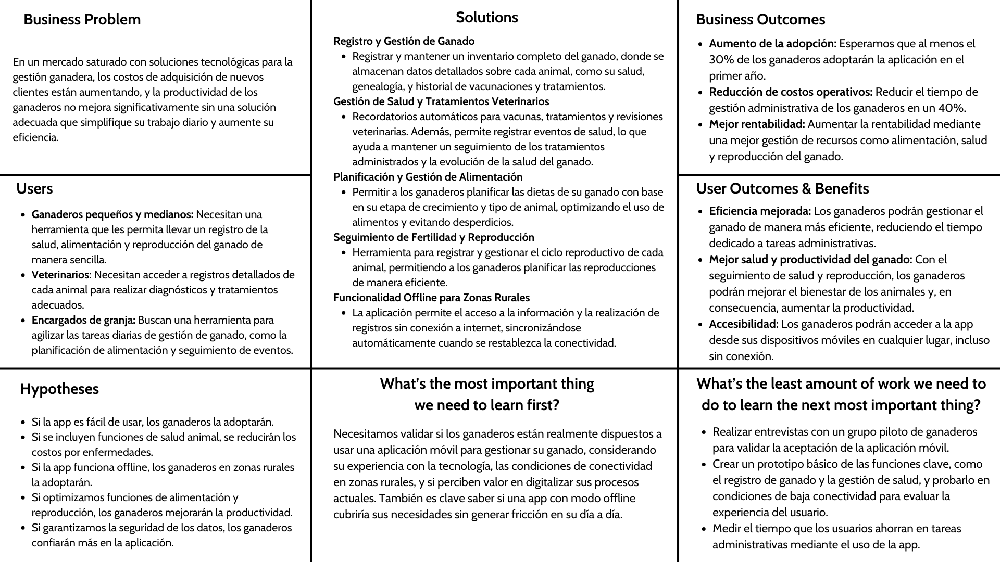

## 1.3. Segmentos objetivo

### Descripción de cada segmento objetivo

La aplicación Moobile ha sido diseñada pensando en las diversas realidades del sector ganadero peruano, abarcando tanto a pequeños productores independientes como a grandes empresas dedicadas a la actividad pecuaria. Cada segmento presenta necesidades, objetivos y desafíos específicos que nuestra plataforma busca atender con soluciones tecnológicas prácticas, accesibles y sostenibles.

A continuación, se detalla el perfil de nuestros principales segmentos objetivos, identificando sus características, motivaciones y problemáticas, con el fin de adaptar y mejorar constantemente nuestros servicios para ofrecerles el mayor valor posible.

#### Productores ganaderos independientes

Este segmento objetivo de nuestra plataforma se centra en los ganaderos independientes comprometidos y preocupados por obtener ganancias de manera ética y sostenible, mientras garantizan una excelente calidad en el cuidado de sus animales en propiedad. Este grupo comprende a ganaderos que poseen una variedad de animales, tales como ovejas, vacas, reses, corderos, gallinas, entre otros, y que residen en Perú. Su principal objetivo es asegurarse de que el estado y cuidado de sus animales sea óptimo, priorizando el bienestar y la salud de estos. Además, están interesados en llevar a cabo prácticas de venta honestas, con un enfoque en productos más naturales y de alta calidad. Como obtener información de nuevos métodos de cuidado animal.

#### Empresas ganaderas

El segmento objetivo de nuestra plataforma se dirige específicamente a grandes empresas corporativas involucradas en la gestión y cuidado de animales. Estas empresas se destacan por su firme compromiso con prácticas éticas y sostenibles en la producción ganadera. Su principal preocupación radica en garantizar que sus animales reciban una alimentación precisa, óptima y honesta, priorizando la salud y el bienestar de cada individuo. Asimismo, estas empresas se preocupan por brindar un cuidado individual a cada animal, asegurándose de que reciban la atención necesaria para su desarrollo y bienestar. Asimismo, contar con un sistema integral de gestión veterinaria, que garantiza un acceso constante y adecuado a servicios de atención médica veterinaria para sus animales.

### Datos cuantitativos del problema

#### Productores ganaderos independientes

Se han registrado numerosos incidentes en los que los productores ganaderos peruanos no reciben una compensación justa en los mercados, y enfrentan dificultades significativas en la gestión del cuidado de sus animales debido a la escasez de recursos económicos y la limitada accesibilidad a servicios veterinarios para consultas y atención adecuada. Estas circunstancias han creado desafíos sustanciales para los ganaderos, quienes luchan por mantener la salud y el bienestar de sus animales mientras buscan asegurar su propio sustento económico en un entorno cada vez más desafiante y competitivo. Se estima que al menos el 15% de los animales muertos en las granjas se debe a la falta de acceso oportuno a servicios veterinarios adecuados, lo que genera pérdidas económicas significativas para los productores, estimadas en un 20% de sus ingresos anuales debido a la falta de compensación justa de los mercados hacia ellos.

#### Empresas ganaderas

En el Perú, el bienestar animal en las empresas ganaderas es a menudo insuficiente, con un preocupante porcentaje del 60% de las operaciones que no cumplen con estándares aceptables en este aspecto. Esta deficiencia se refleja en condiciones de vida inadecuadas para el ganado, como la falta de espacio y la alimentación deficiente, lo que afecta negativamente su salud y bienestar. Además, la gestión de residuos en estas empresas es inadecuada en aproximadamente un 70% de los casos, lo que resulta en una incorrecta disposición de los desechos animales y una potencial contaminación del medio ambiente. Esta situación representa un desafío significativo para la industria ganadera, ya que no solo compromete el bienestar de los animales, sino que también puede tener repercusiones negativas en la salud pública y el medio ambiente.

### Variables geográficas, demográficas y psicológicas

#### Variable geográfica

- País: Perú
- Ciudad: zonas rurales

#### Variable demográfica

- Género: Femenino / Masculino.
- Ocupación: Productores ganaderos
- Estado civil: Todos los estados
- Edad y etapa de ciclo de vida:
- Ciudadanos mayores a 18 años.

#### Variable psicográfica

- Nivel Socioeconómico (NSE): todos los niveles socioeconomicos
- Características de personalidad:
- Altruismo
- Perseverante
- Honestidad

# **Capítulo II: Requirements Elicitation & Analysis**

## 2.1. Competidores

### 2.1.1. Análisis competitivo

<table>
   <tr>
      <td align="center" colspan="6">Competitive Analysis Landscaspe</td>
   </tr>
   <tr>
      <td colspan="2">¿Porqué llevar a cabo este análisis?</td><td colspan="4">¿Cómo podemos proporcionar un buen servicio entre los restaurantes y los consumidores de manera que la comunicación entre ambos sea efectiva y agradable?</td>
   </tr>
   <tr align="center">
      <td colspan="2"><td>Moobile</td><td>Control Ganadero</td><td>Agroptima</td><td>App Ganadera</td>
   </tr>
   <tr>
      <td rowspan="2">Perfil</td><td>Overview</td><td> Moobile es una plataforma móvil accesible que optimiza la gestión ganadera con enfoque en sostenibilidad, bienestar animal y eficiencia, adaptada a pequeños y grandes productores. </td><td> Es una aplicación español, británico y brasileño en el sector de la ganadería. </td><td> Agroptima es un sitio web multiplataforma cofundado por la unión europea para los países de España, Francia e Inglaterra </td><td> Es una empresa fundada en Colombia que cuenta con una para la gestión de ganado. </td>
   </tr>
   <tr>
      <td>Ventaja competitiva. ¿Qué valor ofrece a los clientes?</td><td>La plataforma se diferencia al integrar tecnología accesible con enfoque en sostenibilidad y bienestar animal, ofreciendo soluciones prácticas para productores de todos los tamaños. </td><td> es una app para la gestión de vacas y enfocada para móviles </td><td> cuenta con multiplataforma cuenta con algoritmos matemáticos para una mayor gestión del ganado. </td><td> Tiene gran variedad de herramientas y gran cantidad de distribuidores </td>
   </tr>
   <tr>
      <td rowspan="2">Perfil de Marketing</td><td>Mercado Objetivo</td><td> Productores ganaderos, tanto independientes como empresas, que buscan optimizar el cuidado del ganado y mejorar su rentabilidad. </td><td> Para ganaderos españoles, brasileños e ingleses. </td><td> Para ganaderos españoles,franceses e ingleses. </td><td> Para ganaderos colombianos </td>
   </tr>
   <tr>
      <td>Estrategias de Marketing</td><td> Difusión en redes sociales y anuncios pagados </td><td> Estrategia de posicionamiento </td><td> Estrategia de segmentación </td><td> Estrategia </td>
   </tr>
   <tr>
      <td rowspan="3">Perfil de Producto</td><td>Productos & Servicios</td><td> Aplicación móvil con herramientas de gestión de ganado, monitoreo de salud, alimentación y reproducción.

 </td><td> Web app de gestión de ganado. </td><td> Web app de gestión de ganado. </td><td> Web app de gestión de ganado. </td>
   </tr>
   <tr>
      <td>Precios & Costos</td><td> Subscripcion Bajo costo </td><td> Subscripcion Bajo costo </td><td> Subscripcion Bajo costo </td><td> Subscripcion Bajo costo </td>
   </tr>
   <tr>
      <td>Canales de distribución (Web y/o Móvil)</td><td> App </td><td> App </td><td> Web y móvil </td><td> App </td>
   </tr>

   <tr>
      <td rowspan="5">Análisis SWOT</td><td>Fortalezas</td><td> Contamos con lo último en tecnología e implementamos lo nuevo en desarrollo para mejorar la productividad del servicio </td><td> Es una app netamente para la gestión de vacas cuenta con buena personalización </td><td> Es famoso por ser bueno en gestión ya que usa algoritmos matemáticos para un mejor cálculo del ganado. </td><td> Su ecosistema está basado en un país de origen conoce muy bien a sus clientes y se adapta a ellos </td>
   </tr>
   <tr>
      <td>Debilidades</td><td> Está en pleno desarrollo puede ser un éxito o fracaso </td><td> Solo es de móvil eso limita que sea multiplataforma </td><td> Solo opera en Europa y se basa en reglas ya establecidas por la unión europea </td><td> Solo es una app y para la zona de Colombia por lo tanto solo está disponible en su país de origen </td>
   </tr>
   <tr>
      <td>Oportunidades</td><td> Puede hacer productivos a los ganaderos y empresas de este rubro mejorando sus tomas de decisiones y eficiencia </td><td> Si planeas ir a Europa es buena idea ya que ese es su público objetivo y contará con más servicios. </td><td> Si planeas ir a Europa es buena idea ya que ese es su público objetivo y contará con más servicios. </td><td> Si eres colombiano estarás contento con la app ya que es de uso nacional. </td>
   </tr>
   <tr>
      <td>Amenazas</td><td> Competencia de otras aplicaciones móviles y el riesgo de cambios regulatorios en la industria ganadera que puedan afectar las operaciones de la plataforma. </td><td> No cuenta con muchos clientes la ganadería sigue siendo a la antigua por tanto no hace falta usarla. </td><td> No cuenta con muchos clientes la ganadería sigue siendo a la antigua por tanto no hace falta usarla. </td><td> Falta de apoyo económico los gobiernos locales de Colombia no ven viable esta innovación puede llegar a su desaparición </td>
   </tr>
</table>

### 2.1.2. Estrategias y tácticas frente a competidores

Para competir en el sector ganadero, nuestra estrategia se enfocará en brindar una plataforma que sea accesible, fácil de usar y diseñada específicamente para las necesidades locales de los ganaderos peruanos. A diferencia de soluciones como Agroptima o Control Ganadero, Moobile se distinguirá por su simplicidad y su enfoque en la sostenibilidad y el bienestar animal, facilitando la gestión de la salud, alimentación y reproducción del ganado.

Implementaremos campañas de marketing digital segmentadas, incluyendo redes sociales y colaboraciones con organizaciones locales, para aumentar la visibilidad de la aplicación y educar a los usuarios sobre sus beneficios. Además, ofreceremos planes de suscripción flexibles y asequibles, permitiendo que tanto pequeños productores como grandes empresas puedan optimizar sus operaciones de forma sencilla. Paralelamente, continuaremos mejorando la plataforma de manera constante para responder a las necesidades cambiantes del sector ganadero.

## 2.2. Entrevistas

### 2.2.1. Diseño de entrevistas

**Segmento #1: Productores Ganaderos Independientes**

Moobile ha diseñado un conjunto de preguntas específicas para comprender a fondo las necesidades, experiencias y expectativas de los productores ganaderos independientes. El objetivo es apoyarlos en la mejora de la gestión de sus actividades, optimizar el cuidado de sus animales y evaluar tanto su impacto ambiental como social. Mediante una plataforma fácil de usar, Moobile pone a disposición herramientas que incrementan la eficiencia, refuerzan el control de calidad y fortalecen el vínculo con los consumidores, facilitando así las tareas diarias del productor.

**Datos Generales del Entrevistado:**

- Nombre:
- Edad:
- Tiempo de experiencia en la ganadería:

**Preguntas de la Entrevista:**

1. ¿Cómo decide la dieta de sus animales y qué factores considera al elegir su alimentación?

   (¿Sigue asesoría veterinaria, experiencia personal o recomendaciones externas?)

1. ¿Qué medidas toma para garantizar la salud y el bienestar de sus animales?
1. ¿Qué aspectos considera más importantes en la gestión de la salud veterinaria de su ganado?
1. ¿Lleva algún tipo de registro sobre la salud y el crecimiento de sus animales? ¿Cómo lo hace?

   (¿Utiliza cuadernos, hojas de cálculo, aplicaciones móviles, etc.?)

1. ¿Cuáles son los principales desafíos que enfrenta al administrar su ganadería?
1. ¿Cómo cree que una aplicación podría ayudarle a resolver esos desafíos?
1. Si contara con una aplicación para apoyar su trabajo ganadero, ¿qué funciones le serían más útiles?
1. ¿Qué tipo de información le gustaría tener siempre disponible desde su celular o computadora?
1. ¿Cómo le gustaría registrar la alimentación y consumo de sus animales dentro de la aplicación?
1. ¿Qué beneficios espera lograr al implementar una solución como Moobile en su ganadería?

**Segmento #2: Empresas Ganaderas**

Moobile está enfocada en incrementar la eficiencia y sostenibilidad de las empresas ganaderas a gran escala. A través de entrevistas con administradores, hemos identificado sus principales necesidades y las estrategias clave que emplean para una gestión eficiente. Indagamos sobre las herramientas que consideran fundamentales y el tipo de apoyo que esperan para mejorar tanto el bienestar animal como la productividad. Con base en esta información, Moobile ajusta sus soluciones para responder a los desafíos particulares que enfrenta la ganadería corporativa.

**Datos Generales del Entrevistado:**

- Nombre:
- Edad:
- Tiempo de experiencia en la ganadería:

**Preguntas de la Entrevista:**

1. ¿Cuántos animales maneja actualmente su empresa y cómo varía esa cantidad durante el año?
1. Si su empresa tuviera acceso a una plataforma digital para gestión ganadera, ¿qué funciones considera imprescindibles para mejorar la eficiencia?
1. ¿Cuáles son los mayores retos que enfrentan en la gestión ganadera a gran escala y cómo los abordan hoy en día?
1. ¿Qué tipo de información o datos son clave para la toma de decisiones en su operación ganadera?
1. ¿Qué funcionalidades le gustaría tener para facilitar la gestión del personal y la planificación de tareas?
1. ¿Qué tipo de informes o análisis considera importantes para evaluar el desempeño de su empresa?
1. ¿Cómo le gustaría interactuar con proveedores y socios comerciales a través de una plataforma como Moobile?
1. ¿Qué tan importante es que una aplicación como Moobile se adapte a los procesos actuales de su empresa?
1. ¿Qué aspectos considera que deberían ser completamente personalizables dentro de la plataforma?
1. ¿Qué mejoras espera obtener al integrar una solución como Moobile en su operación ganadera?

### 2.2.2. Registro de entrevistas

Las entrevistas están agrupadas en el siguiente link subido a Microsoft Stream:
[Link Entrevistas](https://upcedupe-my.sharepoint.com/:v:/g/personal/u20221c362_upc_edu_pe/EVZ158upKN9GjlYptAmvVJUBBpr0CBGC4qVE6GsKenCLuA?nav=eyJyZWZlcnJhbEluZm8iOnsicmVmZXJyYWxBcHAiOiJTdHJlYW1XZWJBcHAiLCJyZWZlcnJhbFZpZXciOiJTaGFyZURpYWxvZy1MaW5rIiwicmVmZXJyYWxBcHBQbGF0Zm9ybSI6IldlYiIsInJlZmVycmFsTW9kZSI6InZpZXcifX0%3D&e=7esbD1)

#### Segmento #1: Productores Ganaderos Independientes

Entrevistado: Edo
Sexo: Masculino
Edad: 25
Domicilio: Ica, Peru
Tiempo de experiencia en la ganadería: 5 años
Inicio de la entrevista: 00:00

[](https://postimg.cc/Q9vr2N1M)

<i>Resumen de la Entrevista:</i>
Edo es productor ganadero independiente con más de 5 años de experiencia. Explicó que su decisión sobre la alimentación de los animales combina lo que recomienda el veterinario con la disponibilidad y el precio de los alimentos en la zona. Actualmente lleva registros en hojas de Excel, aunque no siempre de manera constante. Entre sus principales retos mencionó la falta de tiempo, el costo elevado de los medicamentos y la dificultad de contar con personal confiable. Considera que una aplicación le sería útil para organizar su calendario de salud y vacunación, obtener reportes de gastos e ingresos y contar con herramientas que le ayuden a optimizar el manejo de su ganadería.

----

Entrevistada: Merly
Sexo: Femenino
Edad: 24
Domicilio: Lima, Peru
Tiempo de experiencia en la ganadería: 10 años
Inicio de la entrevista: 04:42

[](https://postimg.cc/mzLwT73X)

<i>Resumen de la Entrevista:</i>
Merly es una productora ganadera independiente con experiencia en el rubro desde su infancia. Señaló que la dieta de sus animales la decide principalmente en base a su experiencia y recomendaciones de otros ganaderos, priorizando lo que ve que funciona en el día a día. Sus registros los lleva en cuadernos, aunque de manera sencilla y no siempre sistemática. Entre sus principales desafíos mencionó el alto costo del alimento, la dificultad para acceder a veterinarios de forma rápida y el control individual de cada animal. Mostró interés en una aplicación que le facilite recordatorios de vacunas, el registro de gastos e ingresos, y una mejor organización general de su ganadería.

----

Entrevistada: Oscar Aranda
Sexo: Femenino
Edad: 21
Domicilio: Lima, Peru
Tiempo de experiencia en la ganadería: 2 años
Inicio de la entrevista: 11:20

[](https://postimg.cc/FYJps9MS)

<i>Resumen de la Entrevista:</i>
Oscar ayuda a con el ganado a su familia. Deciden la dieta a partir de asesoría veterinaria, con la que cuentan. Para garantizar la salud del ganado llevan un registro en Excel, y considera que los aspectos más importantes son la salud del animal y el pasto. Los principales desafíos que enfrenta es la pérdida de archivos al tener varios registros. Cree que una app podría ayudar a mantener el control de los archiivos y tener la informaciónd de manera directa y rápida. 

#### Segmento #2: Empresas Ganaderas

Entrevistado: Estefano Charalla
Sexo: Masculino
Edad: 26
Domicilio: Cajamarca, Peru
Tiempo de experiencia en la ganadería: 4 años
Inicio de la entrevista: 15:35


<i>Resumen de la Entrevista:</i>
Estefano Charalla, ingeniero ganadero de 26 años con 4 años de experiencia, lidera una empresa con varios miles de cabezas cuyo inventario fluctúa 10–20% al año, lo que exige control por categoría y lote para decidir a tiempo. Actualmente coordina equipos dispersos con Excel, WhatsApp, radios y cuadernos, pero al escalar “cruje”, por lo que ve clave una plataforma que identifique animales con RFID/QR, se conecte a balanzas, gestione sanidad y reproducción con alertas, muestre potreros y rotaciones en mapa, permita costeo fino, funcione offline e integre ERP, frigorífico, laboratorio y sensores. Para tomar decisiones mira GMD, tasa de preñez, mortalidad, costo por kilo y margen por hectárea, además de rotación de potreros, trazabilidad y métricas ESG, y pide órdenes de trabajo con checklists, fotos, geolocalización, firma digital y turnos visibles sin perseguir por chat. También busca cotizar, comprar y recepcionar en un solo lugar, compartiendo solo la información necesaria con socios comerciales mediante mensajería contextual por lote, con tableros diarios, comparativos entre unidades, auditorías para SENASA y reportes ESG listos para clientes o certificadoras. Insiste en una adopción gradual y altamente personalizable (formularios, permisos, tableros, alertas, etapas, calendarios y mapa), esperando 5–10% menos costos operativos, mejoras en preñez y menor mortalidad, junto con trazabilidad de campo a consumidor que fortalezca la confianza y abra mercados.

----

Entrevistada: Rosa Huamán
Sexo: Femenino
Edad: 30
Domicilio: Abancay, Peru
Tiempo de experiencia en la ganadería: 4 años
Inicio de la entrevista: 21:20


<i>Resumen de la Entrevista:</i>
Rosa Huamán, joven ganadera de 30 años con 4 años de experiencia, lidera una pequeña empresa en Abancay donde maneja unas 30 vacas, además de ovejas y gallinas. Su inventario crece con las crías y disminuye con ventas, lo que requiere un seguimiento cercano. Actualmente gestiona el control de animales, vacunación y alimentación en cuadernos y con recordatorios en el celular, pero reconoce que una plataforma digital sería clave para ordenar costos, registrar sanidad y recibir alertas.

Entre sus principales retos menciona el acceso oportuno a veterinarios y la organización de tareas con el personal limitado que la apoya. Considera fundamentales los datos de costos de alimentación, peso y salud de los animales para decidir el momento de venta y medir la rentabilidad. Pide funcionalidades simples como listas de tareas, reportes de gastos/ganancias y recordatorios personalizables.

Le interesaría interactuar con proveedores y compradores desde la aplicación, simplificando pedidos de alimento, medicinas y ventas. Subraya que la plataforma debe adaptarse a sus procesos actuales, sin complicar la gestión. Rosa espera que una solución como Moobile le ayude a ahorrar tiempo, reducir errores y, sobre todo, garantizar un mejor cuidado de sus animales para crecer de manera ordenada.

----

Entrevistada: Ernesto
Sexo: Masculino
Edad: 28
Domicilio: Ancash, Peru
Tiempo de experiencia en la ganadería: 5 años
Inicio de la entrevista: 28:10

[](https://postimg.cc/ThXy5TZx)

<i>Resumen de la Entrevista:</i>
Ernesto es un empresario ganadero independiente con experiencia de 5 años en el rubro. Señaló cuenta con 30 vacas en su empresa, y que varía entre 30 y 50 durante el año, con el pico más alto en invierno. Nos cuenta que información como el recuento de vacunas es sumamente importante para llevar la correcta salud del ganado, por lo que una función así sería se mucha ayuda para su empresa.

### 2.2.3. Análisis de entrevistas

#### Analisis De Entrevista Segmento 1:

Las entrevistas realizadas a Productores Ganaderos Independientes destacan desafíos comunes en la gestión de sus ganaderías, como la falta de tiempo, el alto costo de los insumos y la dificultad para gestionar los registros manuales. Edo, con más de 5 años de experiencia, combina las recomendaciones veterinarias con la disponibilidad local de alimentos, pero lucha con la falta de personal confiable y el alto costo de los medicamentos. Merly, con experiencia desde su infancia, se basa en su propio conocimiento y consejos de otros ganaderos, pero enfrenta problemas con el acceso a veterinarios y el control individual de cada animal. Oscar, que trabaja con su familia, confía en la asesoría veterinaria y en registros en Excel, pero se ve afectado por la pérdida de archivos. Los tres coincidieron en que una aplicación digital podría ser útil para organizar mejor la salud del ganado, los gastos, los registros y las vacunaciones, optimizando la gestión de su ganadería.

#### Analisis De Entrevista Segmento 2:

Las entrevistas realizadas a empresarios ganaderos destacan la necesidad de optimizar el control y la gestión de inventarios, así como de mejorar el registro de datos clave como la sanidad y la alimentación del ganado. Estefano Charalla, ingeniero ganadero con 4 años de experiencia, lidera una empresa con varios miles de cabezas, lo que le exige un control riguroso por categoría y lote debido a la fluctuación anual del inventario. Actualmente, coordina equipos dispersos utilizando Excel, WhatsApp, radios y cuadernos. Rosa Huamán, quien lidera una pequeña empresa en Abancay con unas 30 vacas, además de ovejas y gallinas, también depende de cuadernos y recordatorios en el celular para gestionar el control de animales, vacunación y alimentación, pero reconoce que una plataforma digital sería clave para organizar costos y registros sanitarios. Por su parte, Ernesto, con 5 años de experiencia y un inventario variable de entre 30 y 50 vacas, destaca la importancia de tener un registro de vacunación eficiente para asegurar la salud del ganado, lo que le haría más fácil su gestión. Los tres empresarios coinciden en que una solución digital podría mejorar la organización, seguimiento y control de sus operaciones ganaderas.

## 2.3. Needfinding

### 2.3.1. User Personas

Para desarrollar nuestros User Persona, utilizamos los datos obtenidos y analizados a partir de las entrevistas realizadas. Se determinó que ambos segmentos debían estar representados por perfiles masculinos. Con base en las respuestas recopiladas, se construyó un perfil que refleja los objetivos, motivaciones y frustraciones más representativas entre los entrevistados. Posteriormente, se llevó a cabo un análisis que permitió identificar los valores y habilidades clave, resumiendo las características más relevantes de cada uno de los segmentos definidos.

**Segmento Ganadero Independiente**
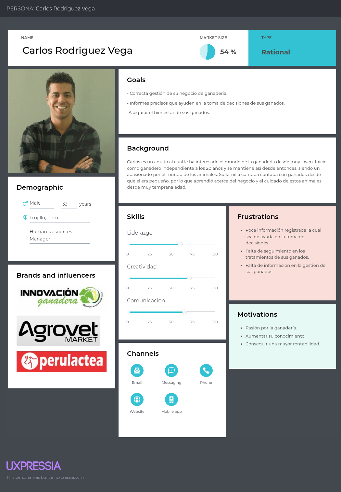

**Segmento Empresa Ganadera**
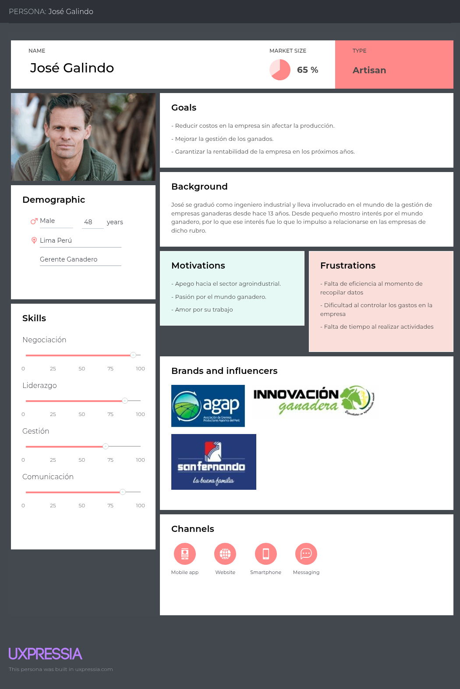

### 2.3.2. User Task Matrix

| Tarea                                       | Ganadero Independiente                       | Empresa Ganadera                          |
|---------------------------------------------|----------------------------------------------|-------------------------------------------|
| Registrar nuevos animales                   | Alta (Manualmente con papel y lápiz)        | Alta (Manualmente con registros en cuadernos) |
| Controlar la alimentación del ganado        | Alta (Registro manual en cuadernos)          | Alta (Registro manual en registros de alimentación) |
| Programar citas con el veterinario          | Media (Llamadas telefónicas)                | Alta (Agenda manual de citas)             |
| Gestionar vacunaciones                      | Alta (Registro manual en registros de vacunación) | Alta (Registro manual en cuadernos de vacunación) |
| Realizar seguimiento del estado de salud    | Alta (Observación manual del ganado)        | Alta (Registro manual de síntomas y signos) |
| Verificar el pronóstico del tiempo          | Media (Consultando en línea o escuchando el pronóstico) | Alta (Consultando en línea o por radio) |
| Consultar información sobre razas de ganado| Media (Investigación en línea o en libros)  | Alta (Investigación en línea o en libros) |
| Mantenimiento de infraestructura y equipos  | Alta (Reparaciones manuales y limpieza)     | Alta (Reparaciones manuales y limpieza)   |
| Manejo de la reproducción y cría de ganado | Alta (Observación y gestión manual del ciclo reproductivo) | Alta (Observación y gestión manual del ciclo reproductivo) |
| Registro de movimientos de ganado           | Alta (Registro manual de traslados, compra y venta) | Alta (Registro manual de traslados, compra y venta) |

### 2.3.3. User Journey Mapping

**Journey Map for Ganadero Indepeniente**
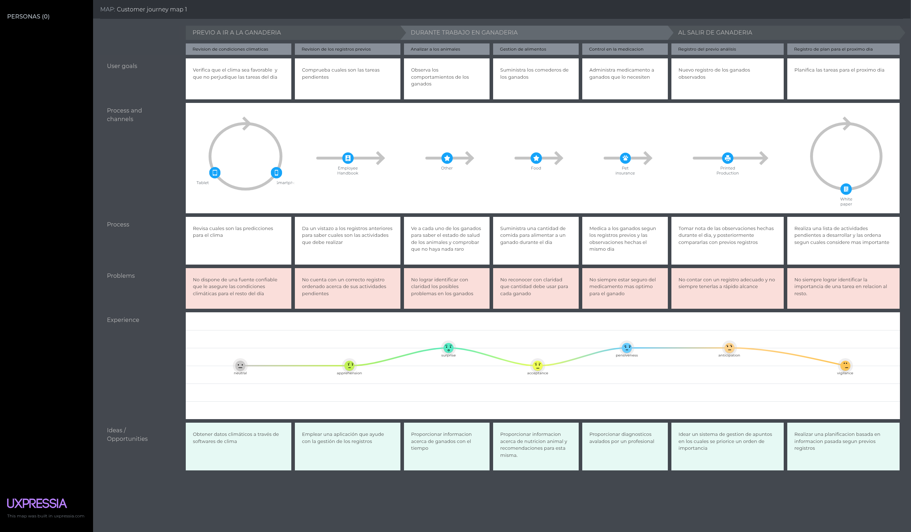

**Journey Map for Empresa Ganadera**
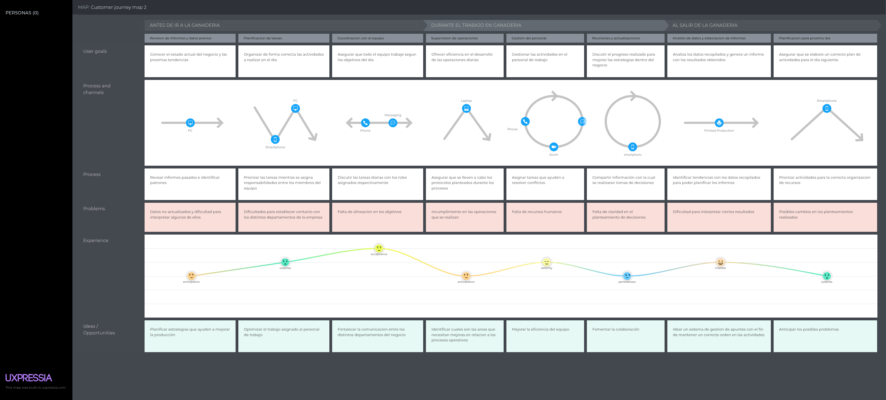

### 2.3.4. Empathy Mapping

**Empathy Map for Ganadero Indepeniente**
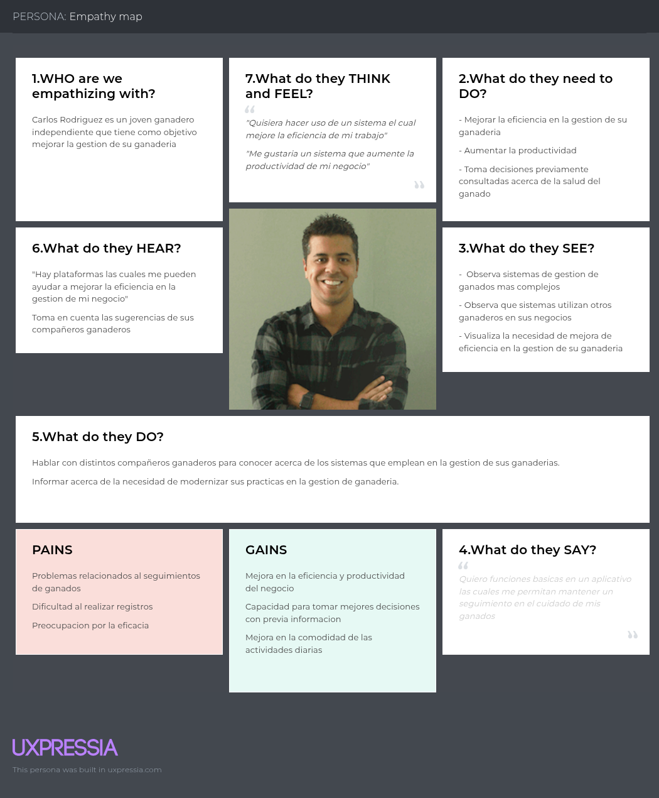

**Empathy Map for Empresa Ganadera**
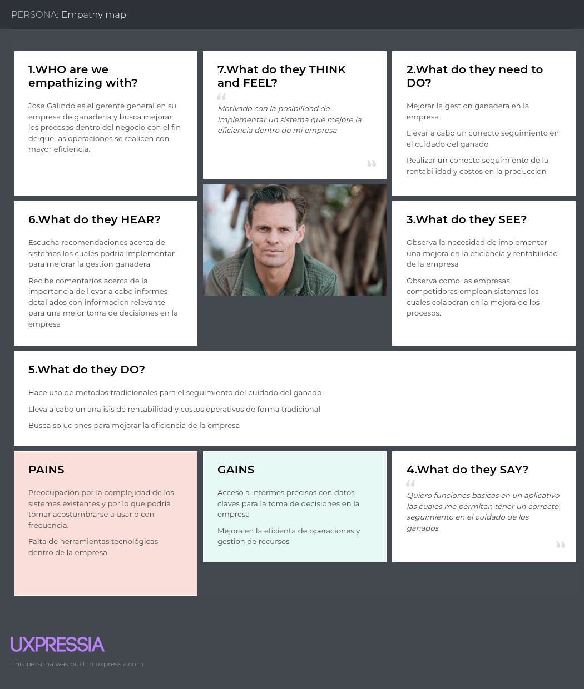

### 2.3.5. As-is Scenario Mapping


## 2.4. Ubiquitous Language

| Palabra                         | Descripción                                                                                                                                                     |
|-------------------------------|-----------------------------------------------------------------------------------------------------------------------------------------------------------------|
| Animal Health (Salud Animal) | Mantener la salud y prevenir enfermedades en el ganado.                                                                                                       |
| Balanced Feeding (Alimentación Equilibrada) | Proporcionar una dieta equilibrada que cumpla con los requisitos nutricionales específicos de los animales.                                                    |
| Artificial Insemination (Inseminación Artificial) | Introducir esperma en el tracto reproductivo de una hembra sin necesidad de apareamiento natural.                                                             |
| Rectal Palpation (Palpación Rectal) | Examen para evaluar la condición reproductiva de una hembra, especialmente en el ganado vacuno.                                                               |
| Deworming (Desparasitación) | Administrar medicamentos antiparasitarios para controlar y prevenir la infestación de parásitos internos y externos en el ganado.                              |
| Branding (Marcado) | Identificación de ganado mediante la aplicación de un sello metálico caliente en la piel del animal.                                                          |
| Weaning (Destete) | Separación gradual de los terneros de sus madres para cesar la lactancia y promover la independencia alimentaria.                                             |
| Grazing Rotation (Rotación de Pastoreo) | Mover el ganado entre diferentes áreas de pastoreo para optimizar el uso del suelo y prevenir el sobrepastoreo.                                               |
| Dystocia (Distocia) | Dificultades durante el parto que pueden requerir intervención veterinaria.                                                                                   |
| Dusting (Aplicación de Polvos) | Aplicación de insecticidas en polvo o en aerosol sobre el pelaje del ganado para controlar infestaciones de insectos y parásitos externos.                    |
| Campaign (Campaña) | Período durante el cual se llevan a cabo actividades específicas en la gestión de ganadería, con objetivos definidos y metas establecidas.                   |
| Batch (Lote) | Grupo de animales criados o tratados juntos, que se manejan y monitorean como una unidad durante un período específico de tiempo.                              |
| Fumigation (Fumigación) | Aplicación de productos químicos o biológicos para eliminar o controlar plagas, insectos, parásitos o enfermedades en el ganado y su entorno.                |

# **Capítulo III: Requirements Specification**

## 3.1. To-Be Scenario Mapping

El To-Be Scenario Mapping permite visualizar el escenario ideal de interacción entre el usuario y el sistema, describiendo cómo deberían llevarse a cabo los procesos una vez implementada la solución. Esta técnica ayuda a identificar los cambios esperados en comparación con la situación actual, resaltando mejoras en la experiencia del usuario, la eficiencia operativa y el logro de los objetivos del proyecto. Este mapeo es fundamental para asegurar que el diseño del sistema esté alineado con las necesidades reales de los usuarios y con los objetivos estratégicos de la solución.

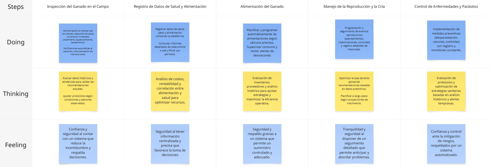

## 3.2. User Stories

Las User Stories representan una herramienta fundamental dentro de las metodologías ágiles para capturar los requerimientos funcionales desde la perspectiva del usuario. Cada historia describe una necesidad concreta, quién la necesita y con qué propósito, facilitando la planificación, priorización y desarrollo iterativo del sistema. Esta técnica garantiza que cada funcionalidad responda a una necesidad real, fomentando un desarrollo orientado al valor y alineado con las expectativas del usuario final.

### Gestión de Establos

**EP01: Como usuario ganadero, quiero gestionar los establos para mantener organizadas las instalaciones donde se alojan los bovinos.**

| User Story ID | Título                     | Descripción                                                                                                                                                    |
|---------------|----------------------------|----------------------------------------------------------------------------------------------------------------------------------------------------------------|
| US01          | Creación de Establos       | Como usuario ganadero, quiero crear nuevos establos para organizar adecuadamente los espacios de alojamiento de los bovinos según sus características.        |
| US02          | Visualización de Establos  | Como usuario ganadero, quiero visualizar la información de todos mis establos para tener un panorama general de las instalaciones disponibles.                |
| US03          | Edición de Establos        | Como usuario ganadero, quiero editar la información de los establos existentes para mantener actualizados sus datos y características.                        |
| US04          | Eliminación de Establos    | Como usuario ganadero, quiero eliminar establos que ya no utilizo para mantener organizado mi registro de instalaciones.                                       |
| US05          | Búsqueda de Establos       | Como usuario ganadero, quiero buscar establos por nombre o capacidad para localizar rápidamente la información que necesito.                 |

----

### Gestión de Bovinos

**EP02: Como usuario ganadero, quiero gestionar la información de mis bovinos para llevar un control detallado del ganado.**

| User Story ID | Título                     | Descripción                                                                                                                                                    |
|---------------|----------------------------|----------------------------------------------------------------------------------------------------------------------------------------------------------------|
| US06          | Registro de Bovinos        | Como usuario ganadero, quiero registrar nuevos bovinos en el sistema para mantener un inventario actualizado de mi ganado.                                     |
| US07          | Visualización de Bovinos   | Como usuario ganadero, quiero visualizar la información completa de mis bovinos para revisar sus datos y estado actual.                                        |
| US08          | Edición de Bovinos         | Como usuario ganadero, quiero editar la información de los bovinos para actualizar sus datos cuando sea necesario (peso, edad, estado reproductivo, etc.).    |
| US09          | Eliminación de Bovinos     | Como usuario ganadero, quiero eliminar bovinos del registro cuando ya no formen parte del ganado (venta, muerte, etc.).                                        |
| US10          | Búsqueda de Bovinos        | Como usuario ganadero, quiero buscar bovinos por nombre y raza para localizar rápidamente información específica.          |
| US11          | Asignación de Bovinos a Establos | Como usuario ganadero, quiero asignar bovinos a establos específicos para organizar la distribución del ganado en las instalaciones.                     |

----

### Gestión de Vacunas

**EP03: Como usuario ganadero, quiero gestionar las vacunas aplicadas a mis bovinos para llevar un control sanitario adecuado.**

| User Story ID | Título                     | Descripción                                                                                                                                                    |
|---------------|----------------------------|----------------------------------------------------------------------------------------------------------------------------------------------------------------|
| US12          | Registro de Vacunas        | Como usuario ganadero, quiero registrar las vacunas aplicadas a mis bovinos para mantener un historial sanitario completo.                                     |
| US13          | Visualización de Vacunas   | Como usuario ganadero, quiero visualizar el historial de vacunación de cada bovino para conocer su estado sanitario actual.                                    |
| US14          | Edición de Registros de Vacunas | Como usuario ganadero, quiero editar los registros de vacunación para corregir errores o actualizar información cuando sea necesario.                    |
| US15          | Eliminación de Registros de Vacunas | Como usuario ganadero, quiero eliminar registros de vacunas incorrectos para mantener la precisión del historial sanitario.                          |
| US16          | Búsqueda de Vacunas        | Como usuario ganadero, quiero buscar registros de vacunación por bovino, fecha o tipo de vacuna para acceder rápidamente a la información sanitaria.          |
| US17          | Asignación de Vacunas a Bovinos | Como usuario ganadero, quiero asignar vacunas específicas a bovinos individuales para llevar un control detallado de los tratamientos aplicados.        |

----

### Gestión de Campañas

**EP04: Como empresario ganadero, quiero gestionar campañas sanitarias y de mejoramiento para coordinar actividades a gran escala.**

| User Story ID | Título                     | Descripción                                                                                                                                                    |
|---------------|----------------------------|----------------------------------------------------------------------------------------------------------------------------------------------------------------|
| US18          | Creación de Campañas       | Como empresario ganadero, quiero crear nuevas campañas sanitarias o de mejoramiento para organizar actividades coordinadas en mi operación ganadera.          |
| US19          | Visualización de Campañas  | Como empresario ganadero, quiero visualizar todas las campañas activas y pasadas para tener un control general de las actividades realizadas.                 |
| US20          | Edición de Campañas        | Como empresario ganadero, quiero editar la información de las campañas para actualizar objetivos, fechas o recursos asignados.                                 |
| US21          | Eliminación de Campañas    | Como empresario ganadero, quiero eliminar campañas canceladas o incorrectas para mantener organizado el registro de actividades.                               |
| US22          | Búsqueda de Campañas       | Como empresario ganadero, quiero buscar campañas por fecha para localizar rápidamente información específica de las actividades.                |

----

### Gestión de Staff

**EP05: Como empresario ganadero, quiero gestionar el personal que trabaja en mi operación ganadera para organizar eficientemente los recursos humanos.**

| User Story ID | Título                     | Descripción                                                                                                                                                    |
|---------------|----------------------------|----------------------------------------------------------------------------------------------------------------------------------------------------------------|
| US23          | Registro de Personal       | Como empresario ganadero, quiero registrar nuevo personal en el sistema para mantener un control de todos los trabajadores de mi operación.                    |
| US24          | Visualización de Personal  | Como empresario ganadero, quiero visualizar la información de todo mi personal para revisar datos de contacto, roles y responsabilidades asignadas.           |
| US25          | Edición de Personal        | Como empresario ganadero, quiero editar la información del personal para actualizar datos personales, roles o responsabilidades cuando sea necesario.          |
| US26          | Eliminación de Personal    | Como empresario ganadero, quiero eliminar registros de personal que ya no trabaja en mi operación para mantener actualizada la base de datos.                  |
| US27          | Búsqueda de Personal       | Como empresario ganadero, quiero buscar personal por nombre para localizar rápidamente información específica de los trabajadores.      |
| US28          | Asignación de Personal a Campañas | Como empresario ganadero, quiero asignar personal específico a las campañas para coordinar los recursos humanos necesarios en cada actividad.           |

----

**EP06: Como visitante del sitio web, quiero conocer las características y beneficios de la plataforma Moobile para evaluar si es la solución adecuada para mi operación ganadera.**

| User Story ID | Título                     | Descripción                                                                                                                                                    |
|---------------|----------------------------|----------------------------------------------------------------------------------------------------------------------------------------------------------------|
| TS01          | Visualización de Información de la Empresa | Como visitante, quiero ver información sobre Cowders para conocer los antecedentes y credibilidad de la empresa desarrolladora. |
| TS02          | Exploración de Funcionalidades de Moobile | Como visitante, quiero conocer las características principales de la plataforma Moobile para entender cómo puede beneficiar mi operación ganadera. |
| TS03          | Consulta de Herramientas de Nutrición y Productividad | Como visitante, quiero información sobre las funciones de gestión de raciones, peso y rendimiento para determinar si mejorará la productividad de mi ganado. |
| TS04          | Acceso a Información de Contacto | Como visitante, quiero acceder fácilmente a la información de contacto de Cowders para realizar consultas específicas sobre la plataforma. |
| TS05          | Conocimiento de Misión y Visión | Como visitante, quiero conocer la misión y visión de Cowders para entender sus objetivos y compromiso con el sector ganadero peruano. |
| TS06          | Vista General de la Plataforma | Como visitante, quiero acceder a una vista general interactiva de la plataforma para familiarizarme con su interfaz y usabilidad. |

## 3.3. Product Backlog

El Product Backlog es un elemento esencial en la gestión ágil de proyectos, ya que representa una lista priorizada de funcionalidades, mejoras y tareas necesarias para el desarrollo del producto. Este backlog fue construido a partir de las necesidades identificadas en las entrevistas, el To-Be Scenario Mapping y las User Stories, permitiendo organizar y planificar el trabajo del equipo de forma estructurada y alineada con los objetivos del proyecto. Cada ítem del backlog está enfocado en generar valor para el usuario final y facilitar una entrega incremental y efectiva de la solución.

| # Orden | User Story ID | Título | Descripción | Story Points |
|---------|---------------|--------|-------------|--------------|
| 1 | US01 | Creación de Establos | Como usuario ganadero, quiero crear nuevos establos para organizar adecuadamente los espacios de alojamiento de los bovinos según sus características. | 3 |
| 2 | US02 | Visualización de Establos | Como usuario ganadero, quiero visualizar la información de todos mis establos para tener un panorama general de las instalaciones disponibles. | 2 |
| 3 | US06 | Registro de Bovinos | Como usuario ganadero, quiero registrar nuevos bovinos en el sistema para mantener un inventario actualizado de mi ganado. | 5 |
| 4 | US07 | Visualización de Bovinos | Como usuario ganadero, quiero visualizar la información completa de mis bovinos para revisar sus datos y estado actual. | 3 |
| 5 | US11 | Asignación de Bovinos a Establos | Como usuario ganadero, quiero asignar bovinos a establos específicos para organizar la distribución del ganado en las instalaciones. | 3 |
| 6 | US03 | Edición de Establos | Como usuario ganadero, quiero editar la información de los establos existentes para mantener actualizados sus datos y características. | 2 |
| 7 | US08 | Edición de Bovinos | Como usuario ganadero, quiero editar la información de los bovinos para actualizar sus datos cuando sea necesario (peso, edad, estado reproductivo, etc.). | 3 |
| 8 | US12 | Registro de Vacunas | Como usuario ganadero, quiero registrar las vacunas aplicadas a mis bovinos para mantener un historial sanitario completo. | 5 |
| 9 | US13 | Visualización de Vacunas | Como usuario ganadero, quiero visualizar el historial de vacunación de cada bovino para conocer su estado sanitario actual. | 3 |
| 10 | US17 | Asignación de Vacunas a Bovinos | Como usuario ganadero, quiero asignar vacunas específicas a bovinos individuales para llevar un control detallado de los tratamientos aplicados. | 3 |
| 11 | US05 | Búsqueda de Establos | Como usuario ganadero, quiero buscar establos por nombre o capacidad para localizar rápidamente la información que necesito. | 2 |
| 12 | US10 | Búsqueda de Bovinos | Como usuario ganadero, quiero buscar bovinos por nombre y raza para localizar rápidamente información específica. | 2 |
| 13 | US16 | Búsqueda de Vacunas | Como usuario ganadero, quiero buscar registros de vacunación por bovino, fecha o tipo de vacuna para acceder rápidamente a la información sanitaria. | 3 |
| 14 | US18 | Creación de Campañas | Como empresario ganadero, quiero crear nuevas campañas sanitarias o de mejoramiento para organizar actividades coordinadas en mi operación ganadera. | 5 |
| 15 | US19 | Visualización de Campañas | Como empresario ganadero, quiero visualizar todas las campañas activas y pasadas para tener un control general de las actividades realizadas. | 3 |
| 16 | US23 | Registro de Personal | Como empresario ganadero, quiero registrar nuevo personal en el sistema para mantener un control de todos los trabajadores de mi operación. | 3 |
| 17 | US24 | Visualización de Personal | Como empresario ganadero, quiero visualizar la información de todo mi personal para revisar datos de contacto, roles y responsabilidades asignadas. | 2 |
| 18 | US28 | Asignación de Personal a Campañas | Como empresario ganadero, quiero asignar personal específico a las campañas para coordinar los recursos humanos necesarios en cada actividad. | 3 |
| 19 | US14 | Edición de Registros de Vacunas | Como usuario ganadero, quiero editar los registros de vacunación para corregir errores o actualizar información cuando sea necesario. | 2 |
| 20 | US20 | Edición de Campañas | Como empresario ganadero, quiero editar la información de las campañas para actualizar objetivos, fechas o recursos asignados. | 3 |
| 21 | US25 | Edición de Personal | Como empresario ganadero, quiero editar la información del personal para actualizar datos personales, roles o responsabilidades cuando sea necesario. | 2 |
| 22 | US22 | Búsqueda de Campañas | Como empresario ganadero, quiero buscar campañas por fecha para localizar rápidamente información específica de las actividades. | 2 |
| 23 | US27 | Búsqueda de Personal | Como empresario ganadero, quiero buscar personal por nombre para localizar rápidamente información específica de los trabajadores. | 2 |
| 24 | US04 | Eliminación de Establos | Como usuario ganadero, quiero eliminar establos que ya no utilizo para mantener organizado mi registro de instalaciones. | 2 |
| 25 | US09 | Eliminación de Bovinos | Como usuario ganadero, quiero eliminar bovinos del registro cuando ya no formen parte del ganado (venta, muerte, etc.). | 3 |
| 26 | US15 | Eliminación de Registros de Vacunas | Como usuario ganadero, quiero eliminar registros de vacunas incorrectos para mantener la precisión del historial sanitario. | 2 |
| 27 | US21 | Eliminación de Campañas | Como empresario ganadero, quiero eliminar campañas canceladas o incorrectas para mantener organizado el registro de actividades. | 2 |
| 28 | US26 | Eliminación de Personal | Como empresario ganadero, quiero eliminar registros de personal que ya no trabaja en mi operación para mantener actualizada la base de datos. | 2 |


## 3.4. Impact Mapping

A continuación presentaremos 3 Business Goals que consideramos importantes en nuestro proyecto:

**Business Goal 1**

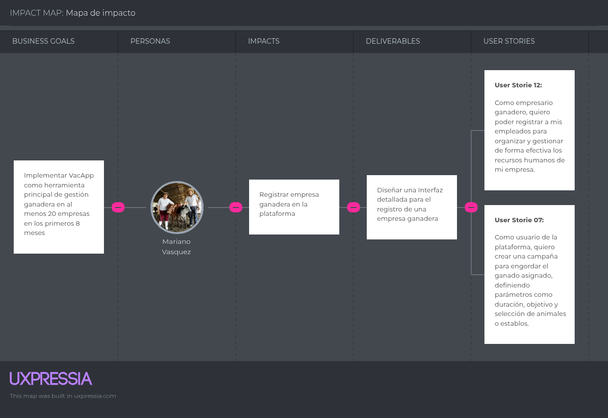 

**Business Goal 2**

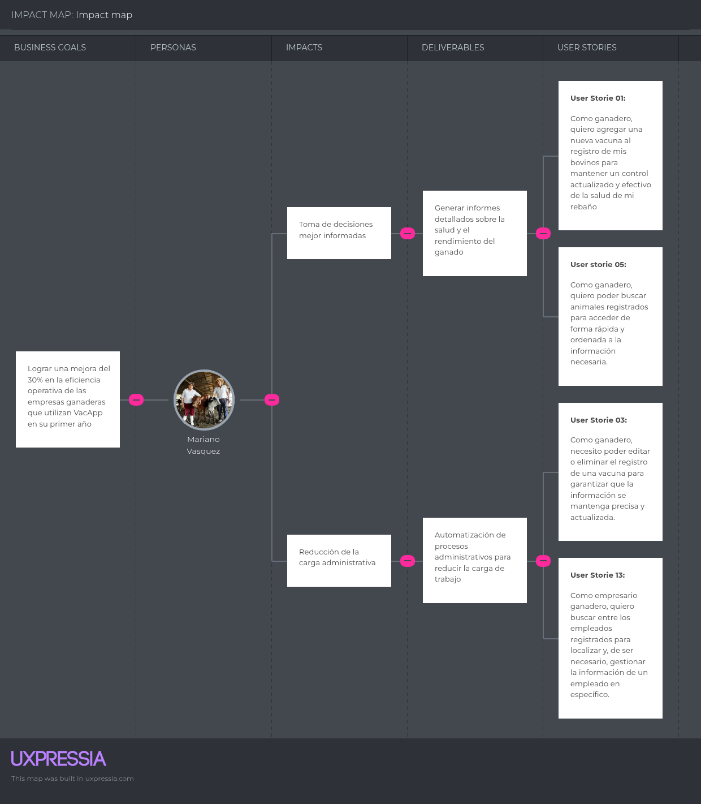 

**Business Goal 3**

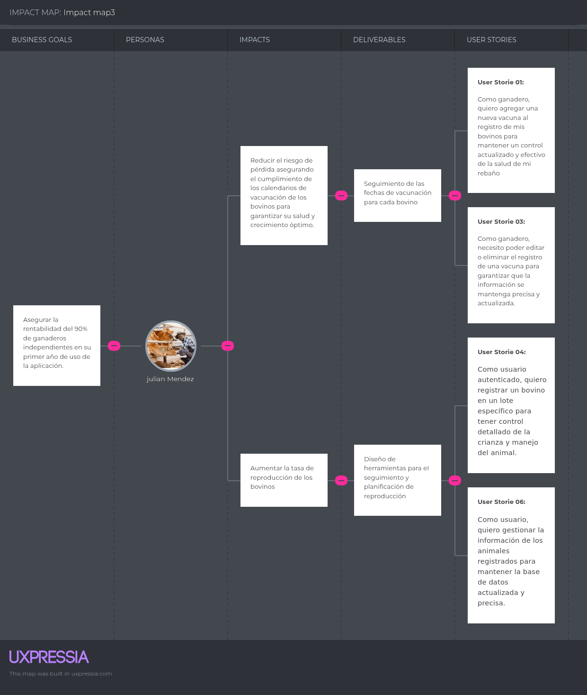 

# **Capítulo IV: Product Design**

## 4.1. Style Guidelines

Las Style Guidelines son fundamentales para garantizar una comunicación consistente y profesional en todos los elementos visuales y de diseño del proyecto, ya sea en formatos impresos, digitales o en cualquier otro medio. En esta sección, se definirán las directrices que orientarán al equipo en la creación de Moobile. Estas normas establecerán aspectos clave como la selección de colores, tipografía, la organización de los documentos y otros elementos visuales. Para el desarrollo de Moobile, Figma será nuestra herramienta principal para diseñar tanto la aplicación móvil como la página de aterrizaje. En ambos casos, se utilizará una paleta de colores que combinará tonos verdes y cremosos, evocando la naturaleza y transmitiendo la confianza vinculada a una gestión responsable y sostenible del cuidado animal. A continuación, se detallarán estos puntos en mayor profundidad.

### 4.1.1. General Style Guidelines

**Branding**

El branding de Moobile está está concebida para transmitir seguridad, firmeza y un compromiso con la sostenibilidad en la ganadería bovina. Su identidad visual establece una conexión directa con la naturaleza y la productividad agrícola, incorporando elementos gráficos que simbolizan el manejo responsable del ganado. El objetivo es crear una imagen sólida y definida, que sea de fácil reconocimiento para los productores y profesionales del sector.

**Typography**

La tipografía seleccionada para Moobile es contemporánea y legible, con un énfasis en la claridad, especialmente en dispositivos móviles. Para los encabezados se usará la fuente Rokkitt, lo que ayudará a resaltar la jerarquía visual de la información, mientras que el cuerpo de texto estará en Mulish, garantizando una lectura cómoda y fluida durante largos períodos. La tipografía elegida busca transmitir seriedad, manteniendo al mismo tiempo una sensación de cercanía y accesibilidad.

[](https://postimg.cc/bsYw1gpY)

[](https://postimg.cc/njktz8s4)

**Colors**

La paleta de colores de Moobile se basa en combinaciones de verdes y tonos crema, cuidadosamente elegidos para reflejar la naturaleza y transmitir confianza en una gestión ganadera sostenible. Los verdes simbolizan frescura, bienestar y responsabilidad ambiental, mientras que los cremas aportan una sensación de arraigo, tradición y vínculo con el entorno rural. Estos colores se aplicarán estratégicamente para lograr una interfaz visualmente equilibrada y fácil de usar en dispositivos móviles.

[](https://postimg.cc/56XZcQmq)

**Spacing**

Se utilizará un espaciado óptimo en toda la interfaz para evitar la saturación visual y asegurar una experiencia de navegación clara y agradable. Los márgenes y separaciones entre los distintos elementos serán definidos con precisión, con el objetivo de mantener un diseño ordenado y armonioso. Esto también favorecerá la usabilidad en dispositivos móviles, donde la interacción requiere mayor exactitud.

**Tono de Comunicación**

El tono de comunicación de Moobile será directo, respetuoso y accesible, orientado específicamente a los usuarios del ámbito de la ganadería bovina. Se empleará un lenguaje claro, profesional y comprensible, con el propósito de generar confianza y transmitir conocimientos relevantes sobre el manejo del ganado. La intención es que el usuario se sienta respaldado e informado, sin perder el tono serio y responsable que define al sector.

### 4.1.2. Web Style Guidelines

El diseño web de Moobile se basará en principios de accesibilidad, usabilidad y coherencia visual, con el fin de garantizar una experiencia de usuario clara, intuitiva y uniforme en todo tipo de dispositivos.

### 4.1.3. Mobile Style Guidelines

La app móvil de Moobile ha sido desarrollada utilizando Flutter, lo que permite mantener una coherencia visual en cuanto a colores, tipografía y componentes gráficos en ambas plataformas: iOS y Android.

La principal diferencia se encuentra en la adaptación a las guías de diseño nativas de cada sistema operativo.

**Tipografía:**

- iOS: Se utiliza SF Pro Display/Text.
- Android: Se emplea Roboto.

Gracias a Flutter, se establece una jerarquía tipográfica uniforme que se ajusta automáticamente al estilo del sistema operativo correspondiente, garantizando una experiencia visual coherente y optimizada para cada entorno.

#### 4.1.3.1. iOS Mobile Style Guidelines

El diseño de la versión iOS de Moobile se ajustará a las Human Interface Guidelines (HIG) de Apple.

**Colores**  
Se utilizarán los mismos tonos definidos en la paleta general para mantener la coherencia de marca.

**Componentes UI**

- Barra de navegación inferior con iconos claros y minimalistas.

- Botones con bordes redondeados (de 12 a 16 px), respetando la estética típica de iOS.

- Uso de modal sheets para formularios y confirmaciones.

**Interacciones**

- Gestos nativos como swipe back y pull-to-refresh.

- Animaciones que incorporan efectos de desenfoque y transparencia, creando una sensación de profundidad.

- Respuestas visuales inmediatas en cada interacción para mejorar la experiencia del usuario.

#### 4.1.3.2. Android Mobile Style Guidelines

El diseño de la versión Android de Moobile se basará en las directrices de Material Design 3 de Google.

**Colores**  
Mismos definidos en la paleta general.

**Componentes UI**
Para la versión Android de Moobile, se utilizará BottomNavigationView o NavigationRail en tablets para facilitar la navegación.

Los botones tendrán esquinas redondeadas siguiendo las especificaciones de Material Design 3.

Además, se incorporará un Floating Action Button (FAB) para las acciones principales, como el registro de bovinos o vacunas.

**Interacciones**
Se implementarán animaciones dinámicas inspiradas en motion design para mejorar la experiencia visual.

La aplicación ofrecerá soporte completo para el modo oscuro (dark mode).

También será compatible con el sistema de personalización de Material You, permitiendo que la interfaz se adapte a los estilos y colores personalizados del usuario.

## 4.2. Information Architecture

La arquictura de información de Moobile ha sido pensada para ofrecer una experiencia de uso fluida y coherente, tanto en la aplicación móvil como en la landing page. Cada decisión en su diseño tiene como objetivo permitir que los usuarios accedan fácilmente a las funciones principales de la plataforma. Para ello, se emplean principios de organización bien definidos, etiquetas claras, sistemas de búsqueda eficaces y una navegación intuitiva que facilita el recorrido del usuario.

### 4.2.1. Organization Systems

Para Moobile, se han definido diferentes esquemas de organización según el tipo de contenido:

- **Jerárquica (Visual Hierarchy):** Se aplica en la Landing Page y en la pantalla principal de la app, destacando las funciones más importantes como registro de ganado y control sanitario. Las acciones frecuentes se ubican en la parte superior o centradas.

- **Secuencial (Step-by-step):** Utilizada en procesos como el registro de animales, guiando al usuario en pasos definidos.

- **Por Tópicos:** En las secciones de información técnica, como manuales o ayudas, la organización se basa en temas relevantes (salud animal, nutrición, reproducción, etc.).

- **Según Audiencia:** Algunas vistas como el panel administrativo o el perfil del veterinario muestran información personalizada, según el rol del usuario dentro del sistema.

### 4.2.2. Labeling Systems

El sistema de etiquetado de Moobile prioriza la claridad y la economía del lenguaje. Las etiquetas han sido diseñadas con términos que el usuario del sector ganadero ya reconoce:

- Se evita el uso de jergas técnicas excesivas.
- Las acciones se etiquetan con verbos directos como "Registrar", "Consultar", "Programar".
- Las categorías principales usan términos como "Animales", "Citas", "Inventario", "Diagnósticos".
- Se emplean iconos acompañantes para reforzar visualmente el significado de cada etiqueta.

### 4.2.3. SEO Tags and Meta Tags

Para mejorar la visibilidad de Moobile en motores de búsqueda y en tiendas de aplicaciones, se han definido los siguientes valores de optimización:

**Landing Page y Web App:**

- **Title:** Moobile – Gestión inteligente para la ganadería bovina
- **Meta Description:** Plataforma digital que optimiza el control sanitario, inventario y manejo del ganado bovino.
- **Keywords:** ganadería, salud animal, veterinaria, bovino, control de ganado, app ganadera
- **Author:** Moobile

**App Store Optimization (ASO):**
- **App Title:** Moobile
- **App Subtitle:** Manejo digital de tu ganado bovino
- **App Keywords:** ganadería, bovinos, recetas, veterinarios, animales
- **App Description:** Moobile es una aplicación móvil diseñada para modernizar y optimizar la gestión ganadera en el Perú. Pensada tanto para ganaderos independientes como para empresas del sector.

### 4.2.4. Searching Systems

Moobile contará con sistemas de búsqueda contextual y filtros específicos según la sección:

- Búsqueda global por nombre, código de animal o categoría.
- Filtros personalizados por estado de salud, tipo de ganado, fechas de registro, entre otros.
- Sugerencias automáticas mientras se escribe (auto-complete).
- Resultados mostrados con etiquetas claras, iconos e información resumida (como nombre, fecha, categoría).

### 4.2.5. Navigation Systems

La navegación de Moobile se basa en patrones comunes de apps móviles para reducir la curva de aprendizaje:

- Navegación inferior (Bottom Navigation) con accesos rápidos a secciones clave: Inicio, Animales, Perfil, etc.
- Menú hamburguesa con opciones complementarias como configuración, soporte y cerrar sesión.
- Enlaces jerárquicos que permiten ir y volver entre secciones sin perder contexto.
- Flujos de usuario optimizados: pasos guiados para tareas como registrar un animal.
- Indicadores visuales para mantener claridad sobre la ubicación actual dentro de la app.

## 4.3. Landing Page UI Design

### 4.3.1. Landing Page Wireframe

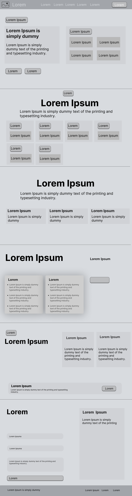

### 4.3.2. Landing Page Mock-up

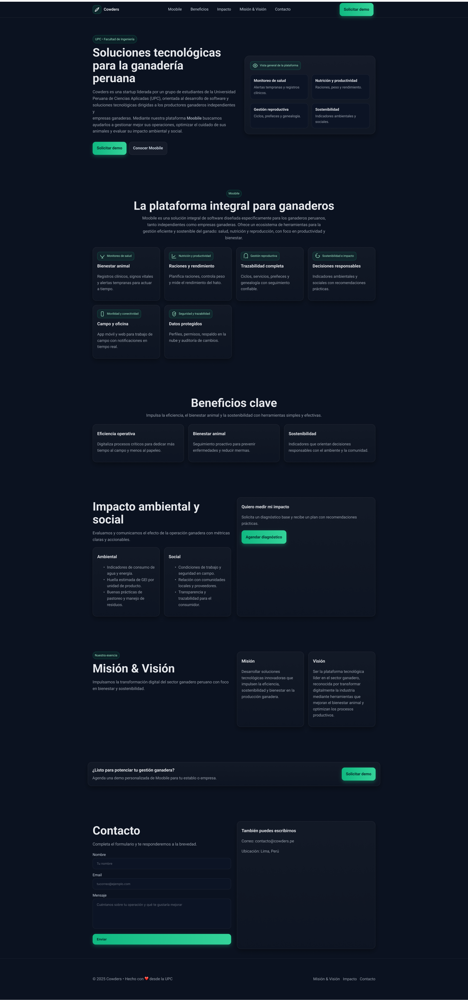

Figma: https://www.figma.com/design/CrGSyZN6jKW73TiJ2qILIv/Cowders-Landing?node-id=0-1&t=h73dRZkoV2g4gPP2-1

## 4.4. Mobile Applications UX/UI Design

### 4.4.1. Mobile Applications Wireframes

Inicio:

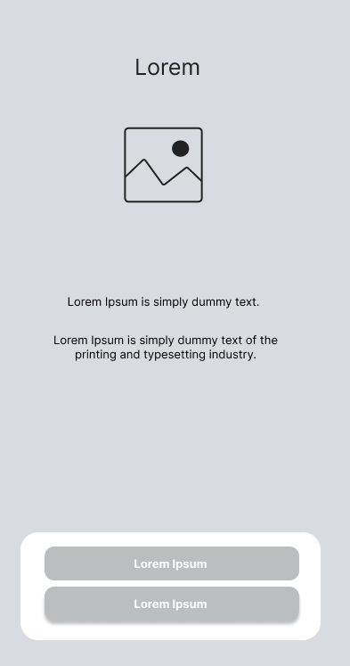

Crear Cuenta:

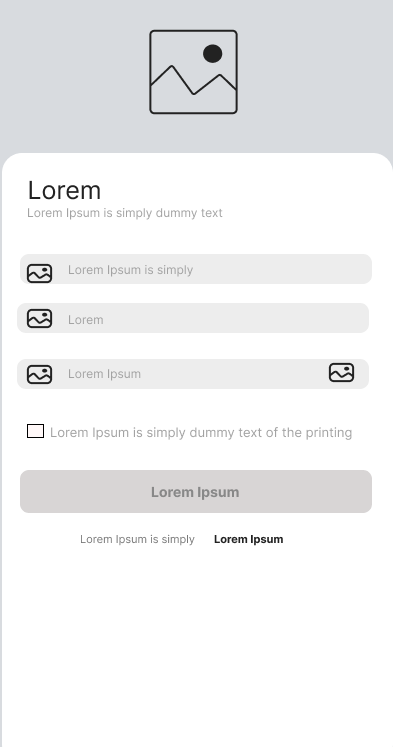

Iniciar Sesion:

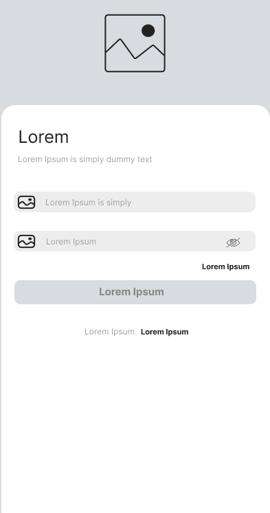

Contenido:

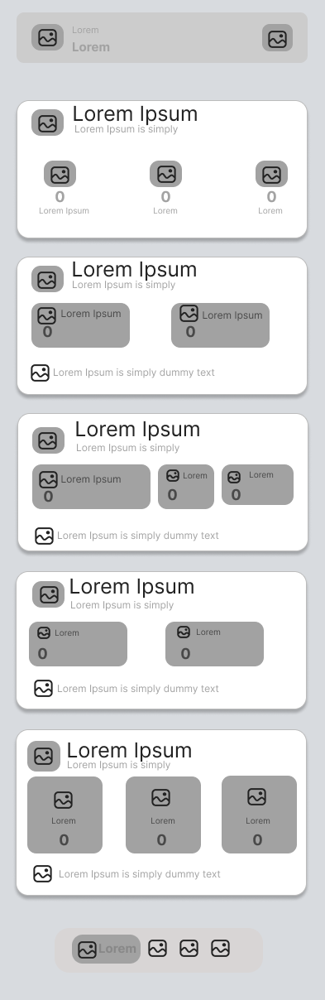

Perfil:

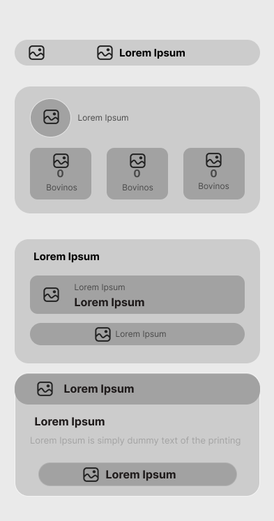

### 4.4.2. Mobile Applications Wireflow Diagrams

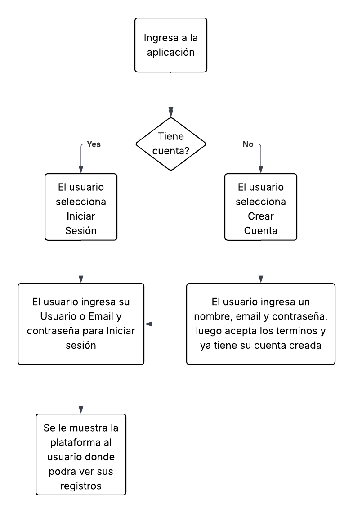

### 4.4.3. Mobile Applications Mock-ups

Inicio:

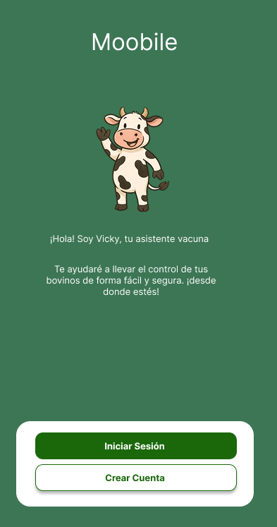

Crear Cuenta:

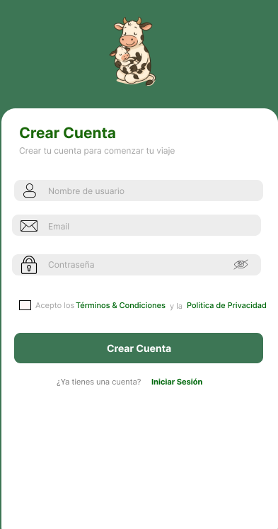

Iniciar Sesion:

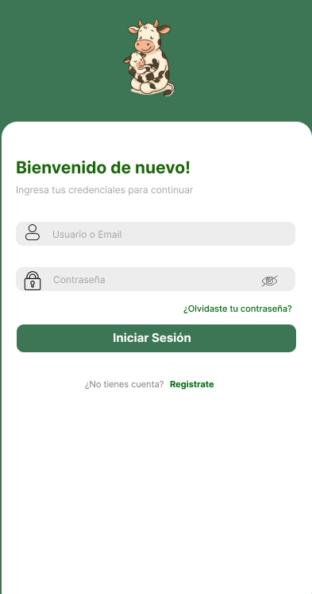

Contenido:

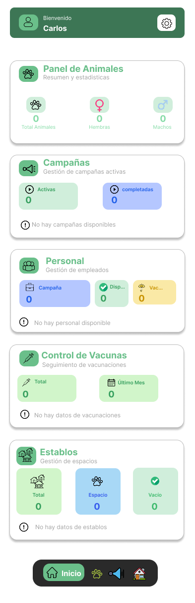

Perfil:

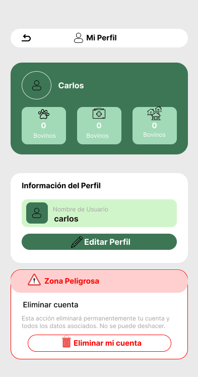

Figma: https://www.figma.com/design/m5rm63SoX3A5fbWQ2xnJRM/Cowders-Mobile?node-id=18-248&t=rPbr6AgPWNwdxWIm-1

### 4.4.4. Mobile Applications User Flow Diagrams

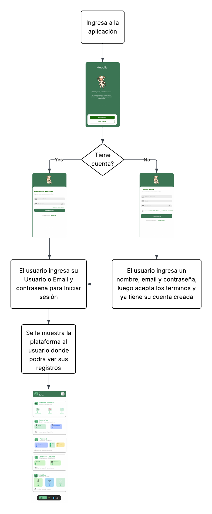

## 4.5. Mobile Applications Prototyping

Al ser contruida en Flutter, la aplicación mantiene el mismo diseño para Android e iOS.

### 4.5.1. Android Mobile Applications Prototyping

[](https://postimg.cc/1gy8YSZ6)

### 4.5.2. iOS Mobile Applications Prototyping

[](https://postimg.cc/1gy8YSZ6)

## 4.6. Web Applications UX/UI Design

### 4.6.1. Web Applications Wireframes

[](https://postimg.cc/64pcrWRz)

[](https://postimg.cc/hzPTwCjt)

[](https://postimg.cc/DJMJNnHx)

[](https://postimg.cc/cvBcbtmT)

### 4.6.2. Web Applications Wireflow Diagrams

[](https://postimg.cc/pmLTDZQY)

### 4.6.3. Web Applications Mock-ups

[](https://postimg.cc/grzgFD5R)

[](https://postimg.cc/0r4DW0q9)

[](https://postimg.cc/y3hKZTm0)

[](https://postimg.cc/47646ZZK)

### 4.6.4. Web Applications User Flow Diagrams

[](https://postimg.cc/RJmCqQVt)

## 4.7. Web Applications Prototyping

[](https://postimg.cc/bdwBfSRV)

## 4.8. Domain-Driven Software Architecture

### 4.8.1. Software Architecture Context Diagram

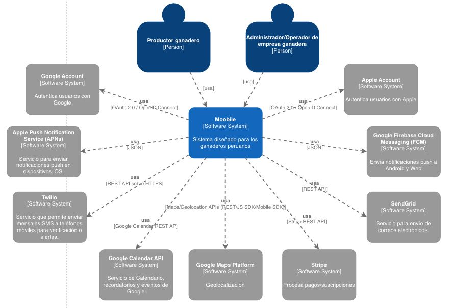

***Figura 4.8.1. Extraído de Visual Paradigm***

### 4.8.2. Software Architecture Container Diagrams

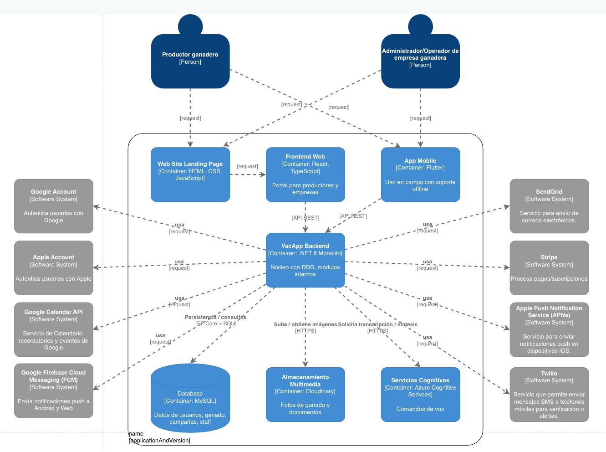

***Figura 4.8.2. Extraído de Visual Paradigm***

### 4.8.3. Software Architecture Components Diagrams

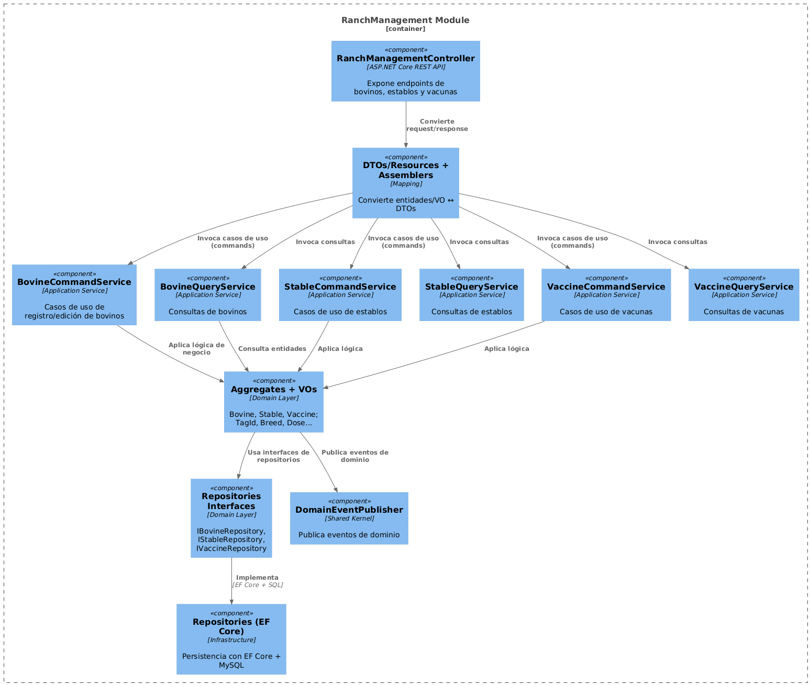

***Figura 4.8.3.1. Extraído de Plant UML***

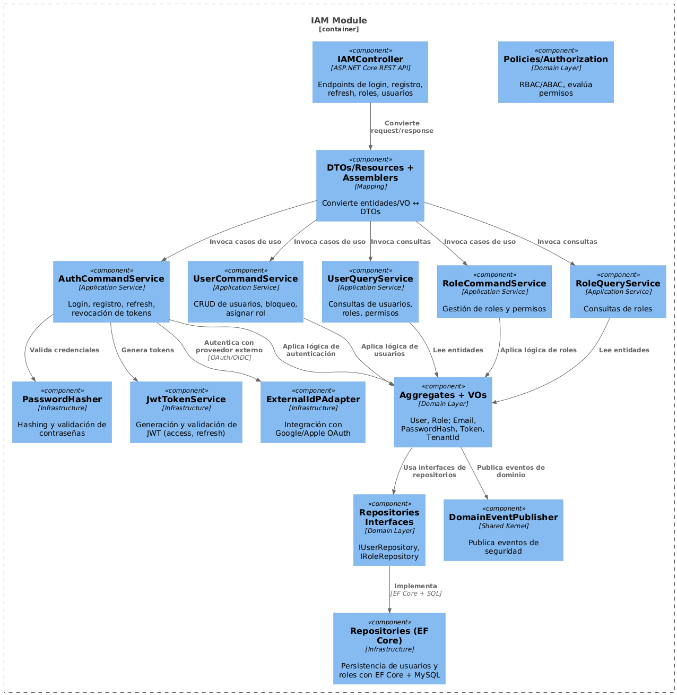

***Figura 4.8.3.2. Extraído de Plant UML***

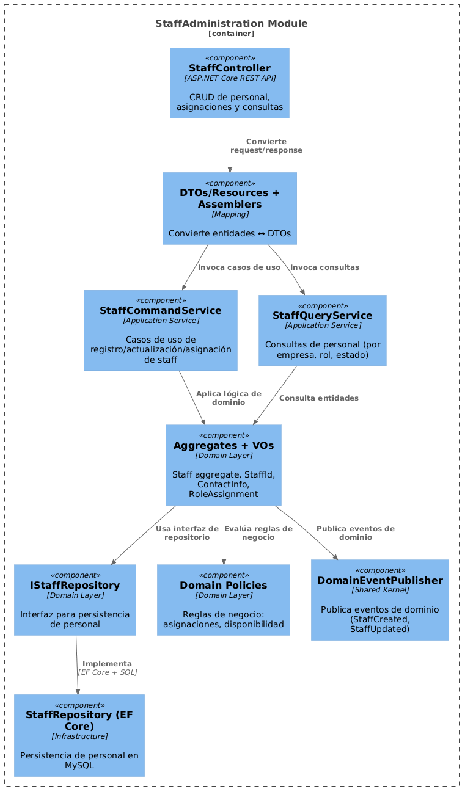

***Figura 4.8.3.3. Extraído de Plant UML***

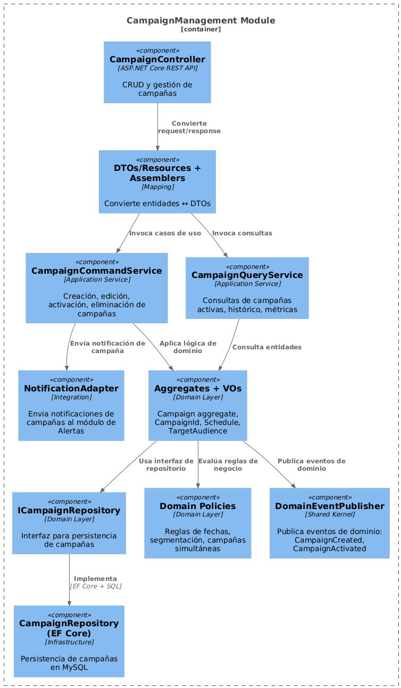

***Figura 4.8.3.4. Extraído de Plant UML***

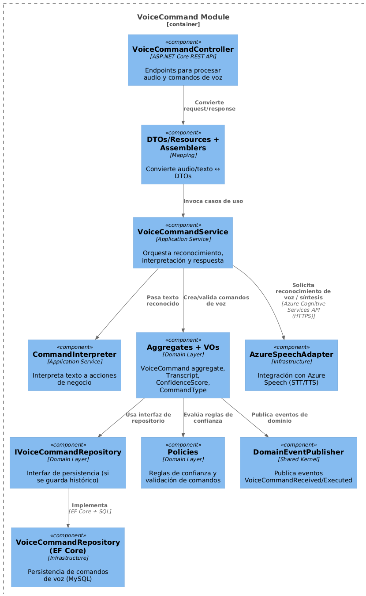

***Figura 4.8.3.5. Extraído de Plant UML***

## 4.9. Software Object-Oriented Design

### 4.9.1. Class Diagrams

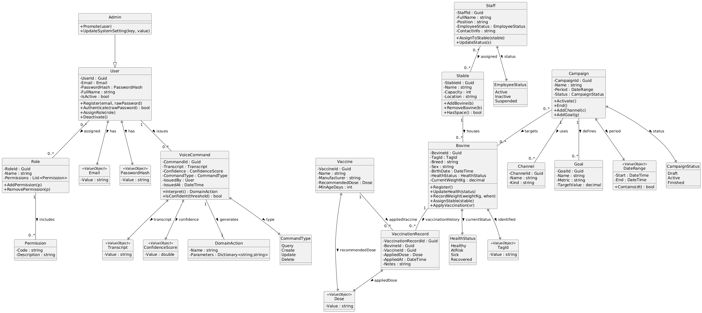

***Figura 4.9.1 Extraído de Plant UML***

### 4.9.2. Class Dictionary

# Moobile - Class Dictionary

## Core System Classes

| **Class** | **Attributes** | **Methods** | **Description** |
|-----------|----------------|-------------|-----------------|
| **User** | UserId: Guid, Email: Email, PasswordHash: PasswordHash, FullName: string, IsActive: bool | Register(email, rawPassword), Authenticate(rawPassword): bool, AssignRole(role), Deactivate() | Usuario del sistema (ganadero, operador, veterinario). Puede autenticarse y tener roles específicos. |
| **Admin** | *Inherits from User* | Promote(user), UpdateSystemSetting(key, value) | Usuario con privilegios administrativos del sistema. |
| **Role** | RoleId: Guid, Name: string, Permissions: List<Permission> | AddPermission(p), RemovePermission(p) | Rol RBAC con conjunto de permisos para control de acceso granular. |
| **Permission** | Code: string, Description: string | - | Permiso granular que un rol puede tener para acceder a funcionalidades específicas. |
| **Bovine** | BovineId: Guid, TagId: TagId, Breed: string, Sex: string, BirthDate: DateTime, HealthStatus: HealthStatus, CurrentWeightKg: decimal | Register(), UpdateHealth(status), RecordWeight(weightKg, when), AssignStable(stable), ApplyVaccination(vr) | Animal (vaca/res) con identificación, salud y métricas. Entidad central del dominio ganadero. |
| **Stable** | StableId: Guid, Name: string, Capacity: int, Location: string | AddBovine(b), RemoveBovine(b), HasSpace(): bool | Establo/corral donde se alojan bovinos. Gestiona capacidad y ubicación física. |
| **Vaccine** | VaccineId: Guid, Name: string, Manufacturer: string, RecommendedDose: Dose, MinAgeDays: int | - | Catálogo de vacunas disponibles (metadatos). Define protocolos de vacunación. |
| **VaccinationRecord** | VaccinationRecordId: Guid, BovineId: Guid, VaccineId: Guid, AppliedDose: Dose, AppliedAt: DateTime, Notes: string | - | Aplicación concreta de una vacuna a un bovino (historial). Registra trazabilidad sanitaria. |
| **Staff** | StaffId: Guid, FullName: string, Position: string, EmployeeStatus: EmployeeStatus, ContactInfo: string | AssignToStable(stable), UpdateStatus(s) | Colaborador/empleado de la operación ganadera. Gestiona recursos humanos. |
| **Campaign** | CampaignId: Guid, Name: string, Period: DateRange, Status: CampaignStatus | Activate(), End(), AddChannel(c), AddGoal(g) | Agrupa comunicaciones/acciones orientadas a objetivos específicos (vacunación, tratamiento). |
| **Channel** | ChannelId: Guid, Name: string, Kind: string (SMS/Email/Push) | - | Canal por el cual se ejecuta la campaña. Define medio de comunicación. |
| **Goal** | GoalId: Guid, Name: string, Metric: string, TargetValue: decimal | - | Objetivo/Meta medible de campaña (ej. "Vacunar 95% del ganado"). |
| **VoiceCommand** | CommandId: Guid, Transcript: Transcript, Confidence: ConfidenceScore, CommandType: CommandType, IssuedBy: User, IssuedAt: DateTime | Interpret(): DomainAction, IsConfident(threshold): bool | Orden de voz emitida por un usuario; se interpreta a una acción de dominio. Facilita el uso para ganaderos. |
| **DomainAction** | Name: string, Parameters: Dictionary<string,string> | - | Acción concreta a ejecutar en el dominio (ej. "ApplyVaccine", "RegisterBovine"). Resultado de la interpretación del comando de voz. |

## Value Objects

| **Value Object** | **Attributes** | **Methods** | **Description** |
|------------------|----------------|-------------|-----------------|
| **Email** | Value: string (validado por formato) | - | Value Object para email con validación incorporada. |
| **PasswordHash** | Value: string | - | Hash seguro (BCrypt/Argon2) de la contraseña. |
| **TagId** | Value: string | - | Identificador físico del animal (arete/chip RFID). Único por bovino. |
| **Dose** | Value: string (p. ej. "5 ml IM") | - | Dosis aplicada/recomendada con unidad y vía de administración. |
| **DateRange** | Start: DateTime, End: DateTime | Contains(dt): bool | Intervalo temporal válido de la campaña con validaciones. |
| **Transcript** | Value: string | - | Texto reconocido del comando de voz (español/quechua). |
| **ConfidenceScore** | Value: double (0–1) | - | Puntaje de confianza del reconocimiento de voz. |

## Enumerations

| **Enum** | **Values** | **Description** |
|----------|------------|-----------------|
| **HealthStatus** | Healthy, AtRisk, Sick, Recovered | Estado sanitario actual del bovino. |
| **CampaignStatus** | Draft, Active, Finished | Ciclo de vida de la campaña. |
| **EmployeeStatus** | Active, Inactive, Suspended | Estado laboral del empleado. |
| **CommandType** | Query, Create, Update, Delete | Tipo de intención del comando (consultar, crear, actualizar, eliminar). |

## Domain Relationships

- **User** puede tener multiples **Roles**
- **Role** contiene multiples **Permissions**
- **Bovine** pertenece a un **Stable**
- **Bovine** tiene multiples **VaccinationRecords**
- **VaccinationRecord** hace referencia a **Vaccine**
- **Campaign** usa multiples **Channels** y define multiples **Goals**
- **Campaign** puede apuntar a multiples **Bovines**
- **Staff** puede ser asignado a multiples **Stables**
- **User** emite varios **VoiceCommands**
- **VoiceCommand** genera un **DomainAction**

## 4.10. Database Design

### 4.10.1. Relational/Non-Relational Database Diagram

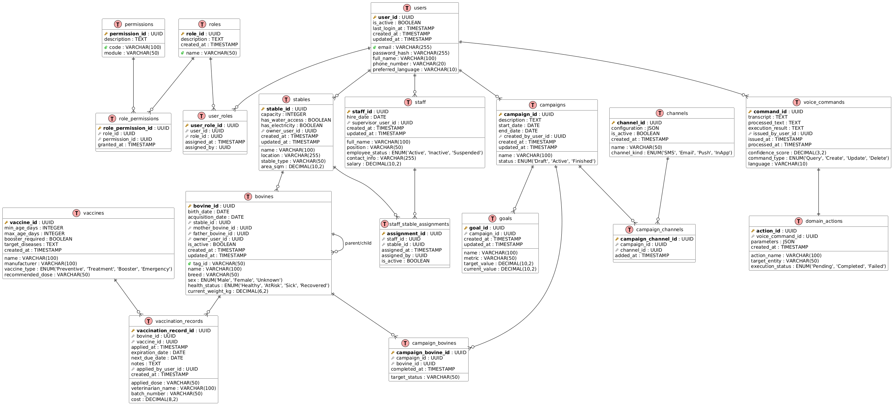

***Figura 4.10.1 Extraído de Plant UML***

# **Capítulo V: Product Implementation**

## 5.1. Software Configuration Management

### 5.1.1. Software Development Environment Configuration.
En esta sección el equipo describe e indica los nombres de productos, el propósito de uso en el proyecto, la ruta de referencia o ruta de descarga de cada uno de los productos de software que se utilizaron por los miembros de equipo para colaborar en el ciclo de vida de los productos digitales.

#### Product UX/UI Design  
Estas herramientas nos permitieron desarrollar el modelo de nuestro proyecto de manera digital.

- **[Miro](https://miro.com/app/dashboard/)**: Es una pizarra digital colaborativa en línea, que puede ser usada para la investigación, la ideación, la creación de lluvias de ideas, mapas mentales y una variedad de otras actividades colaborativas.  
- **[Figma](https://www.figma.com/design/)**: Es una herramienta de prototipo web y editor de gráficos vectorial.  
- **[Structurizr](https://structurizr.com/)**: Es una herramienta de diseño que soporta el modelo C4, para visualizar la arquitectura de software de nuestra solución.  
- **[Trello](https://trello.com/es)**: Es un software de administración de proyectos con interfaz web y con cliente para iOS y Android para organizar proyectos.  

#### Software Development  
Es una estructura aplicada al desarrollo de software. Se utilizaron distintas tecnologías para el proceso del desarrollo del proyecto.

- **[Github](https://github.com/)**: Es una forja para alojar proyectos utilizando el sistema de control de versiones Git.
- **[HTML](https://www.jetbrains.com/help/webstorm/editing-html-files.html)**: Es el código que se utiliza para estructurar y desplegar una página web y sus contenidos. Este lenguaje va a ser utilizado en el presente proyecto.  
- **[CSS](https://www.jetbrains.com/help/webstorm/style-sheets.html#ws_css_completion)**: Es un lenguaje de diseño gráfico para definir y crear la presentación de un documento estructurado escrito en un lenguaje de marcado.​ Este lenguaje se utilizará para la implementación del diseño de nuestro proyecto.  
- **[JavaScript](https://developer.mozilla.org/es/docs/Web/JavaScript)**: Es un lenguaje de secuencias de comandos que te permite crear contenido de actualización dinámica, controlar multimedia, animar imágenes y prácticamente todo lo demás.
- **[Node.js LTS](https://nodejs.org/)**: Runtime para ejecutar herramientas de build y servidores de desarrollo de React.  
- **[npm](https://www.npmjs.com/)/[yarn](https://yarnpkg.com/)/[pnpm](https://pnpm.io/)**: Gestores de paquetes para instalar dependencias del frontend.  
- **[React](https://react.dev/)**: Biblioteca para construir interfaces web basadas en componentes.  
- **[Vite](https://vitejs.dev/)**: Herramienta de bundling y dev server rápida para proyectos React.  
- **[Flutter SDK](https://flutter.dev/)**: Framework multiplataforma para apps móviles (iOS/Android) usando Dart.  
- **[Dart](https://dart.dev/)**: Lenguaje de programación utilizado por Flutter.  
- **[Node.js LTS](https://nodejs.org/)**: Runtime para ejecutar herramientas de build y servidores de desarrollo de React.    

#### Software Deployment  
Tiene la función de examinar el comportamiento del software, asimismo le hace varias pruebas y lo verifica.

- **[Github Pages](https://pages.github.com/)**: Es un servicio de alojamiento de sitio estático que toma archivos HTML, CSS y JavaScript directamente desde un repositorio en GitHub.  


### 5.1.2. Source Code Management

La gestión del código fuente, también conocida como **SCM** (Source Code Management), es una práctica de alta importancia en el desarrollo de software. El propósito de este es registrar y llevar el control de las modificaciones que los miembres del equipo realizan en los repositorios de código a lo largo del ciclo de vida del proyecto. Este sistema nos permite identificar cambios introducidos por cada desarrollador, de esta manera se asegura que todas las contribuciones estén documentadas correctamente. En este caso, utilizaremos  **GitHub** como la plataforma para gestionar las versiones.

**Landing Page: [LandingPage](https://upc-pre-202520-1asi0732-14651-cowders.github.io/landing-page/)**

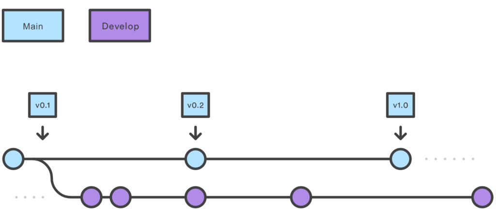

En este proyecto,implementaremos **GitFlow** como ña estrategia principal para la gestión de ramas y el control de versiones. GitFlow es un modelo estructurado que nos permite facilitar el desarrollo. Además, este permite a los equipos trabajar en múltiples funcionalidades de manera simultánea y ordenadamente. Con GitFlow, nos guiaremos según un flujo de trabajo definido que incluirá ramas dedicadas para el desarrollo de todo el ciclo de vida del software. Esta metodología nos permitirá mantener un control moderado sobre el proceso del desarrollo, logrando minimizar conflictos y asegurando la integración de funcionalidades de manera efectiva durante las fusiones.

Como se indicó anteriormente, gracias a GitFlow podremos trabajar con **branches** para realizar el desarrollo de manera progresiva. A continuación, se describirán las ramas que emplearemos:

- **Main Branches**: Son las ramas base que ordenan el flujo de trabajo del proyecto. En GitFlow hay dos esenciales:
  - **Main**: main es la línea de tiempo estable del código y refleja lo que podría ponerse en producción ahora mismo. Solo llegan a main cambios ya verificados y aprobados, por lo que debe mantenerse siempre en un estado confiable.
  - **Develop**: develop concentra el desarrollo activo. Aquí se integran nuevas funcionalidades y mejoras. Las ramas de feature nacen de develop y, al completarse y probarse, regresan a develop. Cuando develop alcanza un estado sólido para lanzar una versión, se fusiona a main y se abre una release.

- **Support Branches**: Son ramas temporales que facilitan distintas fases del proceso y luego se fusionan o eliminan. Las principales son:
  - **Feature Branches**: Se crean desde develop para trabajar en funciones o mejoras específicas.
  - **Release Branches**: Se derivan de develop cuando el código está listo para preparar una nueva versión.
  - **Hotfix Branches**: Se abren desde main para corregir fallos críticos detectados en producción.

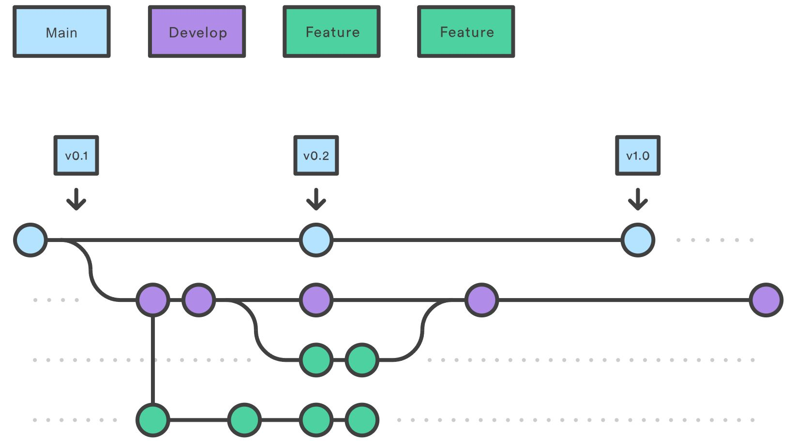

#### Conventional Commits:

La especificación de Conventional Commits es un formato sencillo para escribir mensajes de commit. Define reglas claras que ayudan a mantener un historial de cambios explícito y fácil de entender. Además, se alinea con Semantic Versioning (SemVer), ya que el tipo de commit indica si se añadió una función, se corrigió un error o se introdujeron cambios incompatibles.

- **Estructura:**
<type>[optional scope]: <description>

[optional body]

[optional footer(s)]


### 5.1.3. Source Code Style Guide & Conventions
En esta sección se evidenciarán las convenciones y estilos que se utilizarán en la creación del proyecto. Se van a mencionar las reglas y recomendaciones generales que se tendrán en cuenta para el desarrollo. Todas las nomenclaturas se definirán en inglés.

Las referencias tomadas para estas convenciones incluyen:  
- [HTML Style Guide and Coding Conventions - W3Schools](https://www.w3schools.com/html/html5_syntax.asp)  
- [Google HTML/CSS Style Guide](https://google.github.io/styleguide/htmlcssguide.html)  
- [Google Java Style Guide](https://google.github.io/styleguide/javaguide.html)  
- [Spring Boot Features](https://docs.spring.io/spring-boot/docs/current/reference/html/features.html)  
- [Gherkin Conventions](https://cucumber.io/docs/gherkin/reference/)  

#### **Nomenclatura General**  
Todos los elementos serán nombrados en inglés, incluyendo variables, funciones, clases, archivos y carpetas.  
- Se seguirá la convención camelCase para variables y funciones, y PascalCase para clases (según lenguaje).  
- Se evita el uso de abreviaciones innecesarias para mantener la claridad del código.

#### **Sangría**  
Se utilizará una indentación de **2 espacios** en los archivos, evitando el uso de la tecla **TAB**, siguiendo lo recomendado por W3Schools. 

### 5.1.4. Software Deployment Configuration
Tal como se mencionó anteriormente, la gestión del proyecto se llevará a cabo a través de Github. Asimismo, se utilizará Github Pages para la publicación y el despliegue de la landing page. 

El despliegue de la landing page de Moobile fue posible gracias al uso de las siguientes tecnologías:
  - **Git:** Sistema de control de versiones diseñado para garantizar la eficiencia y compatibilidad, el cual facilitó el trabajo en equipo durante el desarrollo de la Landing Page.
  - **GitHub:** Plataforma para el desarrollo colaborativo.
  - **Git Flow:** Herramienta que nos permitió controlar el progreso de cada integrante en el desarrollo de la Landing Page.
  - **GitHub Pages:** Servicio de GitHub que nos permitió alojar la Landing Page de manera efectiva.

Los pasos realizados fueron los siguientes:
1) En este caso, nuestro equipo utilizó GitHub Pages como método de despliegue, entonces navegaríamos al repositorio de la página y desde allí procederemos a la opción configurar.


2) Acceder a la opción de GitHub Pages y configurar las opciones para obtener el link de la landing page.


3) Tras realizar el paso anterior, se obtuvo el siguiente link: [https://upc-pre-202520-1asi0732-14651-cowders.github.io/landing-page/](https://upc-pre-202520-1asi0732-14651-cowders.github.io/landing-page/). Este nos redirigirá a la landing page desplegada.


## 5.2. Product Implementation & Deployment

### 5.2.1. Sprint Backlogs

#### TB1

| **User Story** |  | **Work-Item / Task** |  |  |  |  |
|---|---|---|---|---|---|---|
| **Id** | **Title** | **Id** | **Title** | **Estimation** | **Assigned To** | **Status (To-do / In-Process / To-Review / Done)** |
| US01 | Creación de Establos | T01 | Implementar creación de establos (backend + UI) | 3 | Bravo Gavilano, Jorge Rafael | To-do |
| US02 | Visualización de Establos | T02 | Implementar listado y detalle de establos | 2 | Gonzalez Custodio, Carlos Alberto | To-do |
| US03 | Edición de Establos | T03 | Implementar edición de establos | 3 | Martinez Ramos, Bryan Felix | To-do |
| US04 | Eliminación de Establos | T04 | Implementar eliminación (soft-delete) de establos | 2 | Roque Tello, Jack Eddie | To-do |
| US05 | Búsqueda de Establos | T05 | Implementar búsqueda por nombre/capacidad | 2 | Silva Morales, Renzo Cesar | To-do |
| US06 | Registro de Bovinos | T06 | Implementar registro de bovinos | 3 | Bravo Gavilano, Jorge Rafael | To-do |
| US07 | Visualización de Bovinos | T07 | Implementar listado y ficha de bovinos | 2 | Gonzalez Custodio, Carlos Alberto | To-do |
| US08 | Edición de Bovinos | T08 | Implementar edición de datos de bovinos | 3 | Martinez Ramos, Bryan Felix | To-do |
| US09 | Eliminación de Bovinos | T09 | Implementar eliminación de bovinos | 2 | Roque Tello, Jack Eddie | To-do |
| US10 | Búsqueda de Bovinos | T10 | Implementar búsqueda por nombre y raza | 2 | Silva Morales, Renzo Cesar | To-do |
| US11 | Asignación de Bovinos a Establos | T11 | Implementar asignación y cambio de establo | 3 | Bravo Gavilano, Jorge Rafael | To-do |
| US12 | Registro de Vacunas | T12 | Implementar registro de vacunas por bovino | 3 | Gonzalez Custodio, Carlos Alberto | To-do |
| US13 | Visualización de Vacunas | T13 | Implementar historial de vacunación | 2 | Martinez Ramos, Bryan Felix | To-do |
| US14 | Edición de Registros de Vacunas | T14 | Implementar edición de registros de vacunas | 3 | Roque Tello, Jack Eddie | To-do |
| US15 | Eliminación de Registros de Vacunas | T15 | Implementar eliminación de registros de vacunas | 2 | Silva Morales, Renzo Cesar | To-do |
| US16 | Búsqueda de Vacunas | T16 | Implementar búsqueda por bovino/fecha/tipo | 2 | Bravo Gavilano, Jorge Rafael | To-do |
| US17 | Asignación de Vacunas a Bovinos | T17 | Implementar asignación de vacunas a bovinos | 3 | Gonzalez Custodio, Carlos Alberto | To-do |
| US18 | Creación de Campañas | T18 | Implementar creación de campañas | 3 | Martinez Ramos, Bryan Felix | To-do |
| US19 | Visualización de Campañas | T19 | Implementar listado y detalle de campañas | 2 | Roque Tello, Jack Eddie | To-do |
| US20 | Edición de Campañas | T20 | Implementar edición de campañas | 3 | Silva Morales, Renzo Cesar | To-do |
| US21 | Eliminación de Campañas | T21 | Implementar eliminación de campañas | 2 | Bravo Gavilano, Jorge Rafael | To-do |
| US22 | Búsqueda de Campañas | T22 | Implementar búsqueda de campañas por fecha | 2 | Gonzalez Custodio, Carlos Alberto | To-do |
| US23 | Registro de Personal | T23 | Implementar registro de personal | 3 | Martinez Ramos, Bryan Felix | To-do |
| US24 | Visualización de Personal | T24 | Implementar listado y perfil de personal | 2 | Roque Tello, Jack Eddie | To-do |
| US25 | Edición de Personal | T25 | Implementar edición de datos de personal | 3 | Silva Morales, Renzo Cesar | To-do |
| US26 | Eliminación de Personal | T26 | Implementar eliminación de registros de personal | 2 | Bravo Gavilano, Jorge Rafael | To-do |
| US27 | Búsqueda de Personal | T27 | Implementar búsqueda de personal por nombre | 2 | Gonzalez Custodio, Carlos Alberto | To-do |
| US28 | Asignación de Personal a Campañas | T28 | Implementar asignación de personal a campañas | 3 | Martinez Ramos, Bryan Felix | To-do |
| TS01 | Visualización de Información de la Empresa | T29 | Implementar página “Sobre Cowders” | 2 | Roque Tello, Jack Eddie | To-do |
| TS02 | Exploración de Funcionalidades de Moobile | T30 | Implementar página de funcionalidades | 2 | Silva Morales, Renzo Cesar | To-do |
| TS03 | Consulta de Herramientas de Nutrición y Productividad | T31 | Implementar sección de raciones/peso/rendimiento | 3 | Bravo Gavilano, Jorge Rafael | To-do |
| TS04 | Acceso a Información de Contacto | T32 | Implementar página y formulario de contacto | 2 | Gonzalez Custodio, Carlos Alberto | To-do |
| TS05 | Conocimiento de Misión y Visión | T33 | Implementar sección de misión y visión | 1 | Martinez Ramos, Bryan Felix | To-do |
| TS06 | Vista General de la Plataforma | T34 | Implementar vista general interactiva (tour) | 3 | Roque Tello, Jack Eddie | To-do |

#### TP1

| **User Story** |  | **Work-Item / Task** |  |  |  |  |
|---|---|---|---|---|---|---|
| **Id** | **Title** | **Id** | **Title** | **Estimation** | **Assigned To** | **Status (To-do / In-Process / To-Review / Done)** |
| US01 | Creación de Establos | T01 | Implementar creación de establos (backend + UI) | 3 | Bravo Gavilano, Jorge Rafael | Done |
| US02 | Visualización de Establos | T02 | Implementar listado y detalle de establos | 2 | Gonzalez Custodio, Carlos Alberto | Done |
| US03 | Edición de Establos | T03 | Implementar edición de establos | 3 | Martinez Ramos, Bryan Felix | Done |
| US04 | Eliminación de Establos | T04 | Implementar eliminación (soft-delete) de establos | 2 | Roque Tello, Jack Eddie | Done |
| US05 | Búsqueda de Establos | T05 | Implementar búsqueda por nombre/capacidad | 2 | Silva Morales, Renzo Cesar | Done |
| US06 | Registro de Bovinos | T06 | Implementar registro de bovinos | 3 | Bravo Gavilano, Jorge Rafael | Done |
| US07 | Visualización de Bovinos | T07 | Implementar listado y ficha de bovinos | 2 | Gonzalez Custodio, Carlos Alberto | Done |
| US08 | Edición de Bovinos | T08 | Implementar edición de datos de bovinos | 3 | Martinez Ramos, Bryan Felix | Done |
| US09 | Eliminación de Bovinos | T09 | Implementar eliminación de bovinos | 2 | Roque Tello, Jack Eddie | Done |
| US10 | Búsqueda de Bovinos | T10 | Implementar búsqueda por nombre y raza | 2 | Silva Morales, Renzo Cesar | Done |
| US11 | Asignación de Bovinos a Establos | T11 | Implementar asignación y cambio de establo | 3 | Bravo Gavilano, Jorge Rafael | Done |
| US12 | Registro de Vacunas | T12 | Implementar registro de vacunas por bovino | 3 | Gonzalez Custodio, Carlos Alberto | Done |
| US13 | Visualización de Vacunas | T13 | Implementar historial de vacunación | 2 | Martinez Ramos, Bryan Felix | Done |
| US14 | Edición de Registros de Vacunas | T14 | Implementar edición de registros de vacunas | 3 | Roque Tello, Jack Eddie | Doneo |
| US15 | Eliminación de Registros de Vacunas | T15 | Implementar eliminación de registros de vacunas | 2 | Silva Morales, Renzo Cesar | Doneo |
| US16 | Búsqueda de Vacunas | T16 | Implementar búsqueda por bovino/fecha/tipo | 2 | Bravo Gavilano, Jorge Rafael | Done |
| US17 | Asignación de Vacunas a Bovinos | T17 | Implementar asignación de vacunas a bovinos | 3 | Gonzalez Custodio, Carlos Alberto | Done |
| US18 | Creación de Campañas | T18 | Implementar creación de campañas | 3 | Martinez Ramos, Bryan Felix | Done |
| US19 | Visualización de Campañas | T19 | Implementar listado y detalle de campañas | 2 | Roque Tello, Jack Eddie | Done |
| US20 | Edición de Campañas | T20 | Implementar edición de campañas | 3 | Silva Morales, Renzo Cesar | Done |
| US21 | Eliminación de Campañas | T21 | Implementar eliminación de campañas | 2 | Bravo Gavilano, Jorge Rafael | Done |
| US22 | Búsqueda de Campañas | T22 | Implementar búsqueda de campañas por fecha | 2 | Gonzalez Custodio, Carlos Alberto | Done |
| US23 | Registro de Personal | T23 | Implementar registro de personal | 3 | Martinez Ramos, Bryan Felix | Done |
| US24 | Visualización de Personal | T24 | Implementar listado y perfil de personal | 2 | Roque Tello, Jack Eddie | Done |
| US25 | Edición de Personal | T25 | Implementar edición de datos de personal | 3 | Silva Morales, Renzo Cesar | Done |
| US26 | Eliminación de Personal | T26 | Implementar eliminación de registros de personal | 2 | Bravo Gavilano, Jorge Rafael | Done |
| US27 | Búsqueda de Personal | T27 | Implementar búsqueda de personal por nombre | 2 | Gonzalez Custodio, Carlos Alberto | Done |
| US28 | Asignación de Personal a Campañas | T28 | Implementar asignación de personal a campañas | 3 | Martinez Ramos, Bryan Felix | Done |
| TS01 | Visualización de Información de la Empresa | T29 | Implementar página “Sobre Cowders” | 2 | Roque Tello, Jack Eddie | Done |
| TS02 | Exploración de Funcionalidades de Moobile | T30 | Implementar página de funcionalidades | 2 | Silva Morales, Renzo Cesar | Done |
| TS03 | Consulta de Herramientas de Nutrición y Productividad | T31 | Implementar sección de raciones/peso/rendimiento | 3 | Bravo Gavilano, Jorge Rafael | Done |
| TS04 | Acceso a Información de Contacto | T32 | Implementar página y formulario de contacto | 2 | Gonzalez Custodio, Carlos Alberto | Done |
| TS05 | Conocimiento de Misión y Visión | T33 | Implementar sección de misión y visión | 1 | Martinez Ramos, Bryan Felix | Done |
| TS06 | Vista General de la Plataforma | T34 | Implementar vista general interactiva (tour) | 3 | Roque Tello, Jack Eddie | Done |


### 5.2.2. Implemented Landing Page Evidence

1) Esta primera parte de la página presenta a Cowders y su propuesta: usar tecnología para ayudar a la ganadería peruana. Arriba se ve el menú para moverse por la web y un botón verde para pedir una demo. El título grande deja claro de qué trata el sitio y, al costado, hay cuatro recuadros que muestran de forma simple qué hace la plataforma: cuida la salud del ganado, mejora la alimentación y productividad, lleva el control reproductivo y promueve la sostenibilidad.

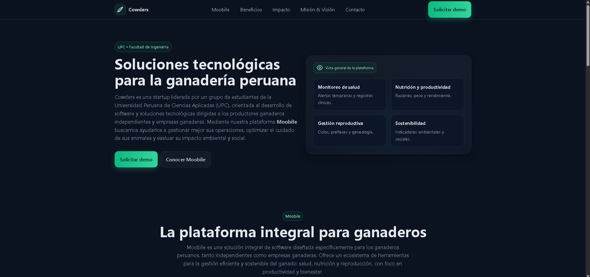

2) Aquí se explica, con ejemplos, qué incluye la plataforma “Moobile”. Cada tarjeta cuenta una función concreta: registrar la salud de los animales, planificar raciones y controlar el peso, llevar un historial confiable de ciclos y preñeces, tomar decisiones con datos ambientales, trabajar desde el campo o la oficina con la app, y mantener la información segura. Es una forma clara de ver “qué puedo hacer” si uso el sistema.

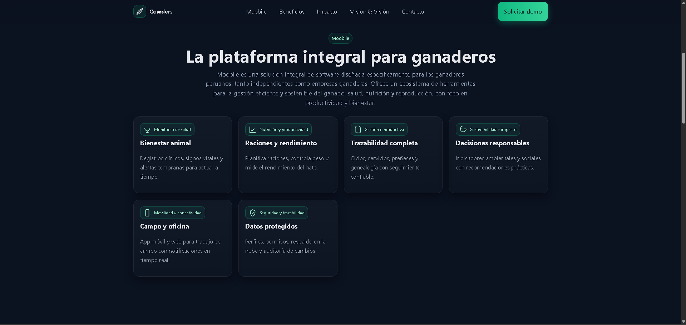

3) En esta parte se resumen los beneficios principales para el usuario: trabajar de manera más eficiente, cuidar mejor a los animales y actuar de forma responsable con el ambiente. Justo al lado aparece un recuadro que invita a “agendar diagnóstico”, pensado para que alguien interesado pueda evaluar su situación y recibir recomendaciones prácticas.

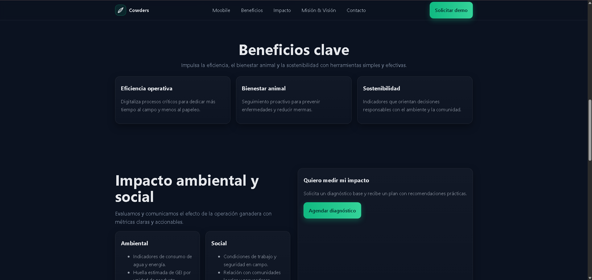

4) Esta sección muestra que el impacto de la plataforma se puede medir. Divide el contenido en dos: ambiental y social. La idea es que no solo se hable de mejoras, sino que se puedan ver con datos. A la derecha se repite la invitación a pedir un diagnóstico.

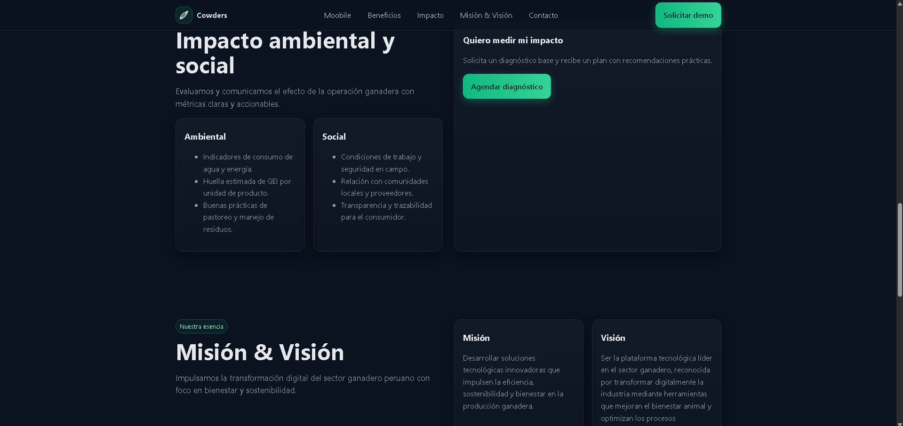

5) Aquí se cuenta la misión y la visión del proyecto.

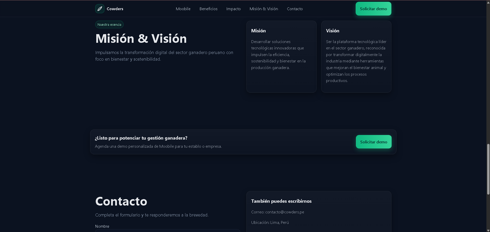

6) Finalmente, está el formulario de contacto. Al lado aparecen el email oficial y la ubicación (Lima, Perú), por si se prefiere escribir directamente. En el pie de página se ve el año, una nota de que el proyecto nació en la UPC y algunos enlaces rápidos para volver a secciones importantes.

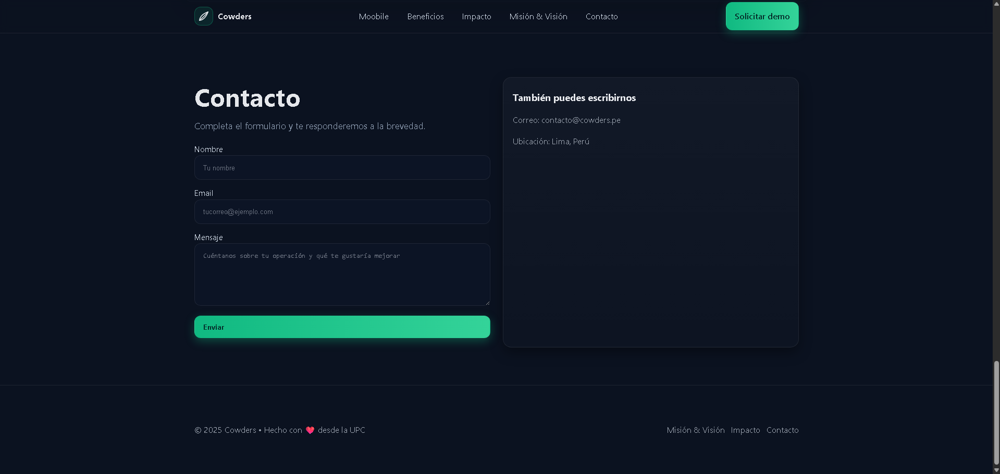

### 5.2.3. Implemented Frontend-Web Application Evidence

1) Se muestra el panel inicial de Moobile con una barra superior que incluye el logo, el saludo “Welcome, Oscar!” y el botón Logout; al centro hay un hero con el título “Welcome to Your Dashboard” y un subtítulo introductorio, una tarjeta que invita a usar comandos de voz con el atajo Ctrl/⌘+Shift+V y, debajo, la sección “Account Overview” compuesta por tres tarjetas de métricas en estado cero —Total Bovines, Total Stables y Total Vaccinations— acompañadas de iconografía; en la esquina inferior derecha aparece un botón flotante de micrófono para activar la entrada por voz.

[](https://postimg.cc/HcxRzrZN)

2) Mantiene el encabezado con saludo y el bloque “Account Overview” con las tres métricas, pero añade debajo una fila de tarjetas de acción rápida: “Bovines Management”, “Stables Management” y “Settings”, cada una con breve descripción contextual, un botón principal (Manage Bovines, Manage Stables u Open Settings) y una sugerencia de comando de voz; el diseño prioriza la navegación directa hacia las áreas clave del sistema.

[](https://postimg.cc/62mSmBFp)

3) Presenta primero el estado vacío del módulo de bovinos con el mensaje “No Bovines Registered”, un llamado a la acción “Register Your First Bovine” y un botón superior “+ Add New Bovine”.

[](https://postimg.cc/qgNWCCCh)

4) Al proceder, aparece el formulario “Register New Bovine” con campos para nombre, género, fecha de nacimiento, raza, ubicación y estable, además de un cargador de imagen opcional, y ofrece las acciones “Cancel” y “Register Bovine”, todo sobre un fondo verde suave que refuerza la temática de gestión animal.

[](https://postimg.cc/hJ454JBG)

5) Muestra el estado vacío de establos con la tarjeta “No Stables Registered”, un botón “Create Your First Stable” y el botón superior “+ Add New Stable”.

[](https://postimg.cc/1gWY89mr)

6) Al crear un establo, se despliega el formulario “Create New Stable” con dos campos esenciales junto a los botones “Cancel” y “Create Stable”, y se complementa con un bloque informativo inferior que explica la gestión de establos y la planificación de capacidad, en una paleta violeta/azulada que diferencia este flujo del de bovinos.

[](https://postimg.cc/DJHjcBbW)

7) La pantalla de configuración organiza tres secciones claras: “Profile Settings”, donde se pueden editar el username y el email con un botón de actualización; “Account Status”, que muestra el correo asociado y su estado de verificación; y “Danger Zone”, que concentra la acción irreversible de eliminación de cuenta; el layout mantiene el encabezado con el nombre del usuario y el botón Logout, y emplea tarjetas con sombras sutiles para jerarquizar la información.

[](https://postimg.cc/Yh1n1N29)

### 5.2.4. Acuerdo de Servicio - SaaS

**Acuerdo de Servicio SaaS (SaaS Agreement) - Moobile**

El presente Acuerdo de Servicio SaaS (“Acuerdo”) se celebra entre Moobile S.A.C., en adelante “Moobile”, proveedor de la plataforma digital y titular de todos los derechos asociados, y el Usuario, entendido como toda persona natural o jurídica que acceda o utilice los servicios ofrecidos por Moobile, ya sea en calidad de productor ganadero independiente o empresa ganadera.

Este documento define los derechos, obligaciones y restricciones aplicables a todos los usuarios, y se integra públicamente como parte de los Términos y Condiciones del sitio web, en cumplimiento de los principios de transparencia, accesibilidad y normativas legales vigentes.

La aceptación de este Acuerdo se realiza mediante el uso o registro en la plataforma Moobile, ya sea a través de la aplicación móvil o el sitio web oficial.

**1. Aceptación del Acuerdo**

El Usuario declara haber leído, comprendido y aceptado todos los términos del presente Acuerdo.
El uso continuado del Servicio implicará la aceptación plena y voluntaria de estas condiciones.

**2. Definiciones**

A efectos del presente documento, se entiende por:

Plataforma: El sistema digital desarrollado y administrado por Moobile que permite gestionar información veterinaria, historial de animales, citas, tratamientos, reportes y otros servicios relacionados.

Usuario: Persona natural o jurídica que accede a los servicios SaaS de Moobile.

Cuenta: Perfil personal o empresarial creado por el Usuario para acceder a la Plataforma.

Datos del Usuario: Toda información ingresada o generada por el Usuario dentro de la Plataforma, incluyendo datos de identificación, registros de animales y transacciones.

Servicio: El acceso en línea a las funcionalidades de Moobile, bajo modalidad de Software como Servicio.

**3. Objeto del Acuerdo**

El presente Acuerdo tiene por objeto establecer los términos y condiciones bajo los cuales Moobile otorga al Usuario una licencia limitada, no exclusiva, intransferible y revocable para utilizar la Plataforma, conforme a los fines previstos y de acuerdo con las disposiciones aquí establecidas.


**4. Acceso y Uso del Servicio**

4.1. El Usuario podrá acceder al Servicio mediante la creación de una cuenta personal o corporativa.
4.2. El Usuario se compromete a proporcionar información veraz, completa y actualizada.
4.3. El acceso al Servicio podrá estar sujeto a planes gratuitos o de suscripción según las condiciones comerciales vigentes.
4.4. El Usuario no podrá:

Copiar, modificar o distribuir el software sin autorización.

Utilizar la Plataforma con fines ilícitos, fraudulentos o contrarios a la moral y buenas costumbres.

Intentar descompilar o realizar ingeniería inversa sobre el software.

**5. Propiedad Intelectual**

Todos los derechos de propiedad intelectual sobre la Plataforma, su código fuente, diseño, logotipos, marcas, bases de datos y documentación son propiedad exclusiva de Moobile S.A.C..
El Usuario no adquiere derecho alguno sobre dichos elementos, salvo el uso limitado otorgado por este Acuerdo.

**6. Confidencialidad y Protección de Datos**

6.1. Moobile garantiza que los Datos del Usuario serán tratados con estricta confidencialidad y conforme a la Ley N.º 29733 – Ley de Protección de Datos Personales del Perú, su Reglamento y normas complementarias.
6.2. Los datos ingresados por el Usuario se emplearán únicamente para el funcionamiento del Servicio, la mejora de la experiencia de uso y el cumplimiento de obligaciones legales.
6.3. Moobile podrá anonimizar o agregar datos con fines estadísticos o de mejora del sistema, sin comprometer información personal identificable.

**7. Exclusión de Intermediación Financiera**

Moobile no gestiona ni intermedia pagos entre los Usuarios ni entre terceros.
Cualquier transacción económica que pudiera derivarse del uso de la Plataforma es responsabilidad exclusiva de las partes involucradas.
Moobile no asume obligación alguna respecto a la recepción, administración o transferencia de fondos, ni garantiza la validez o cumplimiento de acuerdos financieros entre Usuarios o con proveedores externos.

**8. Disponibilidad y Mantenimiento del Servicio**

8.1. Moobile se compromete a mantener una disponibilidad mínima del 99% mensual del Servicio, salvo interrupciones planificadas por mantenimiento o causas de fuerza mayor.
8.2. Los mantenimientos programados serán comunicados con antelación razonable.
8.3. Moobile podrá actualizar la Plataforma para incorporar mejoras de seguridad, rendimiento o nuevas funcionalidades, sin necesidad de notificación previa.

**9. Duración y Terminación**

9.1. El presente Acuerdo entrará en vigor desde la aceptación por parte del Usuario y se mantendrá vigente mientras éste utilice la Plataforma.
9.2. Cualquiera de las partes podrá dar por terminado el Acuerdo en cualquier momento, notificando por los canales establecidos.
9.3. Moobile podrá suspender o cancelar el acceso del Usuario en caso de incumplimiento de las condiciones aquí descritas.

**10. Limitación de Responsabilidad**

Moobile no será responsable por:

Daños indirectos, pérdida de datos o lucro cesante derivados del uso o imposibilidad de uso del Servicio.

Fallos ocasionados por la red de internet, proveedores externos o configuraciones del dispositivo del Usuario.

Contenidos o acciones realizados por terceros dentro de la Plataforma.

**11. Modificaciones al Acuerdo**

Moobile se reserva el derecho de modificar, actualizar o complementar los términos del presente Acuerdo en cualquier momento.
Las modificaciones serán publicadas en la Plataforma o notificadas al Usuario por medios electrónicos.
El uso continuado del Servicio después de la publicación de los cambios constituirá la aceptación plena de las nuevas condiciones.
En caso de no estar de acuerdo con las modificaciones, el Usuario podrá cancelar su cuenta y dejar de utilizar el Servicio sin penalización alguna.

**12. Ley Aplicable y Jurisdicción**

El presente Acuerdo se rige por las leyes de la República del Perú.
Cualquier controversia derivada del mismo será resuelta  ante los tribunales competentes de Lima, Perú.

### 5.2.5. Implemented Native-Mobile Application Evidence

1) Pantalla de bienvenida: presentamos “Moobile” y a Vicky, tu asistente vacuna. Esta vista introduce el propósito de la app (gestionar bovinos de forma simple y segura) y ofrece dos acciones claras para el usuario: Iniciar Sesión o Crear Cuenta.

[](https://postimg.cc/Jymmjwy2)

2) Inicio de sesión: formulario limpio con usuario/email y contraseña, acceso a “¿Olvidaste tu contraseña?” y botón principal Iniciar Sesión. El encabezado y la ilustración refuerzan el tono cercano; priorizamos accesibilidad con campos grandes y toggle de visibilidad de contraseña.

[](https://postimg.cc/v13R94w4)

3) Registro: alta de cuenta con nombre de usuario, email y contraseña, más la casilla de Términos & Condiciones y Política de Privacidad. El botón se habilita solo cuando los datos son válidos, promoviendo calidad de registro y cumplimiento.

[](https://postimg.cc/FfKWMGwK)

4) Home / Panel: tablero inicial con saludo y atajo a configuración, seguido de tarjetas resumen (Panel de Animales, Campañas, Personal). Es la vista de control: métricas en cero para nuevo usuario y navegación inferior para moverse por las secciones clave.

[](https://postimg.cc/YLQb6PLd)

5) Animales (estado vacío): mensaje “No hay bovinos registrados” con CTA Agregar Bovino. Este empty state guía al primer paso crítico del flujo y evita fricción inicial explicando qué hacer a continuación.

6) Registrar Bovino: formulario guiado por bloques (foto, datos básicos, fecha de nacimiento, etc.). El diseño por tarjetas y el botón de agregar foto facilitan capturar información completa y estandarizada desde campo.

[](https://postimg.cc/5j83kZj3)

7) Gestión: hub operativo para Campañas, Vacunas y Empleados con contadores de estado (activas,

[](https://postimg.cc/18d7ZDSc)

8) Gestión: hub operativo para Campañas, Vacunas y Empleados con contadores de estado (activas, vacunados, en campaña). Centraliza administración y seguimiento, reduciendo pasos y manteniendo trazabilidad de actividades sanitarias y de personal.

[](https://postimg.cc/H8tbs1y1)

9) Establos (estado vacío): invita a crear el primer establo para organizar animales por espacio físico. El texto de ayuda explica el beneficio (orden y manejo eficiente), y el botón principal inicia el flujo de creación.

[](https://postimg.cc/SnR15DBx)

### 5.2.6. Implemented RESTful API and/or Serverless Backend Evidence

**1. Staffs.**  
En esta primera captura se ve la sección “Staffs” del panel Swagger, que agrupa todas las operaciones del recurso de personal bajo el prefijo `/api/v1/staff`. La fila verde indica que es posible **crear** un registro de staff con `POST /staff`. Debajo se muestran varios bloques azules que permiten **listar** a todo el personal (`GET /staff`) y **consultar** un registro puntual (`GET /staff/{id}`). Aparecen también las operaciones para **actualizar** (`PUT /staff/{id}`, en color ámbar) y **eliminar** (`DELETE /staff/{id}`, en rojo) un staff existente. Además, la pantalla evidencia tres búsquedas especializadas: **por campaña** (`GET /staff/search-by-campaign/{campaignId}`), **por estado laboral** (`GET /staff/search-by-employee-status/{employeeStatus}`) y **por nombre** (`GET /staff/search-by-name/{name}`), cada una con su breve descripción al lado derecho. Todos los ítems muestran el candado de seguridad, confirmando que requieren autenticación.

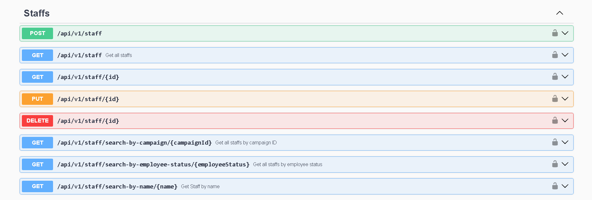

**2. User Admins y Users.**  
La segunda imagen presenta dos grupos diferenciados. Arriba, “User Admins” concentra las rutas administrativas bajo `/api/v1/admin`: se observan los endpoints para **crear** administradores (`POST /admin/create`), **iniciar sesión** (`POST /admin/sign-in`), **ver el perfil** (`GET /admin/profile`), **actualizarlo** (`PUT /admin/update-profile`) y **eliminar la propia cuenta** (`DELETE /admin/delete`). También aparecen los listados globales: **todos los admins** (`GET /admin/all`) y **todos los usuarios** (`GET /admin/all-users`) visibles para un administrador. Abajo, el bloque “Users” muestra el flujo del usuario final con `/api/v1/user`: **registro** (`POST /user/sign-up`), **inicio de sesión** (`POST /user/sign-in`), **consulta de su información** (`GET /user/get-info`), **actualización de perfil** (`PUT /user/update-profile`), **eliminación de cuenta** (`DELETE /user/delete-account`) y **acceso al perfil** (`GET /user/profile`). En ambos grupos, el candado confirma que todas las operaciones están protegidas por autenticación.

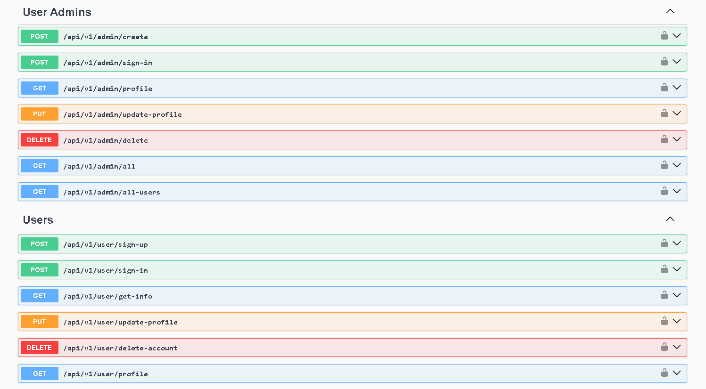

**3. Vaccines y Voice Commands.**  
La tercera captura reúne dos módulos. En la parte superior, “Vaccines” agrupa el CRUD completo bajo `/api/v1/vaccines`: **creación** (`POST /vaccines`), **listado global** (`GET /vaccines`), **consulta por ID** (`GET /vaccines/{id}`), **actualización** (`PUT /vaccines/{id}`) y **eliminación** (`DELETE /vaccines/{id}`). Se destaca además una ruta específica para **recuperar las vacunas vinculadas a un bovino** (`GET /vaccines/bovine/{bovineId}`), lo que evidencia la relación entre entidades. En la parte inferior aparece “Voice Commands”, con rutas de **procesamiento de audio** (`POST /voice-command/process-audio`) y **prueba de parsing textual** (`POST /voice-command/parse-text`), además de **listado de comandos** del usuario (`GET /voice-command`), **listado paginado** (`GET /voice-command/paginated`), **detalle** (`GET /voice-command/{id}`) y **estadísticas** de uso (`GET /voice-command/statistics`). En todos los casos se muestra el icono de candado, señal de que se exige token.

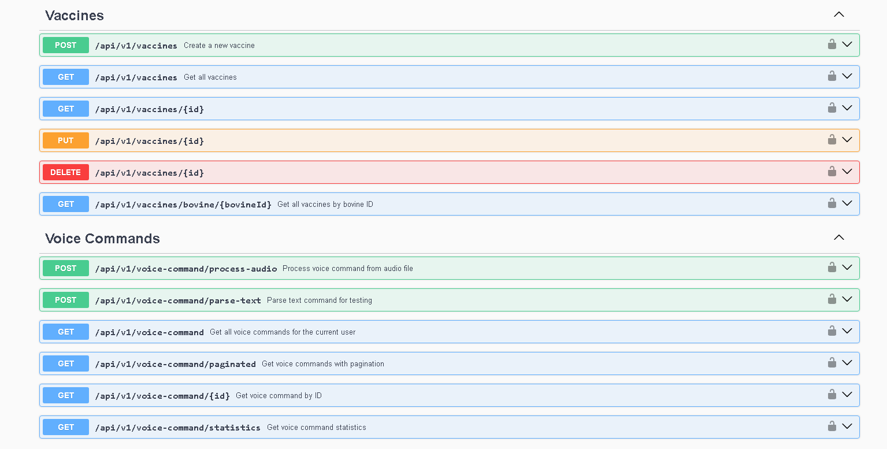

**4. Bovines y Campaigns (vista general).**  
La cuarta imagen abre con la sección “Bovines”, donde se aprecia la **creación** de bovinos (`POST /api/v1/bovines`), el **listado** general (`GET /bovines`), la **consulta por ID** (`GET /bovines/{id}`), la **actualización** (`PUT /bovines/{id}`) y la **eliminación** (`DELETE /bovines/{id}`). Se incluye además un endpoint para **listar por establo** (`GET /bovines/stable/{stableId}`), lo que confirma la vinculación con el módulo de establos.

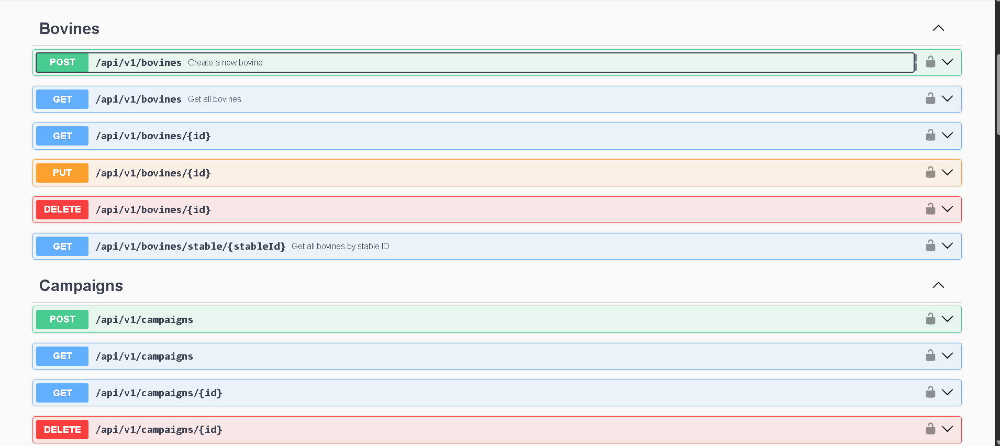

**5. Campaigns (acciones avanzadas).**  
La quinta captura profundiza en la gestión de campañas mostrando, además del CRUD, **operaciones específicas de negocio**. Se observa un `PATCH /api/v1/campaigns/{id}/update-status` para **cambiar el estado** de la campaña (por ejemplo, planificada, activa o finalizada). También aparecen `PATCH /{id}/add-goal` para **agregar objetivos** medibles y `PATCH /{id}/add-channel` para **incorporar canales** de comunicación o ejecución. Finalmente, se listan los recursos asociados con `GET /{id}/goals` y `GET /{id}/channels`, que permiten **consultar objetivos y canales** vinculados a la campaña. La presencia de los candados indica que estas acciones avanzadas exigen autenticación y, previsiblemente, privilegios administrativos.

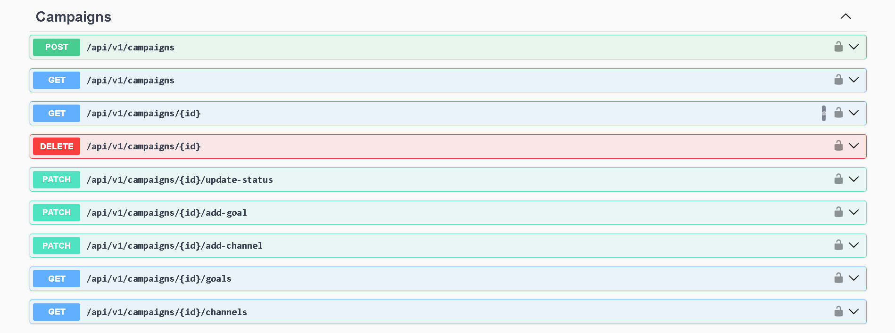

**6. Stables.**  
La última imagen corresponde a la sección “Stables”, donde se visualiza el CRUD completo del recurso **establo** bajo `/api/v1/stables`. El bloque verde indica la **creación** (`POST /stables`), seguido por el **listado** (`GET /stables`) y la **consulta individual** (`GET /stables/{id}`). Se incluyen las operaciones de **actualización** (`PUT /stables/{id}`) y **eliminación** (`DELETE /stables/{id}`), junto con una ruta de **búsqueda por nombre** (`GET /stables/name/{name}`) que facilita localizar establos específicos. Cada fila muestra el icono de candado, reafirmando el control de acceso por token.

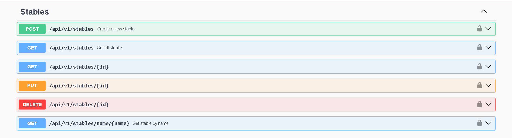

**Conclusión.**  
En conjunto, las seis capturas prueban la implementación de un backend RESTful versionado bajo `/api/v1`, con **recursos claramente separados**, **búsquedas especializadas**, **operaciones de negocio** más allá del CRUD básico, y **seguridad aplicada**.

### 5.2.7. RESTful API documentation

La plataforma expone una **API RESTful** versionada bajo el prefijo `/api/v1`, diseñada para integrarse con aplicaciones web y móviles del ecosistema (p. ej., panel de administración y app de campo). Todas las operaciones utilizan **JSON** como formato de intercambio y fechas en **ISO-8601** (por ejemplo, `2025-09-20T18:36:55.257Z`). Salvo indicación contraria, las peticiones deben incluir el encabezado `Content-Type: application/json` y las respuestas retornan códigos HTTP estándar para indicar éxito o error.

### Autenticación y control de acceso
La capa de administración se gestiona mediante los endpoints:
- `POST /api/v1/admin/create` — alta de administradores por correo.
- `POST /api/v1/admin/sign-in` — autenticación con correo y contraseña.

Tras la autenticación, el cliente debe conservar el mecanismo de sesión/ticket que emita el backend (p. ej., token) y remitirlo en cada solicitud protegida según las políticas de la plataforma. Los usuarios finales del sistema se registran con el recurso **users**, que acepta `username`, `password` y `email`, permitiendo separar perfiles operativos (staff/administradores) de credenciales de uso final.

### Convenciones de recursos
Los recursos principales siguen convenciones REST para operaciones de creación, consulta, actualización y eliminación (CRUD), aunque la implementación exacta de cada verbo puede variar según permisos y flujos del dominio. La API modela entidades del negocio ganadero y sanitario: **Bovines**, **Campaigns**, **Stables**, **Staffs**, **Users** y **Vaccines**, además de un conjunto de **comandos de voz** para ingreso asistido de datos.

### Modelo de datos y validaciones

**Bovines** representa el individuo bovino y concentra metadatos de gestión: `name`, `description`, `startDate`, `endDate`, `status`, `stableId`, y colecciones de `goals` y `channels`. Cada canal contiene `id`, `type` y `details`, habilitando la trazabilidad de comunicaciones o intervenciones asociadas al animal.

**Campaigns** comparte la misma estructura que Bovines (`name`, `description`, `startDate`, `endDate`, `status`, `goals`, `channels`, `stableId`) y se utiliza para planificar y monitorear acciones coordinadas (p. ej., jornadas de sanidad o trazabilidad).

**Stables** define los establos o corrales con `name` y un `limit` de ocupación, insumo clave para reglas de capacidad y asignación.

**Staffs** modela al personal operativo con `name`, `employeeStatus` (estado laboral codificado) y `campaignId` para vincularlo a campañas activas.

**Users** registra credenciales de acceso de usuarios finales (`username`, `password`, `email`).

**Vaccines** registra eventos de vacunación: `id`, `name`, `vaccineType`, `vaccineDate`, `vaccineImg` (evidencia), y `bovineId` para la relación con el individuo.

**Voice Commands** aporta dos endpoints:
- `POST /api/v1/voice-command/process-audio` — recepción de audio binario/base64.
- `POST /api/v1/voice-command/parse-text` — JSON con `text`.  
Ambos transforman insumos de voz o texto libre en estructuras accionables del dominio.

### Flujos típicos
Un flujo estándar de registro sanitario inicia con la **autenticación** del administrador, la **creación** o **actualización** de un **Bovine** (asignando `stableId` y `status`), la **planificación** de una **Campaign** con `startDate`/`endDate` y canales de comunicación, la **asignación** de **Staffs** a la campaña (`campaignId`), y finalmente el **registro** de **Vaccines** por `bovineId`, incluyendo la evidencia `vaccineImg` y la `vaccineDate`. Alternativamente, el personal puede usar **comandos de voz** para acelerar el ingreso de datos desde campo, enviando audio o texto para su interpretación.

### Errores y respuestas
La API emplea códigos HTTP convencionales:
- `201 Created` en altas,
- `200 OK` en lecturas/actualizaciones,
- `400 Bad Request` por validaciones fallidas,
- `401 Unauthorized` si faltan credenciales,
- `404 Not Found` cuando el recurso no existe,
- `409 Conflict` ante colisiones de negocio.

Los cuerpos de error devuelven un mensaje descriptivo y, cuando corresponde, detalles de validación por campo para facilitar la corrección por parte del cliente.

### Versionado y compatibilidad
El prefijo `/api/v1` encapsula cambios controlados. Evoluciones futuras que rompan compatibilidad deberán publicarse bajo un nuevo prefijo (p. ej., `/api/v2`) manteniendo la convivencia temporal de versiones para migraciones seguras. Cambios aditivos (nuevos campos opcionales) se consideran compatibles y no requieren cambio de versión.

### Seguridad y cumplimiento
Los datos sensibles (credenciales, imágenes de vacunación) deben viajar exclusivamente bajo **TLS**. Se recomienda aplicar políticas de caducidad de tokens, límites de tamaño para `vaccineImg`, y controles de acceso por rol para operaciones críticas (creación de administradores, reasignación de establos, eliminación de historiales). Los registros de auditoría (quién, cuándo y qué cambió) son recomendables para trazabilidad sanitaria y cumplimiento.

### Observabilidad y límites operativos
La API está pensada para integrarse con métricas y trazas (latencia por endpoint, ratio de error, throughput). En escenarios de alta concurrencia (campañas masivas), es aconsejable emplear **paginación** en listados, **idempotencia** en operaciones de escritura (especialmente en cargas desde voz) y **rate limiting** por cliente para preservar la estabilidad. Los tiempos (`startDate`, `endDate`, `vaccineDate`) deben procesarse en **UTC** y, de ser necesario, adaptarse a la zona horaria del cliente en la presentación.

> Con este contrato, los equipos cliente (web y móvil) disponen de un **núcleo uniforme y predecible** para operar procesos de inventario bovino, campañas sanitarias, asignación de personal y registro de vacunas, además de capacidades de **entrada por voz** que agilizan el trabajo en campo manteniendo la integridad de los datos.

### 5.2.8. Team Collaboration Insights

Durante el transcurso del Sprint 1, el equipo trabajó de manera conjunta en el repositorio del Informe, empleando herramientas como GitHub, Trello y Google Meet para organizar tareas, compartir avances y aclarar dudas de forma constante.

A continuación, gracias a la sección de Insights de GitHub, se incluyen gráficos que reflejan el nivel de participación de cada miembro del equipo en el repositorio del Informe.

#### Tabla de identificación del equipo

| Username (GitHub) | Nombre completo          | Código de estudiante |
| ----------------- | ------------------------ | -------------------- |
| @rrenzosilva       | Renzo Silva Morales | U20221C362           |
| @UPC-Skylar        | Jack Roque Tello     | U20221C448           |
| @Rafooo6           | Jorge Bravo Gavilano   | U202212535           |
| @CarlosGC-LP       | Carlos Gonzalez Custodio  | U202020230           |

#### Analíticos de GitHub

##### Informe

[](https://postimg.cc/9DNX5gz8)

## 5.3. Video About-the-Product

Con el fin de complementar la documentación y proporcionar una visión más detallada del alcance de Moobile, se ha creado un video de presentación titulado *About The Product*.

Este video resume de manera clara las principales funcionalidades de la aplicación, su propuesta de valor y cómo ayuda a mejorar la gestión del ganado bovino. Además, ofrece a los interesados una experiencia más directa con el producto, facilitando la comprensión de sus características y beneficios a través de un formato dinámico y accesible.

[](https://postimg.cc/4YRwf71k)

Link para ver el video: [Click aquí](https://upcedupe-my.sharepoint.com/:v:/g/personal/u20221c362_upc_edu_pe/Eekw13tWv7FIqGV9iAdzeqcB29U4hkBeUu80jbD8TVKBvg?nav=eyJyZWZlcnJhbEluZm8iOnsicmVmZXJyYWxBcHAiOiJTdHJlYW1XZWJBcHAiLCJyZWZlcnJhbFZpZXciOiJTaGFyZURpYWxvZy1MaW5rIiwicmVmZXJyYWxBcHBQbGF0Zm9ybSI6IldlYiIsInJlZmVycmFsTW9kZSI6InZpZXcifX0%3D&e=h3ZmLl)

# **Part II: Verification, Validation & Pipeline**
  
# **Capítulo VI: Product Verification & Validation**

## 6.1. Testing Suites & Validation
  
### 6.1.1. Core Entities Unit Tests
  
El proyecto Moobile.Platform.Domain.Tests contiene las pruebas unitarias de las entidades principales del dominio de la plataforma Moobile. Estas pruebas garantizan la correcta funcionalidad de los módulos base definidos en las historias de usuario correspondientes a la gestión de establos, bovinos, vacunas, campañas y personal (staff).

Cada conjunto de pruebas se encuentra organizado en carpetas según la entidad a la que pertenece, manteniendo así una estructura modular y de fácil mantenimiento.

#### Estructura general del proyecto de pruebas
```
Moobile.Platform.Domain.Tests
 ├── Bovine
 │   └── BovineTests.cs
 ├── Campaign
 │   └── CampaignTests.cs
 ├── Shared
 │   ├── CampaignCommandFactory.cs
 │   ├── RanchManagementCommandFactory.cs
 │   └── StaffCommandFactory.cs
 ├── Stable
 │   └── StableTests.cs
 ├── Staff
 │   └── StaffTests.cs
 └── Vaccine
     └── VaccineTests.cs

```
#### Cobertura de pruebas por módulo
- Gestión de Establos (EP01)
Las pruebas implementadas en StableTests.cs validan los casos definidos en las historias de usuario US01–US05, abarcando la creación, visualización, edición, eliminación y búsqueda de establos. Se comprueba que las operaciones CRUD se ejecuten correctamente y que las reglas de negocio (como capacidad o nombre único) sean respetadas.

- Gestión de Bovinos (EP02)
El archivo BovineTests.cs cubre las funcionalidades descritas en las historias US06–US11, relacionadas con el registro, visualización, actualización, eliminación, búsqueda y asignación de bovinos a establos. Las pruebas verifican la integridad de los datos y la correcta asociación entre bovinos y establos.

- Gestión de Vacunas (EP03)
En VaccineTests.cs se implementan las pruebas para las historias US12–US17, que incluyen el registro, consulta, modificación, eliminación, búsqueda y asignación de vacunas a bovinos. Estas pruebas aseguran la consistencia del historial sanitario y la relación entre vacunas y animales.

- Gestión de Campañas (EP04)
El archivo CampaignTests.cs valida las historias US18–US22, garantizando el correcto manejo de campañas sanitarias o de mejoramiento, incluyendo su creación, consulta, actualización, eliminación y búsqueda por fecha.

- Gestión de Personal (EP05)
Las pruebas en StaffTests.cs verifican las historias US23–US28, enfocadas en el registro, visualización, edición, eliminación, búsqueda y asignación del personal a campañas. Se valida la consistencia de roles y asignaciones dentro del sistema.

### 6.1.2. Core Integration Tests

En este apartado, se describe cómo se llevaron a cabo las pruebas de integración para verificar que los distintos módulos o bounded contexts del sistema operen adecuadamente al interactuar entre sí.  
El objetivo principal fue garantizar que la comunicación entre los distintos servicios del backend funcione correctamente, asegurando que las operaciones como creación, consulta o actualización de datos se ejecuten de manera coherente e integrada.  

---

### Campaign Bounded Context

```csharp
using System.Net;
using System.Net.Http.Json;
using System.Threading.Tasks;
using Microsoft.AspNetCore.Mvc.Testing;
using NUnit.Framework;
using Moobile_Platform;
using Moobile_Platform.CampaignManagement.Interfaces.REST.Resources;
using System.Collections.Generic;
using System;
using Microsoft.AspNetCore.Hosting;
using System.IO;
using System.Linq;
using Microsoft.VisualStudio.TestPlatform.TestHost;

using GoalType = Moobile_Platform.CampaignManagement.Domain.Model.Aggregates.Goal;
using ChannelType = Moobile_Platform.CampaignManagement.Domain.Model.Aggregates.Channel;


namespace Moobile_Platform.Tests.Integration.Campaign
{
    [TestFixture]
    public class CampaignIntegrationTests
    {
        private HttpClient _client = null!;
        private CustomWebApplicationFactory<Program> _factory = null!; 
        
        private const int MOCKED_USER_ID = 99; 
        private const int MOCKED_STABLE_ID = 1;
        private int _createdCampaignId = 0; 

        [SetUp]
        public void SetUp()
        {
            _factory = new CustomWebApplicationFactory<Program>(); 
            _client = _factory.CreateClient(); 
            _client.DefaultRequestHeaders.Add("X-User-Id", MOCKED_USER_ID.ToString());
        }

        [TearDown]
        public void TearDown()
        {
            _client?.Dispose();
            _factory?.Dispose();
        }
        
        // TEST 1: Crear una campaña correctamente 
        [Test, Order(1)]
        public async Task TEST_1_CreateCampaign_ShouldReturnCreated_WhenDataIsValid()
        {
            var goalsList = new List<GoalType> 
            {
                new GoalType("Aumentar Leche", "Litros", 500, 0, 0) 
            };
            
            var channelsList = new List<ChannelType> 
            { 
                new ChannelType("Email", "Contacto a staff", 0) 
            };

            var createResource = new CreateCampaignResource(
                Name: "Campaña de Integración Base",
                Description: "Campaña de prueba para tests encadenados.",
                StartDate: DateTime.UtcNow.Date.AddDays(1),
                EndDate: DateTime.UtcNow.Date.AddDays(11),
                Status: "Planned", 
                Goals: goalsList, 
                Channels: channelsList, 
                StableId: MOCKED_STABLE_ID
            );

            var response = await _client.PostAsJsonAsync("/api/v1/campaigns", createResource);

            Assert.That(response.StatusCode, Is.EqualTo(HttpStatusCode.Created), $"Esperado Created, recibido {response.StatusCode}. Contenido: {await response.Content.ReadAsStringAsync()}");
            
            var created = await response.Content.ReadFromJsonAsync<CampaignResource>();
            
            _createdCampaignId = created.Id;
            Assert.That(_createdCampaignId, Is.GreaterThan(0), "La campaña debe tener un ID asignado por la base de datos.");
        }
        
        // TEST 2: Obtener todas las campañas del usuario autenticado
        [Test, Order(2)]
        public async Task TEST_2_GetAllCampaigns_ShouldReturnOk_WithListOfCampaigns()
        {
            if (_createdCampaignId == 0) await TEST_1_CreateCampaign_ShouldReturnCreated_WhenDataIsValid();

            var response = await _client.GetAsync("/api/v1/campaigns");

            Assert.That(response.StatusCode, Is.EqualTo(HttpStatusCode.OK));
            
            var campaigns = await response.Content.ReadFromJsonAsync<List<CampaignResource>>();
            
            Assert.That(campaigns, Is.Not.Null);
            Assert.That(campaigns!.Count, Is.GreaterThanOrEqualTo(1), "La lista debe contener al menos una campaña.");
            
            Assert.That(campaigns.Any(c => c.Id == _createdCampaignId), Is.True, "La lista debe contener el ID de la campaña recién creada.");
        }
        
        // TEST 3: Actualizar el estado de una campaña existente 
        [Test, Order(3)]
        public async Task TEST_3_UpdateCampaignStatus_ShouldReturnOk()
        {
            if (_createdCampaignId == 0) await TEST_1_CreateCampaign_ShouldReturnCreated_WhenDataIsValid();
            
            var newStatus = "Completed";
            var updateStatusResource = new UpdateCampaignStatusResource(Status: newStatus);

            var response = await _client.PatchAsJsonAsync($"/api/v1/campaigns/{_createdCampaignId}/update-status", updateStatusResource);

            Assert.That(response.StatusCode, Is.EqualTo(HttpStatusCode.OK), "Se esperaba una respuesta OK (200) al actualizar.");
            
            var updated = await response.Content.ReadFromJsonAsync<CampaignResource>();
            Assert.That(updated!.Status, Is.EqualTo(newStatus), "El estado debe haber sido actualizado correctamente.");
        }
        
        public class CustomWebApplicationFactory<TProgram> : WebApplicationFactory<TProgram> where TProgram : class
        {
            protected override IWebHostBuilder CreateWebHostBuilder()
            {
                var builder = base.CreateWebHostBuilder();
                
                var assembly = typeof(TProgram).Assembly;
                builder.UseContentRoot(Path.GetDirectoryName(assembly.Location)!);
                
                return builder;
            }

            protected override void ConfigureWebHost(IWebHostBuilder builder)
            {
                builder.UseEnvironment("Development");
            }
        }
    }
}
```

## Ranch Bounded Context

```csharp
using System.Net;
using System.Net.Http.Json;
using System.Threading.Tasks;
using Microsoft.AspNetCore.Mvc.Testing;
using NUnit.Framework;
using Moobile_Platform; 
using System.IO;
using Microsoft.AspNetCore.Hosting;
using System.Collections.Generic;
using System.Linq;
using System;
using Microsoft.VisualStudio.TestPlatform.TestHost;

using Moobile_Platform.RanchManagement.Interfaces.REST.Resources; 

namespace Moobile_Platform.Tests.Integration.Ranch
{
    [TestFixture]
    public class StableIntegrationTests
    {
        private HttpClient _client = null!;
        private CustomWebApplicationFactory<Program> _factory = null!; 
        
        private const int MOCKED_USER_ID = 99; 
        private int _createdStableId = 0; 

        [SetUp]
        public void SetUp()
        {
            _factory = new CustomWebApplicationFactory<Program>(); 
            _client = _factory.CreateClient(); 
            _client.DefaultRequestHeaders.Add("X-User-Id", MOCKED_USER_ID.ToString());
        }

        [TearDown]
        public void TearDown()
        {
            _client?.Dispose();
            _factory?.Dispose();
        }
        
        // TEST 1: Creación de Establos
        [Test, Order(1)]
        public async Task R_I_1_CreateStable_ShouldReturnCreated_WhenDataIsValid()
        {
            var createResource = new CreateStableResource(
                Name: "Establo Pruebas Integración",
                Limit: 75
            );

            var response = await _client.PostAsJsonAsync("/api/v1/stables", createResource);

            Assert.That(response.StatusCode, Is.EqualTo(HttpStatusCode.Created), $"Esperado Created, recibido {response.StatusCode}. Contenido: {await response.Content.ReadAsStringAsync()}");
            
            var created = await response.Content.ReadFromJsonAsync<StableResource>();
            
            Assert.That(created, Is.Not.Null);
            Assert.That(created!.Name, Is.EqualTo(createResource.Name));
            
            _createdStableId = created.Id;
            Assert.That(_createdStableId, Is.GreaterThan(0), "El Establo debe tener un ID válido.");
        }
        
        // TEST 2: Visualización de Establos
        [Test, Order(2)]
        public async Task R_I_2_GetStables_ShouldReturnOk_AndContainCreatedStable()
        {
            if (_createdStableId == 0) await R_I_1_CreateStable_ShouldReturnCreated_WhenDataIsValid();

            var response = await _client.GetAsync("/api/v1/stables");

            Assert.That(response.StatusCode, Is.EqualTo(HttpStatusCode.OK));
            
            var stables = await response.Content.ReadFromJsonAsync<List<StableResource>>();
            
            Assert.That(stables, Is.Not.Null);
            Assert.That(stables!.Count, Is.GreaterThanOrEqualTo(1), "Debe contener al menos el establo creado.");
            Assert.That(stables.Any(s => s.Id == _createdStableId), Is.True, "La lista debe contener el ID del establo recién creado.");
        }
        
        // TEST 3: Eliminación de Establos
        [Test, Order(3)]
        public async Task R_I_3_DeleteStable_ShouldReturnNoContent()
        {
            if (_createdStableId == 0) await R_I_1_CreateStable_ShouldReturnCreated_WhenDataIsValid();

            var response = await _client.DeleteAsync($"/api/v1/stables/{_createdStableId}");

            Assert.That(response.StatusCode, Is.EqualTo(HttpStatusCode.NoContent), "Esperado No Content (204) después de la eliminación.");
            
            var getResponse = await _client.GetAsync($"/api/v1/stables/{_createdStableId}");
            Assert.That(getResponse.StatusCode, Is.EqualTo(HttpStatusCode.NotFound), "El recurso no debe existir después de ser eliminado.");
        }
        
        public class CustomWebApplicationFactory<TProgram> : WebApplicationFactory<TProgram> where TProgram : class
        {
            protected override IWebHostBuilder CreateWebHostBuilder()
            {
                var builder = base.CreateWebHostBuilder();
                
                var assembly = typeof(TProgram).Assembly;
                builder.UseContentRoot(Path.GetDirectoryName(assembly.Location)!);
                
                return builder;
            }

            protected override void ConfigureWebHost(IWebHostBuilder builder)
            {
                builder.UseEnvironment("Development");
            }
        }
    }
}
```

## Staff Boundend Context

```csharp
using System.Net;
using System.Net.Http.Json;
using System.Threading.Tasks;
using Microsoft.AspNetCore.Mvc.Testing;
using NUnit.Framework;
using Moobile_Platform; 
using System.IO;
using Microsoft.AspNetCore.Hosting;
using System.Collections.Generic;
using System.Linq;
using System;
using Microsoft.VisualStudio.TestPlatform.TestHost;

using Moobile_Platform.StaffAdministration.Interfaces.REST.Resources; 

namespace Moobile_Platform.Tests.Integration.Staff
{
    [TestFixture]
    public class StaffIntegrationTests
    {
        private HttpClient _client = null!;
        private CustomWebApplicationFactory<Program> _factory = null!; 
        
        private const int MOCKED_USER_ID = 99; 
        private const int MOCKED_CAMPAIGN_ID = 1; 
        private int _createdStaffId = 0; 
        private const int STATUS_ACTIVE = 1;
        private const int STATUS_SUSPENDED = 2; 

        [SetUp]
        public void SetUp()
        {
            _factory = new CustomWebApplicationFactory<Program>(); 
            _client = _factory.CreateClient(); 
            _client.DefaultRequestHeaders.Add("X-User-Id", MOCKED_USER_ID.ToString());
        }

        [TearDown]
        public void TearDown()
        {
            _client?.Dispose();
            _factory?.Dispose();
        }

        // TEST 1: Registro de Personal
        [Test, Order(1)]
        public async Task S_I_1_CreateStaff_ShouldReturnCreated_WhenDataIsValid()
        {
            var createResource = new CreateStaffResource(
                Name: "Juan Pérez Integración",
                EmployeeStatus: STATUS_ACTIVE, 
                CampaignId: MOCKED_CAMPAIGN_ID 
            );

            var response = await _client.PostAsJsonAsync("/api/v1/staff", createResource);

            Assert.That(response.StatusCode, Is.EqualTo(HttpStatusCode.Created), $"Esperado Created, recibido {response.StatusCode}. Contenido: {await response.Content.ReadAsStringAsync()}");
            
            var created = await response.Content.ReadFromJsonAsync<StaffResource>();
            
            Assert.That(created, Is.Not.Null);
            Assert.That(created!.Name, Is.EqualTo(createResource.Name));
            
            _createdStaffId = created.Id;
            Assert.That(_createdStaffId, Is.GreaterThan(0), "El Staff debe tener un ID válido.");
        }
        
        // TEST 2: Visualización de Personal
        [Test, Order(2)]
        public async Task S_I_2_GetStaffById_ShouldReturnOk_WhenStaffExists()
        {
            if (_createdStaffId == 0) await S_I_1_CreateStaff_ShouldReturnCreated_WhenDataIsValid();

            var response = await _client.GetAsync($"/api/v1/staff/{_createdStaffId}");

            Assert.That(response.StatusCode, Is.EqualTo(HttpStatusCode.OK));
            
            var staff = await response.Content.ReadFromJsonAsync<StaffResource>();
            
            Assert.That(staff, Is.Not.Null);
            Assert.That(staff!.Id, Is.EqualTo(_createdStaffId));
        }
        
        // TEST 3: Edición de Personal
        [Test, Order(3)]
        public async Task S_I_3_UpdateStaff_ShouldReturnOk()
        {
            if (_createdStaffId == 0) await S_I_1_CreateStaff_ShouldReturnCreated_WhenDataIsValid();
            
            var newName = "Juan Pérez - Suspendido";
            
            var updateResource = new UpdateStaffResource
            {
                Name = newName, 
                EmployeeStatus = STATUS_SUSPENDED, 
                CampaignId = MOCKED_CAMPAIGN_ID
            };

            var response = await _client.PutAsJsonAsync($"/api/v1/staff/{_createdStaffId}", updateResource);

            Assert.That(response.StatusCode, Is.EqualTo(HttpStatusCode.OK), $"Esperado OK, recibido {response.StatusCode}. Contenido: {await response.Content.ReadAsStringAsync()}");
            
            var updated = await response.Content.ReadFromJsonAsync<StaffResource>();
            
            Assert.That(updated, Is.Not.Null);
            Assert.That(updated!.Name, Is.EqualTo(newName), "El nombre debe haberse actualizado.");
            Assert.That(updated.EmployeeStatus, Is.EqualTo(STATUS_SUSPENDED), "El estado del empleado debe ser 'Suspended' (código 2).");
        }
        
        public class CustomWebApplicationFactory<TProgram> : WebApplicationFactory<TProgram> where TProgram : class
        {
            protected override IWebHostBuilder CreateWebHostBuilder()
            {
                var builder = base.CreateWebHostBuilder();
                
                var assembly = typeof(TProgram).Assembly;
                builder.UseContentRoot(Path.GetDirectoryName(assembly.Location)!);
                
                return builder;
            }

            protected override void ConfigureWebHost(IWebHostBuilder builder)
            {
                builder.UseEnvironment("Development");
            }
        }
    }
}

```

## Voice Boundend Context
```csharp
using System.Net;
using System.Net.Http.Json;
using System.Threading.Tasks;
using Microsoft.AspNetCore.Mvc.Testing;
using NUnit.Framework;
using Moobile_Platform; 
using System.IO;
using Microsoft.AspNetCore.Hosting;
using System.Collections.Generic;
using System;
using System.Linq;
using Microsoft.VisualStudio.TestPlatform.TestHost;

using Moobile_Platform.VoiceCommand.Interfaces.REST.Resources; 

using Moobile_Platform.VoiceCommand.Domain.Model.ValueObjects; 

namespace Moobile_Platform.Tests.Integration.VoiceCommand
{
    [TestFixture]
    public class VoiceCommandIntegrationTests
    {
        private HttpClient _client = null!;
        private CustomWebApplicationFactory<Program> _factory = null!; 
        
        private const int MOCKED_USER_ID = 99;
        private int _createdVoiceId = 0; 
        private const string ENDPOINT_BASE = "/api/v1/voices";

        [SetUp]
        public void SetUp()
        {
            _factory = new CustomWebApplicationFactory<Program>(); 
            _client = _factory.CreateClient(); 
            _client.DefaultRequestHeaders.Add("X-User-Id", MOCKED_USER_ID.ToString());
        }

        [TearDown]
        public void TearDown()
        {
            _client?.Dispose();
            _factory?.Dispose();
        }
        
        private VoiceResource CreateVoiceResource(string originalText, VoiceCommandType type, bool isValid)
        {
            return new VoiceResource(
                Id: 0, 
                OriginalText: originalText,
                CommandType: type, 
                Parameters: isValid ? "stableName=A" : null,
                IsValid: isValid,
                WasExecuted: isValid, 
                UserId: MOCKED_USER_ID,
                CreatedAt: DateTime.UtcNow,
                ExecutedAt: isValid ? DateTime.UtcNow : (DateTime?)null,
                ErrorMessage: isValid ? null : "Invalid command type.",
                ResponseMessage: isValid ? "Command processed." : "Command not recognized."
            );
        }
        
        // TEST 1: Registro de un Comando de Voz 
        [Test, Order(1)]
        public async Task V_I_1_CreateVoiceCommand_ShouldReturnCreated_WhenDataIsValid()
        {
            var createResource = CreateVoiceResource(
                "crear establo", 
                VoiceCommandType.InitializeToCreateStable, 
                isValid: true
            );

            var response = await _client.PostAsJsonAsync(ENDPOINT_BASE, createResource);

            Assert.That(response.StatusCode, Is.EqualTo(HttpStatusCode.Created), $"Esperado Created, recibido {response.StatusCode}. Contenido: {await response.Content.ReadAsStringAsync()}");
            
            var created = await response.Content.ReadFromJsonAsync<VoiceResource>();
            
            Assert.That(created, Is.Not.Null);
            Assert.That(created!.OriginalText, Is.EqualTo(createResource.OriginalText), "El texto original debe coincidir.");
            
            _createdVoiceId = created.Id;
            Assert.That(_createdVoiceId, Is.GreaterThan(0), "El comando de voz debe tener un ID válido.");
        }
        
        // TEST 2: Recuperación del Historial de Comandos
        [Test, Order(2)]
        public async Task V_I_2_GetVoiceCommandLogs_ShouldReturnOk_AndContainCreatedCommand()
        {
            if (_createdVoiceId == 0) await V_I_1_CreateVoiceCommand_ShouldReturnCreated_WhenDataIsValid();

            var response = await _client.GetAsync(ENDPOINT_BASE);

            Assert.That(response.StatusCode, Is.EqualTo(HttpStatusCode.OK));
            
            var commands = await response.Content.ReadFromJsonAsync<List<VoiceResource>>();
            
            Assert.That(commands, Is.Not.Null);
            Assert.That(commands.Any(c => c.Id == _createdVoiceId), Is.True, "La lista debe contener el ID del comando recién creado.");
        }
        
        // TEST 3: Comando Inválido o Mal Formado
        [Test, Order(3)]
        public async Task V_I_3_CreateVoiceCommand_ShouldReturnBadRequest_WhenOriginalTextIsMissing()
        {
            var invalidResource = CreateVoiceResource(
                originalText: "", 
                VoiceCommandType.Unknown, 
                isValid: false
            );

            var response = await _client.PostAsJsonAsync(ENDPOINT_BASE, invalidResource);
            
            Assert.That(response.StatusCode, Is.EqualTo(HttpStatusCode.BadRequest), $"Esperado BadRequest, recibido {response.StatusCode}.");
        }
        
        public class CustomWebApplicationFactory<TProgram> : WebApplicationFactory<TProgram> where TProgram : class
        {
            protected override IWebHostBuilder CreateWebHostBuilder()
            {
                var builder = base.CreateWebHostBuilder();
                
                var assembly = typeof(TProgram).Assembly;
                builder.UseContentRoot(Path.GetDirectoryName(assembly.Location)!);
                
                return builder;
            }

            protected override void ConfigureWebHost(IWebHostBuilder builder)
            {
                builder.UseEnvironment("Development");
            }
        }
    }
}
```

## IAM Boundend Context
```csharp
using System.Net;
using System.Net.Http.Json;
using System.Threading.Tasks;
using Microsoft.AspNetCore.Mvc.Testing;
using NUnit.Framework;
using Moobile_Platform; 
using System.IO;
using Microsoft.AspNetCore.Hosting;
using System;
using System.Linq;
using Microsoft.EntityFrameworkCore;
using Microsoft.Extensions.DependencyInjection;
using Microsoft.VisualStudio.TestPlatform.TestHost;

using Moobile_Platform.IAM.Interfaces.REST.Resources.UserResources;
using Moobile_Platform.Shared.Infrastructure.Persistence.EFC.Configuration;

namespace Moobile_Platform.Tests.Integration.IAM
{
    [TestFixture]
    public class IAMIntegrationTests
    {
        private HttpClient _client = null!;
        private CustomWebApplicationFactory<Program> _factory = null!; 
        
        private string _testUsername = $"user_{Guid.NewGuid():N}"; 
        private const string TEST_PASSWORD = "PasswordSeguro123!";
        private const string ENDPOINT_SIGNUP = "/api/v1/auth/sign-up";
        private const string ENDPOINT_SIGNIN = "/api/v1/auth/sign-in";

        [SetUp]
        public void SetUp()
        {
            _factory = new CustomWebApplicationFactory<Program>(); 
            _client = _factory.CreateClient(); 
        }

        [TearDown]
        public void TearDown()
        {
            _client?.Dispose();
            _factory?.Dispose();
        }
        
        // TEST 1: Registro
        [Test, Order(1)]
        public async Task I_I_1_SignUpUser_ShouldReturnCreated_WhenDataIsValid()
        {
            var signUpResource = new SignUpResource(
                Username: _testUsername,
                Password: TEST_PASSWORD,
                Email: $"{_testUsername}@moobile.com"
            );

            var response = await _client.PostAsJsonAsync(ENDPOINT_SIGNUP, signUpResource);

            Assert.That(response.StatusCode, Is.EqualTo(HttpStatusCode.Created), $"Esperado Created, recibido {response.StatusCode}. Contenido: {await response.Content.ReadAsStringAsync()}");
            
            var createdUser = await response.Content.ReadFromJsonAsync<UserResource>();
            Assert.That(createdUser, Is.Not.Null, "La respuesta debe contener la información del usuario registrado.");
        }

        // TEST 2: Login
        [Test, Order(2)]
        public async Task I_I_2_SignInUser_ShouldReturnOk_WhenCredentialsAreValid()
        {
            await I_I_1_SignUpUser_ShouldReturnCreated_WhenDataIsValid();
            
            var signInResource = new SignInResource(
                Email: $"{_testUsername}@moobile.com",
                UserName: _testUsername,
                Password: TEST_PASSWORD
            );
            
            var response = await _client.PostAsJsonAsync(ENDPOINT_SIGNIN, signInResource);

            Assert.That(response.StatusCode, Is.EqualTo(HttpStatusCode.OK), $"Esperado OK, recibido {response.StatusCode}. Contenido: {await response.Content.ReadAsStringAsync()}");

            var authResponse = await response.Content.ReadFromJsonAsync<UserResource>();
            Assert.That(authResponse, Is.Not.Null);
            Assert.That(authResponse!.token, Is.Not.Null, "La respuesta debe contener el token después de un login exitoso."); 
        }
        
        public class CustomWebApplicationFactory<TProgram> : Microsoft.AspNetCore.Mvc.Testing.WebApplicationFactory<TProgram> where TProgram : class
        {
            protected override IWebHostBuilder CreateWebHostBuilder()
            {
                var builder = base.CreateWebHostBuilder();
                
                var assembly = typeof(TProgram).Assembly;
                builder.UseContentRoot(Path.GetDirectoryName(assembly.Location)!);
                
                return builder;
            }

            protected override void ConfigureWebHost(IWebHostBuilder builder)
            {
                builder.ConfigureServices(services =>
                {
                    var descriptor = services.SingleOrDefault(
                        d => d.ServiceType == typeof(Microsoft.EntityFrameworkCore.DbContextOptions<AppDbContext>));

                    if (descriptor != null)
                    {
                        services.Remove(descriptor);
                    }

                    services.AddDbContext<AppDbContext>(options =>
                    {
                        options.UseInMemoryDatabase($"TestDb-{Guid.NewGuid()}");
                    });
                });
                
                builder.UseEnvironment("Development");
            }
        }
    }
}
```

### 6.1.3. Core Behavior-Driven Development

En el siguiente apartado, se mostrarán las principales pruebas realizadas con Cucumber.
Acceptance Tests:

Url del repositorio: https://github.com/upc-pre-202520-1asi0732-14651-cowders/moobile-acceptance-tests

#### **Feature 01 - Registro de Usuarios**


*Figura 6.1.1: Extraído de Visual Studio Code*

#### **Feature 02 - Login de Usuarios**


*Figura 6.1.2: Extraído de Visual Studio Code*

#### **Feature 03 - Creación de Establos**


*Figura 6.1.3: Extraído de Visual Studio Code*

#### **Feature 04 - Visualización de Establos**


*Figura 6.1.4: Extraído de Visual Studio Code*

#### **Feature 05 - Edición de Establos**


*Figura 6.1.5: Extraído de Visual Studio Code*

#### **Feature 06 - Eliminación de Establos**


*Figura 6.1.6: Extraído de Visual Studio Code*

#### **Feature 07 - Busqueda de Establos**


*Figura 6.1.7: Extraído de Visual Studio Code*

#### **Feature 08 - Registro de Bovinos**


*Figura 6.1.8: Extraído de Visual Studio Code*

#### **Feature 09 - Visualización de Bovinos**


*Figura 6.1.9: Extraído de Visual Studio Code*

#### **Feature 10 - Edición de Bovinos**


*Figura 6.1.10: Extraído de Visual Studio Code*

#### **Feature 11 - Eliminación de Bovinos**


*Figura 6.1.11: Extraído de Visual Studio Code*

#### **Feature 12 - Busqueda de Bovinos**


*Figura 6.1.12: Extraído de Visual Studio Code*

#### **Feature 13 - Asignación de Bovinos a Establos**


*Figura 6.1.13: Extraído de Visual Studio Code*

#### **Feature 14 - Registro de Vacunas**


*Figura 6.1.14: Extraído de Visual Studio Code*

#### **Feature 15 - Visualización de Vacunas**


*Figura 6.1.15: Extraído de Visual Studio Code*

#### **Feature 16 - Eliminación de Registros de Vacunas**


*Figura 6.1.16: Extraído de Visual Studio Code*

#### **Feature 17 - Edición de Registros de Vacunas**


*Figura 6.1.17: Extraído de Visual Studio Code*

#### **Feature 18 - Búsqueda de Vacunas**


*Figura 6.1.18: Extraído de Visual Studio Code*

#### **Feature 19 - Asignación de Vacunas a Bovinos**


*Figura 6.1.19: Extraído de Visual Studio Code*

#### **Feature 20 - Creación de Campañas**


*Figura 6.1.20: Extraído de Visual Studio Code*

#### **Feature 21 - Visualización de Campañas**


*Figura 6.1.21: Extraído de Visual Studio Code*

#### **Feature 22 - Edición de Campañas**


*Figura 6.1.22: Extraído de Visual Studio Code*

#### **Feature 23 - Eliminación de Campañas**


*Figura 6.1.23: Extraído de Visual Studio Code*

#### **Feature 24 - Búsqueda de Campañas**


*Figura 6.1.24: Extraído de Visual Studio Code*

#### **Feature 25 - Registro de Personal**


*Figura 6.1.25: Extraído de Visual Studio Code*

#### **Feature 26 - Visualización de Personal**


*Figura 6.1.26: Extraído de Visual Studio Code*

#### **Feature 27 - Edición de Personal**


*Figura 6.1.27: Extraído de Visual Studio Code*

#### **Feature 28 - Eliminación de Personal**


*Figura 6.1.28: Extraído de Visual Studio Code*

#### **Feature 29 - Búsqueda de Personal**


*Figura 6.1.29: Extraído de Visual Studio Code*

#### **Feature 30 - Asignación de Personal a Campañas**


*Figura 6.1.30: Extraído de Visual Studio Code*

### 6.1.4. Core System Tests

En esta sección se presentan las pruebas esenciales aplicadas al sistema central, con el fin de verificar su funcionamiento adecuado. Dichas pruebas están orientadas a la validación de la lógica central del sistema, asegurando que los componentes críticos operen conforme a los requerimientos previamente establecidos.

| EP01: Gestión de Establos |
| :------------: |
| **Como** usuario ganadero, <br> **Quiero** gestionar los establos <br> **Para** mantener organizadas las instalaciones donde se alojan los bovinos. |
| Prueba con Selenium: <br> [](https://postimg.cc/47ZPmtL3) |

| EP02: Gestión de Bovinos |
| :------------: |
| **Como** usuario ganadero, <br> **Quiero** gestionar la información de mis bovinos <br> **Para** llevar un control detallado del ganado. |
| Prueba con Selenium: <br> [](https://postimg.cc/gXWpjSbh) |

| EP03: Gestión de Vacunas |
| :------------: |
| **Como** usuario ganadero, <br> **Quiero** gestionar las vacunas aplicadas a mis bovinos <br> **Para** llevar un control sanitario adecuado. |
| Prueba con Selenium: <br> [](https://postimg.cc/YhfWCZcy) |

| EP04: Gestión de Campañas |
| :------------: |
| **Como** empresario ganadero, <br> **Quiero** gestionar campañas sanitarias y de mejoramiento <br> **Para** coordinar actividades a gran escala. |
| Prueba con Selenium: <br> [](https://postimg.cc/HVZWtcKW) |

| EP05: Gestión de Staff |
| :------------: |
| **Como** empresario ganadero, <br> **Quiero** gestionar el personal que trabaja en mi operación ganadera <br> **Para** organizar eficientemente los recursos humanos. |
| Prueba con Selenium: <br> [](https://postimg.cc/fkb4Dw52) |

## 6.2. Static testing & Verification

### 6.2.1. Static Code Analysis

#### 6.2.1.1. Coding standard & Code conventions

#### 6.2.1.2. Code Quality & Code Security

### 6.2.2. Reviews

## 6.3. Validation Interviews

### 6.3.1. Diseño de Entrevistas

### 6.3.2. Registro de Entrevistas

### 6.3.3. Evaluaciones según heurísticas

## 6.4. Auditoría de Experiencias de Usuario

### 6.4.1. Auditoría realizada

#### 6.4.1.1. Información del grupo auditado

- Nombre del grupo auditado: DebtGo

- Responsable del equipo: Daniel Jhared Chavarri Zarzosa

- Integrantes del grupo auditado:

  - Maria Fernanda Peña Riofrio

  - Daniel Jhared Chavarri Zarzosa

  - Anderson José William Gamarrra Vega

#### 6.4.1.2. Cronograma de auditoría realizada

<table>
  <thead>
    <tr>
      <th>Actividad</th>
      <th>Fecha de ejecución</th>
      <th>Duración estimada</th>
      <th>Responsables</th>
    </tr>
  </thead>
  <tbody>
    <tr>
      <td>Planificación de auditoría</td>
      <td>08/11/2025</td>
      <td>1 día</td>
      <td>Equipo DebtGo</td>
    </tr>
    <tr>
      <td>Evaluación heurística de la plataforma</td>
      <td>12/11/2025</td>
      <td>1 día</td>
      <td>Equipo DebtGo</td>
    </tr>
    <tr>
      <td>Documentación de hallazgos preliminares</td>
      <td>13/11/2025</td>
      <td>1 día</td>
      <td>Equipo DebtGo</td>
    </tr>
    <tr>
      <td>Entrega del informe de evaluación de heurísticas final</td>
      <td>14/11/2025</td>
      <td>-</td>
      <td>Equipo DebtGo</td>
    </tr>
  </tbody>
</table>

#### 6.4.1.3. Contenido de auditoría realizada

### 6.4.2. Auditoría recibida

#### 6.4.2.1. Información del grupo auditor

- Nombre del grupo auditor: DebtGo

- Responsable del equipo: Daniel Jhared Chavarri Zarzosa

- Integrantes del grupo auditor:

  - Maria Fernanda Peña Riofrio

  - Daniel Jhared Chavarri Zarzosa

  - Anderson José William Gamarrra Vega

- Objetivo de la auditoría: Evaluar la usabilidad de las funciones principales de la plataforma Moobile, identificar hallazgos críticos y proponer mejoras alineadas a principios de usabilidad reconocidos (heurísticas de Nielsen).

#### 6.4.2.2. Cronograma de auditoría recibida

#### 6.4.2.3. Contenido de auditoría recibida

#### 6.4.2.4. Resumen de modificaciones para subsanar hallazgos

# **Capítulo VII: DevOps Practices**
  
## 7.1. Continuous Integration    
  
Para el proyecto VacApp, desarrollado con React y TypeScript en el frontend y C#/.NET en el backend, se implementó un sistema de Integración Continua (CI) mediante GitHub Actions.
Este pipeline automatiza tareas clave como la validación del código, la verificación de tipos, la ejecución de pruebas y la preparación para el despliegue.
De esta manera, cada commit o pull request activa un flujo de validaciones automáticas que permiten detectar errores tempranamente, mantener la calidad del código y asegurar entregas más estables y confiables en los entornos de Azure App Service y Netlify.

### 7.1.1. Tools and Practices
  
Para la implementación de VacApp, desplegamos el frontend en Netlify y el backend en Azure App Service, garantizando un entorno escalable, seguro y de fácil mantenimiento.
Adoptamos el flujo Gitflow para la gestión de ramas en GitHub, junto con Conventional Commits para mantener una estructura clara en los mensajes de commit y SemVer para el versionamiento semántico.
Implementamos integración continua con GitHub Actions, que ejecuta automáticamente validaciones de código, análisis estático con ESLint, comprobación de tipos con TypeScript, y pruebas automatizadas tanto en el frontend como en el backend.

Para el frontend, empleamos pruebas unitarias y de integración usando React Testing Library junto con Vitest, lo que permite verificar la funcionalidad de los componentes y la interacción del usuario en entornos simulados.
En el backend, utilizamos NUnit como framework de testing principal, complementado con Selenium para realizar pruebas end-to-end sobre la interfaz de usuario, validando la integración entre el sistema web y los flujos de usuario reales.
Esta infraestructura de pruebas nos permite detectar errores de manera temprana y asegurar la estabilidad del producto antes de su despliegue.


| Característica     | NUnit | Selenium |
| ------------------ | ----- | -------- |
|                    |    |       |
| Tipo | Framework de testing unitario para .NET| Framework de testing end-to-end para aplicaciones web |
| Lenguaje principal | C#  | Multilenguaje (C#, Java, Python, etc.)         |
| Enfoque            | Pruebas unitarias y de integración en el backend       | Pruebas funcionales simulando la interacción del usuario         |
| Ventajas Clave     | Estructura modular basada en fixtures, assertions y test cases parametrizados. Integración directa con Azure DevOps y GitHub Actions.      |  Ejecución de pruebas en navegadores reales, automatización de flujos completos y validación visual del frontend.        |
| Compatibilidad     | Integración con .NET y Azure Pipelines      | Soporte para múltiples navegadores y entornos CI/C         |
| Tipos de Prueba    | Unitarias, integración, regresión | End-to-End, UI, smoke y regresión visual|

<br>

**Workflow de Integración Continua**
Para asegurar la calidad y consistencia en el desarrollo de VacApp, todos los miembros del equipo siguen el siguiente flujo de trabajo:
	
  
  **1.	Desarrollo local:** Una vez finalizada una feature, el desarrollador ejecuta las pruebas automatizadas con NUnit y Selenium en su entorno local para garantizar la ausencia de errores o regresiones.

**2.	Pull Request:** Si las pruebas son exitosas, se crea una pull request hacia la rama develop, siguiendo el formato de commit definido por Conventional Commits e incluyendo el número de la PR (por ejemplo, #23).
  
  **3.	Pipeline automático:** Al subir la PR al repositorio remoto, GitHub Actions ejecuta automáticamente los pipelines configurados para:
	•	Validar el código con ESLint y TypeScript.
	•	Correr las suites de pruebas con NUnit para el backend.
	•	Ejecutar pruebas end-to-end con Selenium sobre entornos controlados.
  
  **4.	Revisión y pruebas de integración:** Una vez aprobada la PR, los cambios se integran a la rama release, donde se ejecutan pruebas de integración adicionales en un entorno similar a producción (Azure Test Environment).
	
  **5.	Despliegue a producción:** Si las pruebas son exitosas, se aprueba la pull request hacia main, lo que desencadena un despliegue automático:
	•	Frontend: en Netlify.
	•	Backend: en Azure App Service.
En caso de errores o fallas en los pipelines, el cambio se devuelve a la rama del desarrollador para su corrección antes de reiniciar el ciclo.  
  
### 7.1.2. Build & Test Suite Pipeline Components  
  
Este documento describe los Épicos (Epics) principales de la plataforma **Moobile-Platform**, organizados bajo el formato de Historias de Usuario para definir flujos de trabajo clave desde la perspectiva del usuario ganadero.

--

## Epic 01: Gestión de Establos

| Rol | Objetivo | Razón |
| :--- | :--- | :--- |
| **Como usuario ganadero,** | **Quiero gestionar los establos en la plataforma** | **Para mantener organizadas las instalaciones** donde se alojan los bovinos. |


--

## Epic 02: Gestión de Bovinos

| Rol | Objetivo | Razón |
| :--- | :--- | :--- |
| **Como usuario ganadero,** | **Quiero gestionar los bovinos registrados en mis establos** | **Para mantener un control organizado y actualizado** del ganado en la plataforma. |


--

## Epic 03: Edición de Bovinos

| Rol | Objetivo | Razón |
| :--- | :--- | :--- |
| **Como usuario ganadero,** | **Quiero editar la información de los bovinos,** | **Para actualizar sus datos cuando sea necesario** (peso, edad, raza o estado reproductivo). |


--

## Epic 04: Gestión de Campañas

| Rol | Objetivo | Razón |
| :--- | :--- | :--- |
| **Como empresario ganadero,** | **Quiero gestionar campañas sanitarias y de mejoramiento** | **Para coordinar actividades a gran escala** (ej., vacunación, suplementación) y asegurar el cuidado óptimo. |


--

## Epic 05: Gestión de Staff

| Rol | Objetivo | Razón |
| :--- | :--- | :--- |
| **Como empresario ganadero,** | **Quiero gestionar el personal que trabaja en mi operación ganadera** | **Para organizar eficientemente los recursos humanos** y asignar tareas. |


## 7.2. Continuous Delivery

En este apartado se puede encontrar tres puntos principales a tomar en cuenta: La automatización de pruebas (pruebas unitarias, pruebas de integración y pruebas funcionales y de aceptación), el
entorno de pruebas automatizado y las pruebas de rendimiento y carga.

### 7.2.1. Tools and Practices

Para la implementación de VacApp, se emplearon distintas herramientas que cubren desde el análisis estático del código hasta las pruebas automatizadas y la integración continua. El objetivo principal fue garantizar la calidad, estabilidad y mantenibilidad del sistema a través de un proceso de desarrollo controlado y validado en múltiples niveles.

**NUnit:** Framework principal de pruebas unitarias para el backend desarrollado en C# y .NET. Permite validar la lógica de negocio definida en los distintos bounded contexts del dominio de VacApp mediante una convención de nomenclatura descriptiva, asegurando legibilidad y consistencia. Las pruebas de Core Entities Unit Tests cubren las funcionalidades derivadas de las 28 User Stories implementadas, mientras que las Core Integration Tests validan la interacción entre componentes, con 3 pruebas por bounded context y 2 para el módulo IAM (Identity and Access Management).


**Selenium:** Utilizado en los Core System Tests para realizar pruebas end-to-end sobre la interfaz del frontend desarrollado en React y TypeScript, simulando la interacción real de los usuarios con el sistema. Permite validar los flujos críticos del sistema, como autenticación, registro de ganado, gestión de vacunas y campañas, asegurando que la aplicación funcione correctamente en entornos reales.


**Cucumber:** Implementado en la capa de Core Behavior-Driven Development (BDD) para la ejecución de Acceptance Tests. Las pruebas se redactan en lenguaje Gherkin, lo que facilita la comprensión tanto por parte del equipo técnico como de los stakeholders no técnicos. Estas pruebas aseguran que cada User Story (US) cumpla con los criterios de aceptación definidos, validando comportamientos esperados del sistema desde la perspectiva del usuario final.


**GitHub Actions:** Sistema de integración y despliegue continuo (CI/CD) encargado de automatizar la ejecución de pruebas unitarias, de integración y end-to-end en cada pull request. Además, realiza validaciones de código con ESLint y análisis de tipado con TypeScript, garantizando la calidad del código antes de fusionar los cambios en la rama principal del proyecto.


**ESLint y TypeScript:** Se utilizan de manera conjunta en el frontend para mantener un código limpio, consistente y seguro. ESLint aplica reglas personalizadas de estilo, seguridad y buenas prácticas en React, mientras que TypeScript ofrece comprobación estática de tipos, minimizando errores en tiempo de ejecución y mejorando la mantenibilidad a largo plazo.


**Azure App Service:** Servicio en la nube de Microsoft Azure utilizado para desplegar y administrar el backend desarrollado en .NET. Ofrece integración directa con GitHub Actions, soporte para despliegues automatizados y escalabilidad bajo demanda. Permite realizar pruebas en entornos preconfigurados, gestionar logs y monitorear el rendimiento del sistema de manera continua.


**Netlify:** Plataforma utilizada para el despliegue del frontend desarrollado en React y TypeScript. Ofrece integración continua con GitHub, lo que permite realizar despliegues automáticos tras cada merge en la rama principal. Además, proporciona un entorno de hosting rápido, seguro y con soporte para HTTPS, control de versiones y previsualización de cambios antes del despliegue final.


---

### 7.2.2. Stages Deployment Pipeline Components

A continuación, se describen las etapas del pipeline de despliegue implementado en el proyecto **VacApp**.  
Cada fase fue diseñada para garantizar una entrega continua, confiable y de alta calidad del software, asegurando la integración fluida entre el **frontend (React + TypeScript)** y el **backend (.NET + C#)**.

**1. Code Commit**
El proceso se inicia cuando un desarrollador realiza un commit en el repositorio de código.  
Se utiliza **Git** como sistema de control de versiones y **GitHub** como plataforma de alojamiento.  
Todos los commits siguen la convención de **Conventional Commits** para mantener mensajes claros, estructurados y compatibles con **SemVer** (versionado semántico).

**2. Linting y Verificación de Tipos**
En esta etapa se ejecutan herramientas de análisis estático del código en el **frontend**, utilizando **ESLint** para validar la calidad y estilo, y **TypeScript** para la comprobación estricta de tipos.  
Esta validación temprana asegura la robustez del código y previene errores antes de llegar a etapas posteriores del pipeline.

**3. Build**
El código del **frontend** se compila con **Vite** y **TypeScript**, generando los artefactos listos para despliegue en **Netlify**.  
Simultáneamente, el **backend** se compila en **.NET SDK**, verificando la integridad de dependencias, controladores, entidades y servicios.  
Esta fase asegura que no existan errores de compilación y que el sistema esté preparado para las pruebas automatizadas.

**4. Test Unitarios**
Se ejecutan las pruebas unitarias mediante **NUnit** para el backend, cubriendo las **Core Entities Unit Tests** y asegurando el correcto funcionamiento de la lógica de negocio individual.  
Cada prueba sigue una convención descriptiva (*Método_DadaCondición_DeberíaResultadoEsperado*) que mejora la mantenibilidad y claridad de los resultados.

**5. Test de Integración**
Durante esta etapa se ejecutan las **Core Integration Tests** con **NUnit**, validando la interacción entre los distintos **bounded contexts** del dominio y los módulos de infraestructura.  
Cada contexto incluye tres pruebas principales, además de dos pruebas específicas para el módulo **IAM (Identity and Access Management)**.

**6. Test End-to-End**
Las **Core System Tests** se ejecutan con **Selenium**, simulando la interacción real de los usuarios sobre la interfaz web desarrollada en **React**.  
Estas pruebas validan los flujos críticos como el inicio de sesión, la gestión de bovinos, vacunas y campañas, garantizando la correcta experiencia de usuario final.

**7. Acceptance Tests (BDD)**
En esta fase se ejecutan pruebas **Behavior-Driven Development (BDD)** con **Cucumber**, empleando el lenguaje **Gherkin** para validar las 28 **User Stories (US)** del sistema.  
Cada escenario describe comportamientos esperados desde la perspectiva del usuario, facilitando la validación del producto frente a los criterios de aceptación definidos.

**8. Staging Deployment**
Tras superar las fases de prueba, el sistema se despliega automáticamente en un entorno de **staging**:
- **Backend:** desplegado en **Azure App Service**, replicando el entorno productivo.  
- **Frontend:** desplegado en **Netlify**, permitiendo previsualizar la versión antes del lanzamiento final.  
En esta etapa se realizan pruebas adicionales de integración, rendimiento y conectividad entre servicios.

**9. Production Release**
Luego de la aprobación en *staging*, los cambios son fusionados en la rama `main`.  
El pipeline de **GitHub Actions** ejecuta el **despliegue automático a producción**, publicando:
- El **frontend** en **Netlify**.  
- El **backend** en **Azure App Service**.  
Este proceso asegura un flujo continuo y sin intervención manual, reduciendo tiempos de entrega y errores humanos.

**10. Monitoreo Post-Despliegue**
Una vez en producción, **VacApp** es monitoreada continuamente para verificar su rendimiento y estabilidad.  
El backend utiliza **Azure Monitor** y **Application Insights** para el registro estructurado, métricas de uso y detección temprana de errores.  
Asimismo, se supervisa la disponibilidad del frontend mediante herramientas integradas en **Netlify Analytics**, garantizando una respuesta rápida ante cualquier incidencia.

## 7.3. Continuous deployment

El despliegue continuo es una práctica fundamental en el desarrollo de software moderno, que automatiza la entrega de cambios al entorno de producción. En esta sección se describen las
herramientas y procesos implementados para asegurar un flujo de trabajo eficiente, permitiendo que el software sea desplegado de manera rápida, segura y consistente.

### 7.3.1. Tools and Practices

**GitHub Actions:**
Es el motor principal de automatización CI/CD en el proyecto VacApp.
Se configuraron flujos de trabajo que se ejecutan automáticamente ante cada push o pull request en el repositorio.
Estos pipelines realizan una serie de validaciones, incluyendo análisis estático de código con ESLint, verificación de tipos con TypeScript, ejecución de pruebas unitarias con NUnit, pruebas de integración en los distintos bounded contexts, y pruebas end-to-end con Selenium.
En caso de que todas las verificaciones sean exitosas, se procede al despliegue automático del backend en Azure App Service y del frontend en Netlify, garantizando una entrega continua, estable y confiable del sistema.


**Azure App Service:**
Es la plataforma utilizada para el despliegue del backend de VacApp desarrollado en .NET.
Permite integrar directamente el flujo de despliegue con GitHub Actions, ofreciendo un entorno administrado con soporte para scaling, monitoreo de rendimiento y gestión de versiones.
Su infraestructura automatizada facilita el despliegue sin intervención manual, reduciendo el riesgo de errores y mejorando los tiempos de entrega a producción.


**Netlify:**
Es la plataforma utilizada para el despliegue del frontend de VacApp, desarrollado en React y TypeScript.
Netlify proporciona integración nativa con GitHub, lo que permite generar previews automáticos de cada rama y realizar el despliegue final al aprobar los cambios en la rama principal.
Además, ofrece soporte para HTTPS, control de versiones y optimización automática del contenido estático, garantizando alto rendimiento en el entorno productivo.


**ESLint + Prettier:**
Herramientas integradas en el pipeline de CI/CD para garantizar la calidad, legibilidad y consistencia del código en el frontend.
ESLint aplica reglas personalizadas específicas para proyectos en TypeScript y React, detectando errores de estilo, malas prácticas y vulnerabilidades potenciales.
Por su parte, Prettier asegura un formato uniforme en todo el código, siguiendo los estándares definidos por el equipo de desarrollo, como el uso de comillas simples, indentación consistente y trailing commas.
En conjunto, estas herramientas ayudan a mantener un código limpio, profesional y coherente entre todos los miembros del equipo.


**Monitoreo y Validación Post-Despliegue:**
Tras cada despliegue, el sistema se supervisa mediante Azure Monitor y Application Insights para registrar el rendimiento, analizar métricas y detectar errores en tiempo real.
En el frontend, Netlify Analytics permite verificar la disponibilidad y el comportamiento del sitio, asegurando una experiencia estable para los usuarios finales.

### 7.3.2. Production Deployment Pipeline Components

**Despliegue en Azure y Netlify:**

- Azure: Utilizamos Azure para el despliegue del backend, ya que ofrece una plataforma robusta y escalable con integración directa con GitHub, despliegue continuo, soporte completo para variables de entorno y servicios gestionados como Azure App Service o Azure Functions. Además, permite configurar dominios personalizados, certificados SSL y opciones avanzadas de monitoreo y seguridad, todo sin necesidad de gestionar servidores directamente.

- Netlify: Utilizamos Netlify para el despliegue del frontend, ya que permite una configuración rápida mediante integración con Git, despliegue continuo con cada push, gestión sencilla de variables de entorno y entrega optimizada a través de su red CDN global. También proporciona HTTPS automático y funciones como redirecciones, formularios y prerenderizado, lo que facilita un entorno de producción moderno y eficiente.

**Pruebas Unitarias y de Integración:**

- Pruebas Continuas: Adoptamos un enfoque riguroso en la ejecución de pruebas automatizadas utilizando Cucumber para pruebas de aceptación basadas en criterios de negocio y Selenium para pruebas de interfaz de usuario. Para las pruebas unitarias y de integración del backend, utilizamos el ecosistema de pruebas de .NET con C#, lo que nos permite validar el comportamiento de los componentes clave antes de cada despliegue.
- Cobertura de Pruebas: Empleamos herramientas de cobertura específicas para .NET con el fin de asegurar que el código esté correctamente probado. Esto nos permite identificar posibles brechas en la lógica de negocio y mantener un alto estándar de calidad. El enfoque en pruebas automatizadas reduce riesgos y asegura un funcionamiento confiable en entornos de producción.

El proceso de despliegue en producción de la aplicación se gestiona mediante un pipeline automatizado que utiliza Azure como plataforma de alojamiento del backend. Este flujo permite implementar de manera continua y eficiente los cambios aprobados en la rama principal del repositorio, garantizando una integración fluida entre el código fuente, los servicios desplegados y los entornos de producción. En la siguiente imagen se puede observar cómo Azure se integra dentro del pipeline de despliegue para proporcionar un entorno de backend estable, seguro y escalable, facilitando la entrega continua de nuevas funcionalidades a los usuarios finales.

[](https://postimg.cc/k2jqPftf)

Para asegurar la calidad del software y verificar que se cumplan los requisitos funcionales establecidos en el product backlog, se han utilizado pruebas automatizadas mediante Selenium. Estas pruebas reproducen la interacción del usuario con la aplicación y se alinean con las historias de usuario priorizadas durante el desarrollo. De esta manera, se valida que cada funcionalidad implementada cumpla con los criterios de aceptación definidos por el equipo de producto. La siguiente imagen muestra la ejecución de un conjunto de pruebas automatizadas en Selenium, centradas en validar los escenarios clave definidos por las historias de usuario, como parte del proceso de aseguramiento de calidad antes del despliegue.

[](https://postimg.cc/qNCVW44K)

El despliegue del frontend de la aplicación se realiza mediante la plataforma Netlify, que permite una entrega continua y automatizada de la interfaz de usuario hacia producción. Gracias a su integración directa con sistemas de control de versiones como Git, Netlify detecta automáticamente los cambios en la rama principal del repositorio y ejecuta los procesos de construcción y despliegue sin necesidad de intervención manual. Esta automatización garantiza que las nuevas características visuales y mejoras en la experiencia del usuario estén disponibles de forma inmediata. En la siguiente imagen se ilustra cómo Netlify gestiona el pipeline de despliegue del frontend, incluyendo la detección de cambios, la generación del build estático y su publicación en un entorno seguro, escalable y con soporte para HTTPS automático.

[](https://postimg.cc/7f8gSNhQ)

## 7.4. Continuous Monitoring

### 7.4.1. Tools and Practices

### 7.4.2. Monitoring Pipeline Components

### 7.4.3. Alerting Pipeline Components

### 7.4.4. Notification Pipeline Components

# **Part III: Experiment-Driven Lifecycle**

# **Capítulo VIII: Experiment-Driven Development**

## 8.1. Experiment Planning

### 8.1.1. As-Is Summary

### 8.1.2. Raw Material: Assumptions, Knowledge Gaps, Ideas, Claims

### 8.1.3. Experiment-Ready Questions

### 8.1.4. Question Backlog

### 8.1.5. Experiment Cards

## 8.2. Experiment Design

### 8.2.1. Hypotheses

### 8.2.2. Domain Business Metrics

### 8.2.3. Measures

### 8.2.4. Conditions

### 8.2.5. Scale Calculations and Decisions

### 8.2.6. Methods Selection

### 8.2.7. Data Analytics: Goals, KPIs and Metrics Selection

### 8.2.8. Web and Mobile Tracking Plan

## 8.3. Experimentation

### 8.3.1. To-Be User Stories

### 8.3.2. To-Be Product Backlog
  
## Conclusiones Y Recomendaciones

1. **Moobile resuelve una necesidad real y prioritaria del sector ganadero peruano.**  
   Las entrevistas con productores independientes y empresas evidenciaron problemas persistentes de trazabilidad sanitaria, registros dispersos (papel/Excel) y toma de decisiones sin datos. El alcance funcional (bovinos, establos, vacunas, campañas y personal) responde directamente a esos “dolores” y prioriza el valor temprano.

2. **La propuesta está correctamente alineada con prácticas de Ingeniería de Software modernas.**  
   Se definieron user stories claras, un backlog priorizado, arquitectura guiada por DDD y un diseño UX/UI consistente entre web y móvil. El **backend RESTful** (versionado, autenticado y con endpoints de negocio más allá de CRUD) y la evidencia de la **landing** demuestran avance tangible y coherente.

3. **La sostenibilidad, la ética y la seguridad fueron tratadas como requisitos de primer orden.**  
   Se incorporan prácticas y métricas orientadas a bienestar animal y uso eficiente de recursos; se resalta la **privacidad y seguridad** de datos sensibles (sanidad, trazabilidad, suscripciones) como condición para la adopción.

4. **La arquitectura y el backlog posibilitan iteración rápida guiada por datos.**
    Con un dominio modelado en DDD, API versionada y módulos desacoplados (bovinos, establos, vacunas, campañas y staff), el equipo puede liberar un MVP, instrumentar métricas (activación, tiempo ahorrado, cobertura sanitaria) y ejecutar experimentos controlados para validar hipótesis y priorizar mejoras con evidencia.

----

# Bibliografía
- Cohn, M. (2004). User Stories Applied: For Agile Software Development. Addison-Wesley.
- Evans, E. (2004). Domain-Driven Design: Tackling Complexity in the Heart of Software. Addison-Wesley.
- Evans, E. (2015). Domain-Driven Design Reference: Definitions and Pattern Summaries. Domain Language, Inc. https://www.domainlanguage.com/ddd/reference/
- Fowler, M. (2003). Patterns of Enterprise Application Architecture. Addison-Wesley.
- Gothelf, J. (2013). Lean UX: Applying Lean Principles to Improve User Experience. O’Reilly Media.
- ISO/IEC/IEEE 12207:2017 – Systems and software engineering – Software life cycle processes.
- Poppendieck, M., & Poppendieck, T. (2003). Lean Software Development: An Agile Toolkit. Addison-Wesley.
- Vernon, V. (2013). Implementing Domain-Driven Design. Addison-Wesley.

# Anexos

- **Repositorios en GitHub**:

  - Organización: [https://github.com/upc-pre-202520-1asi0732-14651-cowders](https://github.com/upc-pre-202520-1asi0732-14651-cowders)

  - Landing Page: [https://github.com/upc-pre-202520-1asi0732-14651-cowders/landing-page](https://github.com/upc-pre-202520-1asi0732-14651-cowders/landing-page)

  - Frontend: [https://github.com/upc-pre-202520-1asi0732-14651-cowders/frontend](https://github.com/upc-pre-202520-1asi0732-14651-cowders/frontend)

  - Backend: [https://github.com/upc-pre-202520-1asi0732-14651-cowders/backend](https://github.com/upc-pre-202520-1asi0732-14651-cowders/backend)

  - Mobile: [https://github.com/upc-pre-202520-1asi0732-14651-cowders/mobile](https://github.com/upc-pre-202520-1asi0732-14651-cowders/mobile)

  - Unit Tests: [https://github.com/upc-pre-202520-1asi0732-14651-cowders/moobile-unit-tests](https://github.com/upc-pre-202520-1asi0732-14651-cowders/moobile-unit-tests)

  - Integration Tests: [https://github.com/upc-pre-202520-1asi0732-14651-cowders/moobile-integration-tests](https://github.com/upc-pre-202520-1asi0732-14651-cowders/moobile-integration-tests)

  - Acceptance Tests: [https://github.com/upc-pre-202520-1asi0732-14651-cowders/moobile-acceptance-tests](https://github.com/upc-pre-202520-1asi0732-14651-cowders/moobile-acceptance-tests) 

- **Videos de Exposición:**

  - Video de Exposición TB1: [https://upcedupe-my.sharepoint.com/:v:/g/personal/u20221c362_upc_edu_pe/EaVDXrhL0NJAj9O8bAdSD68BTxltcBiUW64HRYQz1Vdy9g?nav=eyJyZWZlcnJhbEluZm8iOnsicmVmZXJyYWxBcHAiOiJTdHJlYW1XZWJBcHAiLCJyZWZlcnJhbFZpZXciOiJTaGFyZURpYWxvZy1MaW5rIiwicmVmZXJyYWxBcHBQbGF0Zm9ybSI6IldlYiIsInJlZmVycmFsTW9kZSI6InZpZXcifX0%3D&e=ApF1Fz](https://upcedupe-my.sharepoint.com/:v:/g/personal/u20221c362_upc_edu_pe/EaVDXrhL0NJAj9O8bAdSD68BTxltcBiUW64HRYQz1Vdy9g?nav=eyJyZWZlcnJhbEluZm8iOnsicmVmZXJyYWxBcHAiOiJTdHJlYW1XZWJBcHAiLCJyZWZlcnJhbFZpZXciOiJTaGFyZURpYWxvZy1MaW5rIiwicmVmZXJyYWxBcHBQbGF0Zm9ybSI6IldlYiIsInJlZmVycmFsTW9kZSI6InZpZXcifX0%3D&e=ApF1Fz)

  - Video de Exposición TP1: [https://upcedupe-my.sharepoint.com/:v:/g/personal/u20221c362_upc_edu_pe/EfZ9E1e-fONHuTSeP6cVsb0Bl-O9sGIWXr0lfG6K-BrgBA?nav=eyJyZWZlcnJhbEluZm8iOnsicmVmZXJyYWxBcHAiOiJTdHJlYW1XZWJBcHAiLCJyZWZlcnJhbFZpZXciOiJTaGFyZURpYWxvZy1MaW5rIiwicmVmZXJyYWxBcHBQbGF0Zm9ybSI6IldlYiIsInJlZmVycmFsTW9kZSI6InZpZXcifX0%3D&e=a4rwIZ](https://upcedupe-my.sharepoint.com/:v:/g/personal/u20221c362_upc_edu_pe/EfZ9E1e-fONHuTSeP6cVsb0Bl-O9sGIWXr0lfG6K-BrgBA?nav=eyJyZWZlcnJhbEluZm8iOnsicmVmZXJyYWxBcHAiOiJTdHJlYW1XZWJBcHAiLCJyZWZlcnJhbFZpZXciOiJTaGFyZURpYWxvZy1MaW5rIiwicmVmZXJyYWxBcHBQbGF0Zm9ybSI6IldlYiIsInJlZmVycmFsTW9kZSI6InZpZXcifX0%3D&e=a4rwIZ)

- **Despliegues:**

  - Landing Page: [upc-pre-202520-1asi0732-14651-cowders.github.io/landing-page](https://upc-pre-202520-1asi0732-14651-cowders.github.io/landing-page/)
  
  - Frontend: [moobile-front-v1.netlify.app](https://moobile-front-v1.netlify.app/)

  - Backend: [moobile.azurewebsites.net/swagger](https://moobile.azurewebsites.net/swagger/index.html)

- **Entrevistas (Microsoft Stream):** [https://upcedupe-my.sharepoint.com/:v:/g/personal/u20221c362_upc_edu_pe/EVZ158upKN9GjlYptAmvVJUBBpr0CBGC4qVE6GsKenCLuA?nav=eyJyZWZlcnJhbEluZm8iOnsicmVmZXJyYWxBcHAiOiJTdHJlYW1XZWJBcHAiLCJyZWZlcnJhbFZpZXciOiJTaGFyZURpYWxvZy1MaW5rIiwicmVmZXJyYWxBcHBQbGF0Zm9ybSI6IldlYiIsInJlZmVycmFsTW9kZSI6InZpZXcifX0%3D&e=7esbD1](https://upcedupe-my.sharepoint.com/:v:/g/personal/u20221c362_upc_edu_pe/EVZ158upKN9GjlYptAmvVJUBBpr0CBGC4qVE6GsKenCLuA?nav=eyJyZWZlcnJhbEluZm8iOnsicmVmZXJyYWxBcHAiOiJTdHJlYW1XZWJBcHAiLCJyZWZlcnJhbFZpZXciOiJTaGFyZURpYWxvZy1MaW5rIiwicmVmZXJyYWxBcHBQbGF0Zm9ybSI6IldlYiIsInJlZmVycmFsTW9kZSI6InZpZXcifX0%3D&e=7esbD1)

- **About-the-Product:** 
  - Microsoft Stream: [https://upcedupe-my.sharepoint.com/:v:/g/personal/u20221c362_upc_edu_pe/Eekw13tWv7FIqGV9iAdzeqcB29U4hkBeUu80jbD8TVKBvg?nav=eyJyZWZlcnJhbEluZm8iOnsicmVmZXJyYWxBcHAiOiJTdHJlYW1XZWJBcHAiLCJyZWZlcnJhbFZpZXciOiJTaGFyZURpYWxvZy1MaW5rIiwicmVmZXJyYWxBcHBQbGF0Zm9ybSI6IldlYiIsInJlZmVycmFsTW9kZSI6InZpZXcifX0%3D&e=h3ZmLl](https://upcedupe-my.sharepoint.com/:v:/g/personal/u20221c362_upc_edu_pe/Eekw13tWv7FIqGV9iAdzeqcB29U4hkBeUu80jbD8TVKBvg?nav=eyJyZWZlcnJhbEluZm8iOnsicmVmZXJyYWxBcHAiOiJTdHJlYW1XZWJBcHAiLCJyZWZlcnJhbFZpZXciOiJTaGFyZURpYWxvZy1MaW5rIiwicmVmZXJyYWxBcHBQbGF0Zm9ybSI6IldlYiIsInJlZmVycmFsTW9kZSI6InZpZXcifX0%3D&e=h3ZmLl)

  - Link de Youtube: [https://youtu.be/UvyjXTcFnHk](https://youtu.be/UvyjXTcFnHk)
